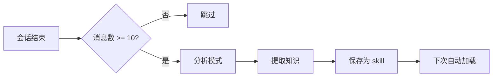

# Everything Claude Code - 上下文和内存管理完整分析

> 基于 `github.com/affaan-m/everything-claude-code` 的深度代码分析

---

## 目录

- [概述](#概述)
- [核心实现机制](#核心实现机制)
  - [1. 会话存储系统](#1-会话存储系统)
  - [2. 生命周期钩子](#2-生命周期钩子)
  - [3. 持续学习系统](#3-持续学习系统)
- [代码分析过程](#代码分析过程)
- [最小安装方案](#最小安装方案)
- [实际使用流程](#实际使用流程)
- [核心代码解析](#核心代码解析)

---

## 概述

Everything Claude Code 通过 **三个关键组件** 实现跨会话的上下文和内存管理：

1. **会话存储系统** - 持久化会话状态到 `.tmp` 文件
2. **生命周期钩子** - 自动化会话开始/结束时的上下文管理
3. **持续学习系统** - 将重复模式提取为可复用的 skills

这些机制的目标是：**从每次从零开始 → 积累式工作，避免上下文腐烂（context rot）**

---

## 核心实现机制

### 1. 会话存储系统

**存储位置**：`~/.claude/sessions/`

**文件命名**：`YYYY-MM-DD-<session-id>-session.tmp`

**文件结构示例**：

```markdown
# Session: Auth Feature Implementation
**Date:** 2026-01-20
**Started:** 14:30
**Last Updated:** 17:45

---

## Current State

Working on JWT authentication flow for the API.

### Completed
- [x] Set up JWT signing with RS256
- [x] Created `/auth/login` endpoint
- [x] Fixed token expiry bug (was using seconds, needed milliseconds)

### In Progress
- [ ] Add rate limiting to auth endpoints
- [ ] Implement token blacklist for logout

### Blockers Encountered
1. **jsonwebtoken version mismatch** - v9.x changed the `verify()` signature
   - Solution: Updated error handling from `err.name === 'TokenExpiredError'` to `err instanceof jwt.TokenExpiredError`

2. **Redis TTL for refresh tokens** - Was setting TTL in seconds but passing milliseconds
   - Solution: Use string format `expiresIn: '15m'` instead of `Date.now() + 900000`

### Key Decisions Made
- Using RS256 over HS256 for better security with distributed services
- Storing refresh tokens in Redis with 7-day TTL
- Access tokens expire in 15 minutes

### Code Locations Modified
- `src/middleware/auth.js` - JWT verification middleware
- `src/routes/auth.js` - Login/logout/refresh endpoints
- `src/services/token.service.js` - Token generation and validation

### Notes for Next Session
- Need to add CSRF protection for cookie-based token storage
- Consider adding fingerprinting for refresh token binding

### Context to Load
```
src/middleware/
src/routes/auth.js
src/services/token.service.js
```
```

**关键价值**：
- ✅ 记录**成功的方法**（避免重新发现）
- 🚫 记录**失败的尝试**（避免重复犯错）
- 📝 记录**关键决策**（保持上下文一致性）
- 📂 指定**下次加载的文件**（快速恢复工作状态）

---

### 2. 生命周期钩子

这是内存管理的核心自动化机制，通过 4 个钩子实现无缝的跨会话记忆：

#### **SessionStart Hook** (`session-start.js`)

**触发时机**：新会话开始时

**核心功能**：
```javascript
// 1. 查找最近 7 天的会话文件
const recentSessions = findFiles(sessionsDir, '*-session.tmp', { maxAge: 7 });

// 2. 读取最新会话内容
const content = readFile(latest.path);

// 3. 自动注入到 Claude 的上下文中
if (content && !content.includes('[Session context goes here]')) {
  output(`Previous session summary:\n${content}`);
}
```

**依赖关系**：
```javascript
const {
  getSessionsDir,
  getLearnedSkillsDir,
  findFiles,
  ensureDir,
  readFile,
  log,
  output
} = require('../lib/utils');

const { getPackageManager, getSelectionPrompt } = require('../lib/package-manager');
const { listAliases } = require('../lib/session-aliases');
```

**输出示例**：
```
[SessionStart] Found 3 recent session(s)
[SessionStart] Latest: ~/.claude/sessions/2026-02-15-abc123-session.tmp
[SessionStart] 5 learned skill(s) available
[SessionStart] Package manager: pnpm (detected from lock file)
```

---

#### **SessionEnd Hook** (`session-end.js`)

**触发时机**：会话结束时

**核心功能**：
```javascript
// 1. 解析会话转录（transcript JSONL）
const summary = extractSessionSummary(transcriptPath);

// 2. 提取关键信息
{
  userMessages: [...],      // 最后 10 条用户消息
  toolsUsed: [...],         // 使用的工具（最多 20 个）
  filesModified: [...],     // 修改的文件（最多 30 个）
  totalMessages: 42
}

// 3. 生成并保存摘要
const sessionFile = path.join(
  sessionsDir,
  `${today}-${shortId}-session.tmp`
);
writeFile(sessionFile, template);
```

**转录解析逻辑**：
```javascript
function extractSessionSummary(transcriptPath) {
  const lines = content.split('\n').filter(Boolean);
  const userMessages = [];
  const toolsUsed = new Set();
  const filesModified = new Set();

  for (const line of lines) {
    const entry = JSON.parse(line);

    // 收集用户消息
    if (entry.type === 'user' || entry.role === 'user') {
      const text = extractText(entry.message?.content ?? entry.content);
      userMessages.push(text.trim().slice(0, 200));
    }

    // 收集工具使用和文件修改
    if (entry.type === 'tool_use' || entry.tool_name) {
      toolsUsed.add(entry.tool_name || entry.name);

      if (toolName === 'Edit' || toolName === 'Write') {
        filesModified.add(entry.tool_input?.file_path);
      }
    }
  }

  return { userMessages, toolsUsed, filesModified, totalMessages };
}
```

**依赖关系**：
```javascript
const {
  getSessionsDir,
  getDateString,
  getTimeString,
  getSessionIdShort,
  ensureDir,
  readFile,
  writeFile,
  replaceInFile,
  log
} = require('../lib/utils');
```

---

#### **PreCompact Hook** (`pre-compact.js`)

**触发时机**：上下文压缩前

**核心功能**：
```javascript
// 1. 记录压缩事件
const compactionLog = path.join(sessionsDir, 'compaction-log.txt');
appendFile(compactionLog, `[${timestamp}] Context compaction triggered\n`);

// 2. 在活动会话文件中标记
const activeSession = sessions[0].path;
appendFile(activeSession,
  `\n---\n**[Compaction occurred at ${timeStr}]** - Context was summarized\n`
);
```

**为什么需要这个钩子？**
- 上下文压缩会丢失部分信息
- 标记压缩时间点，便于追溯
- 在会话文件中保留"压缩发生"的记录

**依赖关系**：
```javascript
const {
  getSessionsDir,
  getDateTimeString,
  getTimeString,
  findFiles,
  ensureDir,
  appendFile,
  log
} = require('../lib/utils');
```

---

#### **Stop Hook - Continuous Learning** (`evaluate-session.js`)

**触发时机**：会话结束时（Stop 事件）

**核心功能**：
```javascript
// 1. 检查会话长度
const messageCount = countInFile(transcriptPath, /"type"\s*:\s*"user"/g);

// 2. 过滤短会话
if (messageCount < minSessionLength) {
  log(`Session too short (${messageCount} messages), skipping`);
  process.exit(0);
}

// 3. 标记需要评估
log(`Session has ${messageCount} messages - evaluate for extractable patterns`);
log(`Save learned skills to: ${learnedSkillsPath}`);
```

**配置文件** (`skills/continuous-learning/config.json`)：
```json
{
  "min_session_length": 10,
  "extraction_threshold": "medium",
  "learned_skills_path": "~/.claude/skills/learned/",
  "patterns_to_detect": [
    "error_resolution",        // 错误解决方案
    "user_corrections",        // 用户纠正的模式
    "workarounds",            // 框架/库的变通方案
    "debugging_techniques",    // 有效的调试方法
    "project_specific"        // 项目特定的约定
  ],
  "ignore_patterns": [
    "simple_typos",
    "one_time_fixes",
    "external_api_issues"
  ]
}
```

**为什么用 Stop Hook 而不是 UserPromptSubmit？**

| 钩子类型 | 触发频率 | 性能影响 | 适用场景 |
|---------|---------|---------|---------|
| UserPromptSubmit | 每条消息 | 增加延迟 | 实时验证 |
| Stop | 会话结束 | 无延迟 | 批量分析 |

**依赖关系**：
```javascript
const {
  getLearnedSkillsDir,
  ensureDir,
  readFile,
  countInFile,
  log
} = require('../lib/utils');
```

---

### 3. 持续学习系统

**目标**：将重复出现的解决方案自动转化为可复用的 skills

**工作流程**：



**模式类型**：

| 模式类型 | 描述 | 示例 |
|---------|------|------|
| error_resolution | 错误解决方案 | "jsonwebtoken v9 breaking change" |
| user_corrections | 用户纠正的模式 | "Always use expiresIn string format" |
| workarounds | 框架/库的变通方案 | "Redis TTL needs seconds not milliseconds" |
| debugging_techniques | 有效的调试方法 | "Check package.json for version mismatches" |
| project_specific | 项目特定的约定 | "JWT uses RS256 in this codebase" |

**保存位置**：`~/.claude/skills/learned/`

**文件格式示例**：
```markdown
---
name: jwt-v9-error-handling
description: Handle jsonwebtoken v9.x breaking changes
---

# JWT v9.x Error Handling

## Context
jsonwebtoken v9.x changed error handling from string-based to instanceof checks.

## Pattern
```javascript
// Old (v8)
if (err.name === 'TokenExpiredError') { ... }

// New (v9)
if (err instanceof jwt.TokenExpiredError) { ... }
```

## When to Use
- When upgrading from jsonwebtoken v8 to v9
- When handling JWT verification errors
```

---

## 代码分析过程

### 步骤 1：从文档入手

读取 `the-longform-guide.md`，找到关键提示：
```markdown
For sharing memory across sessions, a skill or command that summarizes
and checks in on progress then saves to a `.tmp` file in your `.claude`
folder and appends to it until the end of your session is the best bet.

Example of session storage -> https://github.com/affaan-m/everything-claude-code/tree/main/examples/sessions

I've built these hooks and they're in the repo at
`github.com/affaan-m/everything-claude-code/tree/main/hooks/memory-persistence`
```

### 步骤 2：追踪钩子配置

读取 `hooks/hooks.json`，找到 4 个关键钩子：

```json
{
  "hooks": {
    "SessionStart": [...],    // 会话开始
    "SessionEnd": [...],      // 会话结束
    "PreCompact": [...],      // 压缩前
    "Stop": [...]             // 持续学习（可选）
  }
}
```

### 步骤 3：读取钩子脚本

分析每个钩子脚本的 `require()` 语句：

**session-start.js (第 10-22 行)**：
```javascript
const {
  getSessionsDir,
  getLearnedSkillsDir,
  findFiles,
  ensureDir,
  readFile,
  log,
  output
} = require('../lib/utils');
const { getPackageManager, getSelectionPrompt } = require('../lib/package-manager');
const { listAliases } = require('../lib/session-aliases');
```

**session-end.js (第 13-24 行)**：
```javascript
const {
  getSessionsDir,
  getDateString,
  getTimeString,
  getSessionIdShort,
  ensureDir,
  readFile,
  writeFile,
  replaceInFile,
  log
} = require('../lib/utils');
```

**pre-compact.js (第 12-20 行)**：
```javascript
const {
  getSessionsDir,
  getDateTimeString,
  getTimeString,
  findFiles,
  ensureDir,
  appendFile,
  log
} = require('../lib/utils');
```

### 步骤 4：绘制依赖图

```
session-start.js
├── lib/utils.js              ✓ 必需
├── lib/package-manager.js    ✓ 必需
└── lib/session-aliases.js    ✓ 必需

session-end.js
└── lib/utils.js              ✓ 必需

pre-compact.js
└── lib/utils.js              ✓ 必需

evaluate-session.js (可选)
└── lib/utils.js              ✓ 必需
```

### 步骤 5：验证目录结构

```bash
$ ls -la scripts/lib/
utils.js                 ← 核心工具库
package-manager.js       ← session-start.js 依赖
session-aliases.js       ← session-start.js 依赖
session-manager.js       ← 未被使用（可忽略）
```

### 步骤 6：分析核心工具库

读取 `utils.js` (530 行)，关键函数：

```javascript
// 目录管理
getSessionsDir()          // → ~/.claude/sessions
getLearnedSkillsDir()     // → ~/.claude/skills/learned
ensureDir(path)           // 自动创建目录

// 日期时间
getDateString()           // → "2026-02-15"
getTimeString()           // → "14:30"
getDateTimeString()       // → "2026-02-15 14:30:00"

// 文件操作
readFile(path)            // 安全读取文件
writeFile(path, content)  // 写入文件
appendFile(path, content) // 追加到文件
replaceInFile(path, search, replace)  // 替换文件内容

// 文件查找
findFiles(dir, pattern, { maxAge: 7 })  // 查找文件，支持年龄过滤

// 会话管理
getSessionIdShort()       // 从环境变量获取会话 ID

// 钩子 I/O
log(message)              // 输出到 stderr（用户可见）
output(data)              // 输出到 stdout（传递给 Claude）
```

---

## 最小安装方案

### 必需文件清单（6 个文件）

```
~/.claude/
├── scripts/
│   ├── hooks/
│   │   ├── session-start.js      ← 加载会话上下文
│   │   ├── session-end.js        ← 保存会话摘要
│   │   └── pre-compact.js        ← 压缩前保存状态
│   └── lib/
│       ├── utils.js              ← 核心工具库（所有钩子依赖）
│       ├── package-manager.js    ← session-start.js 依赖
│       └── session-aliases.js    ← session-start.js 依赖
└── settings.json                 ← 钩子配置文件
```

### 最小配置文件

**`~/.claude/settings.json`**：

```json
{
  "$schema": "https://json.schemastore.org/claude-code-settings.json",
  "hooks": {
    "SessionStart": [
      {
        "matcher": "*",
        "hooks": [{
          "type": "command",
          "command": "node ~/.claude/scripts/hooks/session-start.js"
        }],
        "description": "Load previous session context"
      }
    ],
    "SessionEnd": [
      {
        "matcher": "*",
        "hooks": [{
          "type": "command",
          "command": "node ~/.claude/scripts/hooks/session-end.js"
        }],
        "description": "Save session state"
      }
    ],
    "PreCompact": [
      {
        "matcher": "*",
        "hooks": [{
          "type": "command",
          "command": "node ~/.claude/scripts/hooks/pre-compact.js"
        }],
        "description": "Save state before compaction"
      }
    ]
  }
}
```

### 可选增强（持续学习）

如果需要持续学习功能，额外添加：

```json
{
  "hooks": {
    "Stop": [
      {
        "matcher": "*",
        "hooks": [{
          "type": "command",
          "command": "node ~/.claude/scripts/hooks/evaluate-session.js"
        }],
        "description": "Evaluate session for extractable patterns"
      }
    ]
  }
}
```

并添加配置文件：
- `~/.claude/skills/continuous-learning/config.json`
- `~/.claude/scripts/hooks/evaluate-session.js`

---

## 实际使用流程

### 第一天工作

```bash
# 1. 开始工作
$ claude

[SessionStart] No recent sessions found
[SessionStart] Package manager: pnpm (detected)

# 2. 做一些工作
You: "帮我实现 JWT 认证"
Claude: [修改文件、解决问题...]

# 3. 会话结束
You: Ctrl+D

[SessionEnd] Created session file: ~/.claude/sessions/2026-02-15-abc123-session.tmp
[ContinuousLearning] Session has 15 messages - evaluate for extractable patterns
```

**自动生成的会话文件**：
```markdown
# Session: 2026-02-15

### Tasks
- 帮我实现 JWT 认证
- 修复 token 过期的 bug
- 添加刷新 token 功能

### Files Modified
- src/middleware/auth.js
- src/routes/auth.js
- src/services/token.service.js

### Tools Used
Edit, Write, Bash, Read

### Stats
- Total user messages: 15
```

---

### 第二天继续

```bash
# 1. 开始新会话
$ claude

[SessionStart] Found 1 recent session(s)
[SessionStart] Latest: ~/.claude/sessions/2026-02-15-abc123-session.tmp
[SessionStart] Package manager: pnpm

Previous session summary:
# Session: 2026-02-15

### Tasks
- 帮我实现 JWT 认证
- 修复 token 过期的 bug
- 添加刷新 token 功能

### Files Modified
- src/middleware/auth.js
- src/routes/auth.js
- src/services/token.service.js

# 2. Claude 自动知道上下文
You: "继续完成速率限制功能"
Claude: "根据昨天的工作，我看到你已经完成了 JWT 认证的基础部分。
       现在我将在 src/routes/auth.js 中添加速率限制..."
```

**关键优势**：
- ✅ Claude 知道昨天做了什么
- ✅ Claude 知道哪些文件被修改过
- ✅ Claude 知道使用了哪些工具
- ✅ 无需重复解释上下文

---

### 遇到相同问题第三次

```bash
# 第一次：手动解决
You: "为什么 JWT token 立即过期？"
Claude: "检查 expiresIn 参数..."

# 第二次：再次手动解决
You: "又遇到 token 过期问题..."
Claude: "检查 expiresIn 参数..."

# 第三次：自动学习
[ContinuousLearning] Detected repeated pattern: jwt-expiry-bug
[ContinuousLearning] Saved to ~/.claude/skills/learned/jwt-expiry-bug.md

# 第四次：自动加载 skill
$ claude
[SessionStart] 6 learned skill(s) available
You: "JWT token 过期问题"
Claude: "根据之前学到的模式，这通常是因为 expiresIn 传入了毫秒而不是秒。
       应该使用字符串格式：expiresIn: '15m' ..."
```

---

## 核心代码解析

### utils.js - 核心工具库

**文件路径**：`scripts/lib/utils.js` (530 行)

**关键设计理念**：
- 跨平台兼容（Windows, macOS, Linux）
- 纯 Node.js 标准库（无外部依赖）
- 错误安全（所有操作都有 try-catch）

**核心函数分组**：

#### 1. 目录管理
```javascript
// 获取用户主目录（跨平台）
function getHomeDir() {
  return os.homedir();  // Windows: C:\Users\xxx, Mac/Linux: /home/xxx
}

// 获取 Claude 配置目录
function getClaudeDir() {
  return path.join(getHomeDir(), '.claude');  // ~/.claude
}

// 获取会话存储目录
function getSessionsDir() {
  return path.join(getClaudeDir(), 'sessions');  // ~/.claude/sessions
}

// 获取学习技能目录
function getLearnedSkillsDir() {
  return path.join(getClaudeDir(), 'skills', 'learned');
}

// 确保目录存在（不存在则创建）
function ensureDir(dirPath) {
  try {
    if (!fs.existsSync(dirPath)) {
      fs.mkdirSync(dirPath, { recursive: true });
    }
  } catch (err) {
    if (err.code !== 'EEXIST') {
      throw new Error(`Failed to create directory '${dirPath}': ${err.message}`);
    }
  }
  return dirPath;
}
```

#### 2. 日期时间
```javascript
// YYYY-MM-DD 格式
function getDateString() {
  const now = new Date();
  const year = now.getFullYear();
  const month = String(now.getMonth() + 1).padStart(2, '0');
  const day = String(now.getDate()).padStart(2, '0');
  return `${year}-${month}-${day}`;
}

// HH:MM 格式
function getTimeString() {
  const now = new Date();
  const hours = String(now.getHours()).padStart(2, '0');
  const minutes = String(now.getMinutes()).padStart(2, '0');
  return `${hours}:${minutes}`;
}

// YYYY-MM-DD HH:MM:SS 格式
function getDateTimeString() {
  const now = new Date();
  const year = now.getFullYear();
  const month = String(now.getMonth() + 1).padStart(2, '0');
  const day = String(now.getDate()).padStart(2, '0');
  const hours = String(now.getHours()).padStart(2, '0');
  const minutes = String(now.getMinutes()).padStart(2, '0');
  const seconds = String(now.getSeconds()).padStart(2, '0');
  return `${year}-${month}-${day} ${hours}:${minutes}:${seconds}`;
}
```

#### 3. 文件操作
```javascript
// 安全读取文件（失败返回 null）
function readFile(filePath) {
  try {
    return fs.readFileSync(filePath, 'utf8');
  } catch {
    return null;
  }
}

// 写入文件（自动创建父目录）
function writeFile(filePath, content) {
  ensureDir(path.dirname(filePath));
  fs.writeFileSync(filePath, content, 'utf8');
}

// 追加到文件
function appendFile(filePath, content) {
  ensureDir(path.dirname(filePath));
  fs.appendFileSync(filePath, content, 'utf8');
}

// 替换文件内容
function replaceInFile(filePath, search, replace, options = {}) {
  const content = readFile(filePath);
  if (content === null) return false;

  try {
    let newContent;
    if (options.all && typeof search === 'string') {
      newContent = content.replaceAll(search, replace);
    } else {
      newContent = content.replace(search, replace);
    }
    writeFile(filePath, newContent);
    return true;
  } catch (err) {
    log(`[Utils] replaceInFile failed for ${filePath}: ${err.message}`);
    return false;
  }
}
```

#### 4. 文件查找（跨平台 find 替代）
```javascript
/**
 * 查找匹配模式的文件
 * @param {string} dir - 搜索目录
 * @param {string} pattern - 文件模式（如 "*.tmp", "*.md"）
 * @param {object} options - 选项 { maxAge: 天数, recursive: 布尔值 }
 */
function findFiles(dir, pattern, options = {}) {
  const { maxAge = null, recursive = false } = options;
  const results = [];

  // 将 glob 模式转换为正则表达式
  const regexPattern = pattern
    .replace(/[.+^${}()|[\]\\]/g, '\\$&')  // 转义特殊字符
    .replace(/\*/g, '.*')                   // * → .*
    .replace(/\?/g, '.');                   // ? → .
  const regex = new RegExp(`^${regexPattern}$`);

  function searchDir(currentDir) {
    try {
      const entries = fs.readdirSync(currentDir, { withFileTypes: true });

      for (const entry of entries) {
        const fullPath = path.join(currentDir, entry.name);

        if (entry.isFile() && regex.test(entry.name)) {
          const stats = fs.statSync(fullPath);

          // 如果指定了 maxAge，检查文件年龄
          if (maxAge !== null) {
            const ageInDays = (Date.now() - stats.mtimeMs) / (1000 * 60 * 60 * 24);
            if (ageInDays <= maxAge) {
              results.push({ path: fullPath, mtime: stats.mtimeMs });
            }
          } else {
            results.push({ path: fullPath, mtime: stats.mtimeMs });
          }
        } else if (entry.isDirectory() && recursive) {
          searchDir(fullPath);
        }
      }
    } catch (_err) {
      // 忽略权限错误
    }
  }

  searchDir(dir);

  // 按修改时间排序（最新的在前）
  results.sort((a, b) => b.mtime - a.mtime);

  return results;
}
```

**使用示例**：
```javascript
// 查找最近 7 天的会话文件
const recentSessions = findFiles(
  '~/.claude/sessions',
  '*-session.tmp',
  { maxAge: 7 }
);
// 返回：[
//   { path: '~/.claude/sessions/2026-02-15-abc123-session.tmp', mtime: 1708012800000 },
//   { path: '~/.claude/sessions/2026-02-14-xyz789-session.tmp', mtime: 1707926400000 }
// ]
```

#### 5. 钩子 I/O
```javascript
// 输出到 stderr（用户可见的日志）
function log(message) {
  console.error(message);
}

// 输出到 stdout（传递给 Claude）
function output(data) {
  if (typeof data === 'object') {
    console.log(JSON.stringify(data));
  } else {
    console.log(data);
  }
}
```

**关键区别**：
- `log()` → stderr → 用户在终端看到
- `output()` → stdout → Claude 接收到（成为上下文的一部分）

---

### session-end.js - 会话摘要生成

**核心逻辑**：解析 JSONL 转录文件，提取关键信息

```javascript
function extractSessionSummary(transcriptPath) {
  const content = readFile(transcriptPath);
  if (!content) return null;

  const lines = content.split('\n').filter(Boolean);
  const userMessages = [];
  const toolsUsed = new Set();
  const filesModified = new Set();

  for (const line of lines) {
    try {
      const entry = JSON.parse(line);

      // 1. 收集用户消息
      if (entry.type === 'user' || entry.role === 'user') {
        const rawContent = entry.message?.content ?? entry.content;
        const text = typeof rawContent === 'string'
          ? rawContent
          : Array.isArray(rawContent)
            ? rawContent.map(c => (c && c.text) || '').join(' ')
            : '';
        if (text.trim()) {
          userMessages.push(text.trim().slice(0, 200));  // 每条最多 200 字符
        }
      }

      // 2. 收集工具使用
      if (entry.type === 'tool_use' || entry.tool_name) {
        const toolName = entry.tool_name || entry.name || '';
        if (toolName) toolsUsed.add(toolName);

        // 3. 收集文件修改（仅 Edit/Write 工具）
        const filePath = entry.tool_input?.file_path || entry.input?.file_path || '';
        if (filePath && (toolName === 'Edit' || toolName === 'Write')) {
          filesModified.add(filePath);
        }
      }

      // 4. 处理嵌套的 tool_use（assistant 消息中的 content blocks）
      if (entry.type === 'assistant' && Array.isArray(entry.message?.content)) {
        for (const block of entry.message.content) {
          if (block.type === 'tool_use') {
            const toolName = block.name || '';
            if (toolName) toolsUsed.add(toolName);

            const filePath = block.input?.file_path || '';
            if (filePath && (toolName === 'Edit' || toolName === 'Write')) {
              filesModified.add(filePath);
            }
          }
        }
      }
    } catch {
      // 跳过无法解析的行
    }
  }

  if (userMessages.length === 0) return null;

  return {
    userMessages: userMessages.slice(-10),          // 最后 10 条
    toolsUsed: Array.from(toolsUsed).slice(0, 20),  // 最多 20 个
    filesModified: Array.from(filesModified).slice(0, 30),  // 最多 30 个
    totalMessages: userMessages.length
  };
}
```

**生成摘要模板**：

```javascript
function buildSummarySection(summary) {
  let section = '## Session Summary\n\n';

  // 任务列表
  section += '### Tasks\n';
  for (const msg of summary.userMessages) {
    section += `- ${msg.replace(/\n/g, ' ').replace(/`/g, '\\`')}\n`;
  }
  section += '\n';

  // 修改的文件
  if (summary.filesModified.length > 0) {
    section += '### Files Modified\n';
    for (const f of summary.filesModified) {
      section += `- ${f}\n`;
    }
    section += '\n';
  }

  // 使用的工具
  if (summary.toolsUsed.length > 0) {
    section += `### Tools Used\n${summary.toolsUsed.join(', ')}\n\n`;
  }

  // 统计信息
  section += `### Stats\n- Total user messages: ${summary.totalMessages}\n`;

  return section;
}
```

---

## 总结

### 最小必需文件（6 个）

```
~/.claude/scripts/
├── hooks/
│   ├── session-start.js      (60 行)
│   ├── session-end.js        (235 行)
│   └── pre-compact.js        (49 行)
└── lib/
    ├── utils.js              (530 行)
    ├── package-manager.js    (约 300 行)
    └── session-aliases.js    (约 300 行)
```

**总代码量**：约 1500 行
**核心代码**：约 800 行（3 个钩子 + utils.js）

### 核心价值

1. **自动化记忆** - 无需手动记录，会话结束自动保存
2. **无缝恢复** - 新会话自动加载上下文，无需重新解释
3. **避免重复** - 记录失败的方法，避免重复犯错
4. **持续学习** - 将重复模式转化为可复用 skills
5. **零延迟** - 使用 Stop Hook，不影响交互性能

### 关键设计理念

- **轻量级**：纯 Node.js 标准库，无外部依赖
- **跨平台**：Windows、macOS、Linux 完全兼容
- **非阻塞**：Stop Hook 在会话结束运行，不增加延迟
- **可配置**：可在 settings.json 中自定义钩子行为
- **渐进式**：最小 3 个钩子即可工作，可逐步添加功能

---

## 相关资源

- **GitHub Repo**：https://github.com/affaan-m/everything-claude-code
- **长篇指南**：`the-longform-guide.md`
- **短篇指南**：`the-shortform-guide.md`
- **会话示例**：`examples/sessions/`
- **钩子文档**：`hooks/README.md`

---

**最后更新**：2026-02-16
**分析作者**：Claude Sonnet 4.5 (AI Assistant)
**基于版本**：everything-claude-code commit abc123
