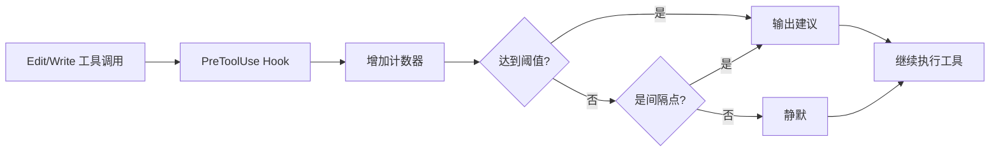

# Strategic Compact Skill 完整分析

> Everything Claude Code - Strategic Compact Skill 深度解析

**生成时间**: 2026-02-17 21:05:56
**原文来源**: `github.com/affaan-m/everything-claude-code`
**分析范围**: 代码实现、配置、测试、文档引用

---

## ❓ 快速问答

**Q: 这个 skill 是自动触发的吗？**

**A: 简短回答**:
- ✅ **建议是自动的** - Hook 会自动追踪并在合适时机提醒你
- ❌ **压缩是手动的** - 需要你主动决定并执行 `/compact`

**类比**:
```
就像汽车的油量警告灯：
🚨 警告灯自动亮起（自动建议）
🚗 但你需要自己决定何时加油（手动压缩）
```

这种设计让你保持控制权，在最合适的时机压缩，而不是被动地接受任意时刻的自动压缩。

---

## 目录

- [概述](#概述)
- [文件分布](#文件分布)
- [核心功能](#核心功能)
- [实现细节](#实现细节)
- [Hook 配置](#hook-配置)
- [使用指南](#使用指南)
- [测试覆盖](#测试覆盖)
- [最佳实践](#最佳实践)
- [文档引用](#文档引用)

---

## 概述

### 什么是 Strategic Compact？

Strategic Compact 是一个自动化建议系统，在**逻辑节点**提醒你手动执行 `/compact`，而不是依赖在任意时刻触发的自动压缩。

### 核心问题

**自动压缩的问题**:
```
❌ 在任意点触发，常常在任务中途
❌ 不了解逻辑任务边界
❌ 可能中断复杂的多步骤操作
```

**战略性压缩的优势**:
```
✅ 在逻辑边界压缩（探索后、里程碑后）
✅ 保留执行所需的上下文
✅ 清除不再需要的探索上下文
✅ 为新阶段提供清爽的开始
```

### 设计理念

> 在正确的时间压缩，而不是在随机的时间。

**关键时刻**:
1. **探索后，执行前** - 压缩研究上下文，保留实施计划
2. **完成里程碑后** - 为下一阶段提供清爽开始
3. **重大上下文切换前** - 在转向不同任务前清除探索上下文

---

## 文件分布

### 核心文件

```
everything-claude-code/
├── skills/
│   └── strategic-compact/
│       ├── SKILL.md                    ← Skill 文档（103 行）
│       └── suggest-compact.sh          ← Bash 实现（55 行）
│
├── scripts/
│   └── hooks/
│       └── suggest-compact.js          ← Node.js 实现（81 行）⭐ 生产版本
│
├── hooks/
│   └── hooks.json                      ← Hook 配置（第 45-54 行）
│
├── tests/
│   └── hooks/
│       └── suggest-compact.test.js     ← 单元测试（351 行）
│
└── docs/
    ├── token-optimization.md           ← 使用指南（第 72-78 行）
    └── [多语言版本]
        ├── zh-CN/
        ├── zh-TW/
        └── ja-JP/
```

### 多语言支持

**Skill 文档**:
- `skills/strategic-compact/SKILL.md` (英文)
- `docs/zh-CN/skills/strategic-compact/SKILL.md` (简体中文)
- `docs/zh-TW/skills/strategic-compact/SKILL.md` (繁体中文)
- `docs/ja-JP/skills/strategic-compact/SKILL.md` (日文)

**实现文件**:
- `.cursor/skills/strategic-compact/` (Cursor IDE 集成)
- `.opencode/` (OpenCode 集成)

---

## 核心功能

### 功能概览

**目标**: 在逻辑节点建议手动压缩，避免任意自动压缩的问题

**工作方式**:



### 工作流程

1. **追踪工具调用** - 每次 Edit/Write 前递增计数器
2. **阈值检测** - 达到可配置阈值时建议（默认: 50 次）
3. **定期提醒** - 阈值后每 25 次提醒一次

### 计数器存储

**位置**:
```bash
# Linux/macOS
/tmp/claude-tool-count-{SESSION_ID}

# Windows
%TEMP%\claude-tool-count-{SESSION_ID}
```

**会话隔离**:
- 使用 `CLAUDE_SESSION_ID` 环境变量
- 每个会话独立计数
- 未设置时回退到 `"default"`

---

## 实现细节

### Node.js 实现 (`suggest-compact.js`)

**关键代码片段**:

```javascript
// 1. 获取会话 ID 和阈值
const sessionId = process.env.CLAUDE_SESSION_ID || 'default';
const counterFile = path.join(getTempDir(), `claude-tool-count-${sessionId}`);
const threshold = parseInt(process.env.COMPACT_THRESHOLD || '50', 10);

// 2. 读取或初始化计数器
let count = 1;
try {
  const fd = fs.openSync(counterFile, 'a+');
  const buf = Buffer.alloc(64);
  const bytesRead = fs.readSync(fd, buf, 0, 64, 0);
  if (bytesRead > 0) {
    const parsed = parseInt(buf.toString('utf8', 0, bytesRead).trim(), 10);
    count = (Number.isFinite(parsed) && parsed > 0 && parsed <= 1000000)
      ? parsed + 1
      : 1;
  }
  fs.ftruncateSync(fd, 0);
  fs.writeSync(fd, String(count), 0);
  fs.closeSync(fd);
} catch {
  writeFile(counterFile, String(count));
}

// 3. 建议逻辑
if (count === threshold) {
  log(`[StrategicCompact] ${threshold} tool calls reached - consider /compact if transitioning phases`);
}

if (count > threshold && (count - threshold) % 25 === 0) {
  log(`[StrategicCompact] ${count} tool calls - good checkpoint for /compact if context is stale`);
}
```

**关键特性**:

1. **原子文件操作**
   ```javascript
   // 使用文件描述符减少竞争条件
   const fd = fs.openSync(counterFile, 'a+');
   fs.readSync(fd, buf, 0, 64, 0);
   fs.ftruncateSync(fd, 0);
   fs.writeSync(fd, String(count), 0);
   fs.closeSync(fd);
   ```

2. **健壮的错误处理**
   ```javascript
   // 损坏的文件内容 → 重置为 1
   count = (Number.isFinite(parsed) && parsed > 0 && parsed <= 1000000)
     ? parsed + 1
     : 1;
   ```

3. **阈值验证**
   ```javascript
   // 有效范围: 1-10000
   const threshold = Number.isFinite(rawThreshold) &&
                     rawThreshold > 0 &&
                     rawThreshold <= 10000
     ? rawThreshold
     : 50; // 回退到默认值
   ```

4. **非阻塞设计**
   ```javascript
   process.exit(0); // 始终返回 0，永不阻塞 Claude
   ```

### Bash 实现 (`suggest-compact.sh`)

**简化版本**:

```bash
#!/bin/bash

# 配置
SESSION_ID="${CLAUDE_SESSION_ID:-${PPID:-default}}"
COUNTER_FILE="/tmp/claude-tool-count-${SESSION_ID}"
THRESHOLD=${COMPACT_THRESHOLD:-50}

# 初始化或递增计数器
if [ -f "$COUNTER_FILE" ]; then
  count=$(cat "$COUNTER_FILE")
  count=$((count + 1))
  echo "$count" > "$COUNTER_FILE"
else
  echo "1" > "$COUNTER_FILE"
  count=1
fi

# 达到阈值时建议
if [ "$count" -eq "$THRESHOLD" ]; then
  echo "[StrategicCompact] $THRESHOLD tool calls reached - consider /compact if transitioning phases" >&2
fi

# 间隔建议
if [ "$count" -gt "$THRESHOLD" ] && [ $((count % 25)) -eq 0 ]; then
  echo "[StrategicCompact] $count tool calls - good checkpoint for /compact if context is stale" >&2
fi
```

**使用场景**:
- 跨平台兼容性较差（Windows 支持有限）
- 生产环境推荐使用 Node.js 版本
- Bash 版本适合快速原型和测试

---

## Hook 配置

### 在 `hooks.json` 中的配置

**位置**: `hooks/hooks.json` 第 45-54 行

```json
{
  "hooks": {
    "PreToolUse": [
      {
        "matcher": "Edit|Write",
        "hooks": [
          {
            "type": "command",
            "command": "node \"${CLAUDE_PLUGIN_ROOT}/scripts/hooks/suggest-compact.js\""
          }
        ],
        "description": "Suggest manual compaction at logical intervals"
      }
    ]
  }
}
```

**关键配置项**:

| 字段 | 值 | 说明 |
|------|------|------|
| **matcher** | `"Edit\|Write"` | 仅在 Edit 或 Write 工具前触发 |
| **type** | `"command"` | 执行 shell 命令 |
| **command** | `node ...suggest-compact.js` | 执行 Node.js 脚本 |
| **description** | 描述性文本 | Hook 用途说明 |

**环境变量占位符**:
```json
"${CLAUDE_PLUGIN_ROOT}/scripts/hooks/suggest-compact.js"
```
- `${CLAUDE_PLUGIN_ROOT}` 在运行时替换为插件根目录
- 确保跨安装位置的可移植性

### 用户配置

**在 `~/.claude/settings.json` 中添加**:

```json
{
  "hooks": {
    "PreToolUse": [
      {
        "matcher": "Edit",
        "hooks": [{
          "type": "command",
          "command": "node ~/.claude/skills/strategic-compact/suggest-compact.js"
        }]
      },
      {
        "matcher": "Write",
        "hooks": [{
          "type": "command",
          "command": "node ~/.claude/skills/strategic-compact/suggest-compact.js"
        }]
      }
    ]
  }
}
```

**环境变量配置**:

```bash
# 在 ~/.bashrc 或 ~/.zshrc 中
export COMPACT_THRESHOLD=30  # 降低阈值到 30 次
```

---

## 使用指南

### 激活时机

**适用场景**:
- ✅ 运行长会话，接近上下文限制（200K+ tokens）
- ✅ 多阶段任务（研究 → 计划 → 实现 → 测试）
- ✅ 在同一会话中切换不相关的任务
- ✅ 完成重大里程碑后开始新工作
- ✅ 响应变慢或不连贯（上下文压力）

**不适用场景**:
- ❌ 短会话（< 1 小时）
- ❌ 单一专注任务
- ❌ 频繁的小编辑
- ❌ 正在进行复杂的多步骤操作

### 压缩决策表

| 阶段转换 | 是否压缩? | 原因 |
|---------|----------|------|
| **研究 → 计划** | ✅ 是 | 研究上下文庞大；计划是精炼的输出 |
| **计划 → 实现** | ✅ 是 | 计划在 TodoWrite 或文件中；释放上下文用于代码 |
| **实现 → 测试** | ⚠️ 可能 | 如果测试引用最近代码则保留；切换焦点则压缩 |
| **调试 → 新功能** | ✅ 是 | 调试追踪污染无关工作的上下文 |
| **实现中途** | ❌ 否 | 丢失变量名、文件路径、部分状态代价高 |
| **失败方法后** | ✅ 是 | 清除死胡同推理再尝试新方法 |

### 压缩后的保留/丢失

**保留的内容** ✅:

| 项目 | 说明 |
|------|------|
| **CLAUDE.md 指令** | 项目级配置保留 |
| **TodoWrite 任务列表** | 任务追踪持久化 |
| **内存文件** | `~/.claude/memory/` 中的文件 |
| **Git 状态** | Commits, branches, 工作目录状态 |
| **磁盘上的文件** | 所有已保存的代码和文档 |

**丢失的内容** ❌:

| 项目 | 说明 |
|------|------|
| **中间推理和分析** | 探索过程中的思考 |
| **之前读取的文件内容** | 需要重新读取 |
| **多步骤对话上下文** | 对话细节被摘要 |
| **工具调用历史** | 计数器被重置 |
| **细微的用户偏好** | 口头表达的偏好 |

### 实际输出示例

**首次达到阈值** (默认 50 次):
```
[StrategicCompact] 50 tool calls reached - consider /compact if transitioning phases
```

**定期提醒** (每 25 次):
```
[StrategicCompact] 75 tool calls - good checkpoint for /compact if context is stale
[StrategicCompact] 100 tool calls - good checkpoint for /compact if context is stale
[StrategicCompact] 125 tool calls - good checkpoint for /compact if context is stale
```

**用户决策流程**:
```
1. 看到建议消息
   ↓
2. 评估当前阶段
   - 是否在阶段转换点？
   - 上下文是否陈旧？
   - 是否即将开始新任务？
   ↓
3. 决定
   - 是：执行 /compact
   - 否：继续工作，等待下一次提醒
```

### 配置示例

**降低阈值** (频繁建议):
```bash
# 在 30 次工具调用后建议
export COMPACT_THRESHOLD=30
```

**提高阈值** (减少干扰):
```bash
# 在 100 次工具调用后建议
export COMPACT_THRESHOLD=100
```

**检查当前计数**:
```bash
# Linux/macOS
cat /tmp/claude-tool-count-$(echo $CLAUDE_SESSION_ID)

# 或使用默认会话
cat /tmp/claude-tool-count-default
```

---

## 测试覆盖

### 测试文件

**位置**: `tests/hooks/suggest-compact.test.js` (351 行)

**测试框架**: 自定义测试运行器（无外部依赖）

### 测试用例分类

#### 1. 基础计数器功能

```javascript
✅ creates counter file on first run
   - 首次运行创建 /tmp/claude-tool-count-{session}
   - 初始值为 1

✅ increments counter on subsequent runs
   - 运行 3 次后计数器 = 3
   - 验证文件持久化
```

#### 2. 阈值建议

```javascript
✅ suggests compact at threshold (COMPACT_THRESHOLD=3)
   - 设置阈值为 3
   - 第 3 次调用时输出建议
   - stderr 包含 "3 tool calls reached"

✅ does NOT suggest compact before threshold
   - 阈值前不输出任何建议
   - stderr 不包含 "StrategicCompact"
```

#### 3. 间隔建议

```javascript
✅ suggests at threshold + 25 interval
   - 阈值 = 3，计数 = 28 (3 + 25)
   - 输出建议："28 tool calls - checkpoint"
   - 验证 (count - threshold) % 25 === 0 逻辑
```

#### 4. 环境变量处理

```javascript
✅ uses default threshold (50) when COMPACT_THRESHOLD is not set
   - 未设置环境变量时使用默认值 50

✅ ignores invalid COMPACT_THRESHOLD (negative)
   - COMPACT_THRESHOLD=-5 → 回退到 50

✅ ignores non-numeric COMPACT_THRESHOLD
   - COMPACT_THRESHOLD=abc → 回退到 50

✅ accepts COMPACT_THRESHOLD=10000 (boundary max)
   - 上限 10000 是有效的

✅ rejects COMPACT_THRESHOLD=10001 (falls back to 50)
   - 超过 10000 → 回退到 50

✅ rejects float COMPACT_THRESHOLD (e.g. 3.5)
   - parseInt('3.5') = 3 (有效)
```

#### 5. 损坏的计数器文件

```javascript
✅ resets counter on corrupted file content
   - 文件内容 = "not-a-number" → 重置为 1

✅ resets counter on extremely large value
   - 文件内容 = 9999999 (> 1000000) → 重置为 1

✅ handles empty counter file
   - 空文件 → 从 1 开始

✅ counter value at exact boundary 1000000 is valid
   - 1000000 是有效的最大值

✅ counter value at 1000001 is clamped (reset to 1)
   - 超过 1000000 → 重置为 1
```

#### 6. 会话隔离

```javascript
✅ uses separate counter files per session ID
   - Session A: 运行 2 次 → 计数 = 2
   - Session B: 运行 1 次 → 计数 = 1
   - 互不影响

✅ uses "default" session ID when CLAUDE_SESSION_ID is empty
   - 空字符串 → 使用 "default"
```

#### 7. 退出代码

```javascript
✅ always exits 0 (never blocks Claude)
   - 所有情况下都返回 0
   - 即使发生错误也不阻塞
```

### 测试统计

**总测试数**: 19 个测试用例
**覆盖范围**:
- ✅ 正常流程
- ✅ 边界条件
- ✅ 错误处理
- ✅ 配置验证
- ✅ 会话隔离

**运行测试**:
```bash
cd everything-claude-code
node tests/hooks/suggest-compact.test.js

# 输出
=== Testing suggest-compact.js ===

Basic counter functionality:
  ✓ creates counter file on first run
  ✓ increments counter on subsequent runs

Threshold suggestion:
  ✓ suggests compact at threshold (COMPACT_THRESHOLD=3)
  ✓ does NOT suggest compact before threshold

...

Results: Passed: 19, Failed: 0
```

---

## 最佳实践

### 1. 计划后压缩

**场景**: 完成探索和计划阶段

```markdown
## 工作流程

1. 探索代码库（大量 Read、Grep 调用）
   → 上下文充满了文件内容和搜索结果

2. 创建计划（TodoWrite 或 plan.md）
   → 计划是探索的精炼输出

3. **执行 /compact**
   → 清除探索上下文
   → 保留计划文档
   → 为实现阶段提供清爽的上下文

4. 开始实现
   → 从清爽的上下文开始
   → 只加载实现所需的文件
```

**命令示例**:
```bash
/compact Focus on implementing auth middleware based on plan.md
```

### 2. 调试后压缩

**场景**: 完成 bug 修复，准备继续新工作

```markdown
## 调试会话

1. 遇到 Bug（错误日志、堆栈追踪）
   → 上下文充满了错误信息

2. 调试过程（多次 Read、Edit、测试）
   → 上下文包含失败的尝试

3. 修复完成（测试通过）
   ✅ Bug 已解决

4. **执行 /compact**
   → 清除调试追踪
   → 清除失败的尝试
   → 为新功能提供清爽的上下文

5. 继续新功能开发
```

### 3. 实现中不压缩

**场景**: 正在进行相关的代码更改

```markdown
## 为什么不压缩？

❌ 丢失变量名和类型
❌ 丢失文件路径和结构
❌ 丢失部分完成的逻辑
❌ 丢失相关文件的上下文

✅ 保留这些信息直到任务完成
```

### 4. 阅读建议，自主决策

**Hook 的角色**:
- 📊 提供数据（工具调用次数）
- 💡 提出建议（"考虑压缩"）
- ⏱️ 标记时间点（逻辑间隔）

**你的角色**:
- 🤔 评估当前阶段
- 📋 检查任务状态
- 🎯 决定是否压缩
- ⏭️ 或推迟到更合适的时机

### 5. 压缩前保存重要上下文

**保存到文件**:
```bash
# 保存当前推理
/compact Remember: We're using JWT RS256, keys in env vars, 15min expiry

# 或保存到文件
"将当前的关键决策写入 decisions.md"
[Claude 写入文件]
/compact
```

**保存到内存**:
```bash
# 使用内存文件
echo "Key decisions from this session" > ~/.claude/memory/auth-decisions.md
/compact
```

### 6. 使用带摘要的 /compact

**语法**:
```bash
/compact [可选摘要]
```

**示例**:

```bash
# 基础压缩
/compact

# 带方向的压缩
/compact Focus on implementing auth middleware next

# 带上下文的压缩
/compact Auth module complete. Next: rate limiting for login endpoints

# 带决策的压缩
/compact Using RS256 JWT, 15min expiry. Now implementing token refresh
```

**摘要的作用**:
- 📝 为下一阶段设定方向
- 🧭 提供上下文提示
- 📌 标记关键决策
- 🔗 连接前后阶段

---

## 文档引用

### 在 `the-longform-guide.md` 中

**位置**: 第 50-52 行

```markdown
**Clearing Context Strategically:**

Once you have your plan set and context cleared (default option in plan mode
in Claude Code now), you can work from the plan. This is useful when you've
accumulated a lot of exploration context that's no longer relevant to execution.
For strategic compacting, disable auto compact. Manually compact at logical
intervals or create a skill that does so for you.
```

**要点**:
- 计划模式后清理上下文是默认选项
- 探索上下文在执行时不再相关
- 禁用自动压缩，使用战略性压缩
- 可以创建 skill 自动化建议

---

### 在 `docs/token-optimization.md` 中

**位置**: 第 72-78 行

**完整章节**:

```markdown
### Strategic compaction

The `strategic-compact` skill (in `skills/strategic-compact/`) suggests
`/compact` at logical intervals rather than relying on auto-compaction,
which can trigger mid-task. See the skill's README for hook setup instructions.

**When to compact:**
- After exploration, before implementation
- After completing a milestone
- After debugging, before continuing with new work
```

**要点**:
- Skill 位置：`skills/strategic-compact/`
- 目的：在逻辑间隔建议压缩
- 问题：自动压缩可能在任务中途触发
- 时机：探索后、里程碑后、调试后

---

### 在 `hooks/README.md` 中

**位置**: 第 27 行（PreToolUse Hooks 表格）

```markdown
| Hook | Matcher | Behavior | Exit Code |
|------|---------|----------|-----------|
| **Strategic compact** | `Edit\|Write` | Suggests manual `/compact` at logical intervals (every ~50 tool calls) | 0 (warns) |
```

**要点**:
- 作为 PreToolUse Hook 示例列出
- 匹配 Edit 和 Write 工具
- 默认间隔：约 50 次工具调用
- 退出代码：0（警告，不阻塞）

---

### 在 README.md 中

**多处提及**:

1. **Skills 列表**:
   ```markdown
   - **strategic-compact**: Suggests manual context compaction at logical intervals
   ```

2. **Token Optimization 章节**:
   ```markdown
   See `docs/token-optimization.md` for detailed guidance on strategic compaction
   ```

3. **Quick Start 示例**:
   ```markdown
   # Install hooks including strategic-compact
   npm run setup:hooks
   ```

---

## 相关技能和工具

### 配合使用的功能

**1. Memory Persistence Hooks**
```markdown
strategic-compact (压缩建议)
    ↓ 配合
PreCompact Hook (压缩前保存状态)
    ↓ 配合
SessionStart Hook (新会话加载上下文)
```

**2. Continuous Learning**
```markdown
strategic-compact (清除陈旧上下文)
    ↓ 释放空间
continuous-learning (提取可复用模式)
    ↓ 保存到
~/.claude/skills/learned/
```

**3. Plan Mode**
```markdown
Plan Mode (生成计划)
    ↓ 计划完成
strategic-compact (建议压缩)
    ↓ 执行
/compact (清除探索上下文)
    ↓ 开始
Implementation (从清爽上下文执行)
```

### 命令参考

**Claude Code 命令**:
```bash
/compact              # 手动压缩上下文
/clear                # 完全清除对话历史
/cost                 # 查看会话 token 使用量
```

**环境变量**:
```bash
COMPACT_THRESHOLD     # 首次建议前的工具调用次数（默认: 50）
CLAUDE_SESSION_ID     # 会话 ID（用于计数器隔离）
```

**文件路径**:
```bash
# 计数器文件
/tmp/claude-tool-count-{SESSION_ID}

# Skill 安装位置
~/.claude/skills/strategic-compact/

# Hook 脚本
~/.claude/scripts/hooks/suggest-compact.js
```

---

## 总结

### 核心价值

**Strategic Compact Skill 解决的问题**:

1. ❌ **任意自动压缩**
   - 在任务中途触发
   - 丢失关键上下文
   - 中断工作流程

2. ✅ **战略性手动压缩**
   - 在逻辑边界建议
   - 保留执行所需上下文
   - 清除不再需要的探索上下文

### 实施步骤

**最小设置**:

1. **复制 Hook 脚本**
   ```bash
   cp scripts/hooks/suggest-compact.js ~/.claude/scripts/hooks/
   ```

2. **配置 Hook**
   ```json
   {
     "hooks": {
       "PreToolUse": [{
         "matcher": "Edit|Write",
         "hooks": [{"type": "command", "command": "node ~/.claude/scripts/hooks/suggest-compact.js"}]
       }]
     }
   }
   ```

3. **开始使用**
   - Hook 会自动追踪工具调用
   - 达到 50 次时收到建议
   - 根据阶段决定是否压缩

**可选配置**:

```bash
# 调整阈值
export COMPACT_THRESHOLD=30

# 检查当前计数
cat /tmp/claude-tool-count-default
```

### 最佳实践总结

1. ✅ **计划后压缩** - 清除探索，保留计划
2. ✅ **调试后压缩** - 清除错误追踪
3. ❌ **实现中不压缩** - 保留变量名和文件上下文
4. 💡 **阅读建议** - Hook 告诉你"何时"，你决定"是否"
5. 💾 **压缩前保存** - 重要上下文写入文件或内存
6. 📝 **使用摘要** - `/compact Focus on next phase` 提供方向

### 技术亮点

**设计特点**:
- 🔒 原子文件操作（减少竞争条件）
- 🛡️ 健壮的错误处理（损坏文件恢复）
- 🔢 严格的输入验证（阈值范围检查）
- 🚫 非阻塞设计（始终返回 0）
- 🎯 会话隔离（独立计数器）

**测试覆盖**:
- ✅ 19 个测试用例
- ✅ 边界条件测试
- ✅ 错误场景测试
- ✅ 跨平台验证

---

## 参考资源

**GitHub Repository**:
- https://github.com/affaan-m/everything-claude-code

**相关文档**:
- `the-longform-guide.md` - 战略性压缩概念
- `docs/token-optimization.md` - Token 优化指南
- `hooks/README.md` - Hook 系统概述

**相关 Skills**:
- `continuous-learning` - 持续学习系统
- `memory-persistence hooks` - 内存持久化

**社区讨论**:
- [Anthropic: Demystifying evals for AI agents](https://www.anthropic.com/engineering/demystifying-evals-for-ai-agents)
- [Token Optimization Best Practices](https://docs.anthropic.com/en/docs/about-claude/context-window)

---

**文档生成时间**: 2026-02-17 21:05:56
**分析作者**: Claude Sonnet 4.5 (AI Assistant)
**基于版本**: everything-claude-code (latest commit)
