# 动态系统提示注入完整指南

> Everything Claude Code - Dynamic System Prompt Injection 深度解析

**生成时间**: 2026-02-21 18:19:49
**原文来源**: `github.com/affaan-m/everything-claude-code`
**分析范围**: 概念、实现、使用场景、最佳实践

---

## ❓ 快速问答

**Q: 动态系统提示注入是一个 skill 吗？**

**A: 不是，它是一种使用技术/模式**
- ❌ 不是独立的 skill
- ✅ 是一种使用 `contexts/` 目录 + CLI 参数的技术
- 📁 包含 3 个预定义上下文文件
- 🎯 通过 `--system-prompt` 参数动态注入

**核心思想**:
```
根据任务类型动态切换 Claude 的行为模式，而不是每次加载所有规则
```

---

## 目录

- [核心概念](#核心概念)
- [文件结构](#文件结构)
- [预定义上下文](#预定义上下文)
- [使用方式](#使用方式)
- [权限层级](#权限层级)
- [实际场景](#实际场景)
- [自定义上下文](#自定义上下文)
- [最佳实践](#最佳实践)
- [对比分析](#对比分析)
- [高级用法](#高级用法)

---

## 核心概念

### 什么是动态系统提示注入？

**定义**: 使用 Claude CLI 的 `--system-prompt` 参数，在启动会话时动态注入特定的系统提示，而不是依赖始终加载的全局配置文件。

**核心机制**:

```mermaid
graph LR
    A[选择任务类型] --> B[选择对应上下文文件]
    B --> C[通过 --system-prompt 注入]
    C --> D[Claude 获得特定行为指令]
    D --> E[按照上下文执行任务]
```



### 解决的问题

#### 传统方式的局限

**全局配置文件** (始终加载):

```
CLAUDE.md (用户级)
    ↓ 每次会话都加载
.claude/rules/ (项目级)
    ↓ 每次会话都加载
所有规则和指令
    ↓ 问题
- 无法根据任务类型调整
- 浪费 token 加载不相关指令
- 行为模式固定
- 上下文窗口被占用
```

**动态注入** (按需加载):

```
任务类型识别
    ↓ 根据需求选择
仅加载相关上下文
    ↓ 优势
- 精确的行为控制
- 节省 token
- 灵活切换模式
- 上下文窗口高效利用
```

### 设计理念

> **"外科手术式的上下文加载"** - 只加载当前任务真正需要的指令

**核心原则**:

1. **按需加载** - 不同任务，不同上下文
2. **模式切换** - 快速在开发/审查/研究间切换
3. **Token 优化** - 避免加载无关指令
4. **行为专注** - 每种模式有明确的优先级

---

## 文件结构

### 在 Repo 中的位置

```
everything-claude-code/
├── contexts/                    ← 上下文目录
│   ├── dev.md                  ← 开发模式 (21 行)
│   ├── review.md               ← 代码审查模式 (23 行)
│   └── research.md             ← 研究探索模式 (27 行)
│
├── the-longform-guide.md       ← 文档引用（第 54-75 行）
└── README.md                   ← 结构说明（第 320-323 行）
```

### 文件特点

**精简设计**:
- 每个文件 < 30 行
- Markdown 格式
- 清晰的结构
- 可读性强

**标准结构**:
```markdown
# [模式名称] Context

Mode: [模式类型]
Focus: [关注重点]

## Behavior
[行为指令列表]

## [模式特定章节]
[详细指令]

## Tools to favor
[推荐工具]

## Output
[输出要求]
```

---

## 预定义上下文

### 1. dev.md - 开发模式

**文件路径**: `contexts/dev.md`

**完整内容**:

```markdown
# Development Context

Mode: Active development
Focus: Implementation, coding, building features

## Behavior
- Write code first, explain after
- Prefer working solutions over perfect solutions
- Run tests after changes
- Keep commits atomic

## Priorities
1. Get it working
2. Get it right
3. Get it clean

## Tools to favor
- Edit, Write for code changes
- Bash for running tests/builds
- Grep, Glob for finding code
```

**适用场景**:
- ✅ 实现新功能
- ✅ 修复 bug
- ✅ 编写代码
- ✅ 快速迭代

**行为特点**:
- 🚀 快速行动，先实现后解释
- 🎯 优先可工作的方案
- 🧪 修改后自动运行测试
- 📦 保持提交原子化

**效果**:
```
开发模式下的 Claude：
"我会先实现功能，然后运行测试验证。代码如下：..."

vs

默认模式下的 Claude：
"让我先解释一下实现思路... [长篇解释] ...然后我们来看代码..."
```

---

### 2. review.md - 代码审查模式

**文件路径**: `contexts/review.md`

**完整内容**:

```markdown
# Code Review Context

Mode: PR review, code analysis
Focus: Quality, security, maintainability

## Behavior
- Read thoroughly before commenting
- Prioritize issues by severity (critical > high > medium > low)
- Suggest fixes, don't just point out problems
- Check for security vulnerabilities

## Review Checklist
- [ ] Logic errors
- [ ] Edge cases
- [ ] Error handling
- [ ] Security (injection, auth, secrets)
- [ ] Performance
- [ ] Readability
- [ ] Test coverage

## Output Format
Group findings by file, severity first
```

**适用场景**:
- ✅ PR 审查
- ✅ 代码质量检查
- ✅ 安全审计
- ✅ 架构评估

**行为特点**:
- 🔍 彻底阅读后再评论
- 🎯 按严重程度优先排序
- 💡 提供修复建议，不只是指出问题
- 🛡️ 重点检查安全漏洞

**输出格式**:
```markdown
## src/auth.js

### Critical
- Line 45: SQL injection vulnerability in login query
  Fix: Use parameterized queries

### High
- Line 67: Missing authentication check
  Fix: Add auth middleware

### Medium
- Line 89: Error message exposes internal details
  Fix: Use generic error messages

## src/api.js
...
```

---

### 3. research.md - 研究探索模式

**文件路径**: `contexts/research.md`

**完整内容**:

```markdown
# Research Context

Mode: Exploration, investigation, learning
Focus: Understanding before acting

## Behavior
- Read widely before concluding
- Ask clarifying questions
- Document findings as you go
- Don't write code until understanding is clear

## Research Process
1. Understand the question
2. Explore relevant code/docs
3. Form hypothesis
4. Verify with evidence
5. Summarize findings

## Tools to favor
- Read for understanding code
- Grep, Glob for finding patterns
- WebSearch, WebFetch for external docs
- Task with Explore agent for codebase questions

## Output
Findings first, recommendations second
```

**适用场景**:
- ✅ 理解代码库
- ✅ 调查问题
- ✅ 学习新技术
- ✅ 架构分析

**行为特点**:
- 📚 行动前先理解
- ❓ 提出澄清问题
- 📝 边研究边记录
- 🚫 理解清楚前不写代码

**研究流程**:
```
1. 理解问题 → "你想了解什么？"
2. 探索代码/文档 → [广泛阅读]
3. 形成假设 → "基于我的发现，我认为..."
4. 验证证据 → [检查相关代码]
5. 总结发现 → "结论：..."
```

---

## 使用方式

### 基础用法

**命令语法**:
```bash
claude --system-prompt "$(cat <context-file>)"
```

**三种模式**:

```bash
# 1. 开发模式
claude --system-prompt "$(cat contexts/dev.md)"

# 2. 代码审查模式
claude --system-prompt "$(cat contexts/review.md)"

# 3. 研究模式
claude --system-prompt "$(cat contexts/research.md)"
```

**工作原理**:

```bash
$(cat contexts/dev.md)
    ↓ Shell 命令替换
[读取文件内容]
    ↓ 作为字符串传递
--system-prompt "..."
    ↓ Claude CLI 处理
注入到系统提示中
    ↓ 会话开始
Claude 按照上下文行为
```

### 推荐设置 - Shell 别名

**配置文件**: `~/.bashrc` 或 `~/.zshrc`

```bash
# 动态系统提示注入别名
alias claude-dev='claude --system-prompt "$(cat ~/.claude/contexts/dev.md)"'
alias claude-review='claude --system-prompt "$(cat ~/.claude/contexts/review.md)"'
alias claude-research='claude --system-prompt "$(cat ~/.claude/contexts/research.md)"'
```

**使用示例**:

```bash
# 开发工作
cd ~/projects/myapp
claude-dev

# 审查 PR
cd ~/projects/myapp
git checkout pr-123
claude-review

# 研究代码库
cd ~/projects/new-library
claude-research
```

### 多上下文组合

**组合多个上下文文件**:

```bash
# 开发 + 项目特定规则
claude --system-prompt "$(cat ~/.claude/contexts/dev.md)" \
      --system-prompt "$(cat ./PROJECT-RULES.md)"

# 审查 + 安全清单
claude --system-prompt "$(cat ~/.claude/contexts/review.md)" \
      --system-prompt "$(cat ~/.claude/security-checklist.md)"
```

**加载顺序**:
```
第一个 --system-prompt
    ↓ 追加
第二个 --system-prompt
    ↓ 追加
第三个 --system-prompt
    ↓ 合并后注入
```

---

## 权限层级

### 提示权限系统

Claude 有一个提示权限层级系统：

```
┌─────────────────────────────────┐
│  System Prompt                  │  ← 最高权限
│  (--system-prompt)              │
└─────────────────────────────────┘
           ↓ 优先于
┌─────────────────────────────────┐
│  User Messages                  │  ← 中等权限
│  (你的输入)                      │
└─────────────────────────────────┘
           ↓ 优先于
┌─────────────────────────────────┐
│  Tool Results                   │  ← 最低权限
│  (Read, Grep 等)                │
└─────────────────────────────────┘
```

### 权限示例

**场景**: 代码风格冲突

```markdown
**System Prompt** (dev.md):
"Prefer working solutions over perfect solutions"

**User Message**:
"请完美地实现这个功能，每个细节都要考虑"

**Tool Result** (Read CLAUDE.md):
"代码必须完美符合所有最佳实践"

结果：Claude 会优先遵循 System Prompt，
      实现可工作的方案，而不是追求完美
```

**场景**: 行为模式冲突

```markdown
**System Prompt** (review.md):
"Read thoroughly before commenting"

**User Message**:
"快速看一下这个 PR"

**Tool Result**:
[PR 的 diff 内容]

结果：Claude 会彻底阅读 PR，即使你说"快速"，
      因为 System Prompt 优先级更高
```

### 为什么这个设计重要？

**稳定性**:
- System Prompt 提供一致的行为基准
- 用户临时请求不会破坏模式
- 确保专业工作流程

**灵活性**:
- 用户仍可通过明确指令覆盖
- 但需要非常明确的表述
- 保护核心行为模式

---

## 实际场景

### 场景 1: 快速功能开发

**任务**: 实现用户认证功能

**启动**:
```bash
cd ~/projects/webapp
claude-dev
```

**对话流程**:

```
You: 实现 JWT 认证

Claude (dev 模式):
"我会先实现核心功能，然后测试。代码如下：

[直接给出实现代码]

现在运行测试验证..."

[执行] npm test

✅ 测试通过。功能已实现。

需要我解释实现细节吗？"
```

**vs 默认模式**:

```
You: 实现 JWT 认证

Claude (默认模式):
"让我先解释 JWT 的工作原理...

[长篇解释]

现在我们来看实现方案...

[多个选项对比]

推荐使用方案 A，因为...

[更多解释]

代码如下..."
```

**dev 模式优势**:
- ⏱️ 节省时间：直接给出实现
- 🎯 聚焦目标：代码优先
- 🧪 快速验证：立即测试

---

### 场景 2: PR 审查

**任务**: 审查认证模块的 PR

**启动**:
```bash
cd ~/projects/webapp
git checkout pr-456
claude-review
```

**对话流程**:

```
You: 审查这个 PR 的安全性

Claude (review 模式):
"我会彻底审查代码，重点关注安全问题。

正在阅读变更..."

[读取所有修改的文件]

"审查完成。发现以下问题：

## src/auth/login.js

### Critical 🔴
- Line 45: SQL injection vulnerability
  当前代码：
  \`\`\`javascript
  const query = \`SELECT * FROM users WHERE email = '\${email}'\`;
  \`\`\`

  修复建议：
  \`\`\`javascript
  const query = 'SELECT * FROM users WHERE email = ?';
  db.query(query, [email]);
  \`\`\`

### High 🟠
- Line 78: JWT secret 硬编码
  风险：泄露后无法撤销
  修复：使用环境变量

### Medium 🟡
- Line 92: 错误消息暴露内部信息
  当前：'Database connection failed: connection timeout'
  建议：'Authentication failed. Please try again.'

## src/auth/middleware.js
..."
```

**review 模式优势**:
- 🔍 彻底检查：不遗漏问题
- 🎯 优先级明确：严重问题优先
- 💡 实用建议：给出修复方案
- 📊 结构化输出：易于处理

---

### 场景 3: 代码库研究

**任务**: 理解新项目的架构

**启动**:
```bash
cd ~/projects/unknown-codebase
claude-research
```

**对话流程**:

```
You: 这个项目的架构是什么？

Claude (research 模式):
"让我先探索代码库来理解架构。

澄清问题：
1. 你想了解整体架构还是特定模块？
2. 重点是数据流、组件关系，还是部署架构？

[等待回答]

假设你想了解整体架构，我会：

Step 1: 探索项目结构"
[Glob] **/*.{js,ts,json}

"发现：
- 前端：React + TypeScript
- 后端：Node.js + Express
- 数据库：PostgreSQL

Step 2: 分析关键文件"
[Read] package.json
[Read] src/index.js
[Read] README.md

"形成假设：
这是一个典型的三层架构...

Step 3: 验证假设"
[Grep] "import.*from" src/

"发现导入关系验证了三层结构。

Step 4: 总结发现

## 架构概览

\`\`\`
┌──────────┐
│  React   │ ← 前端（Port 3000）
└──────────┘
     ↓ HTTP
┌──────────┐
│ Express  │ ← API 层（Port 8080）
└──────────┘
     ↓ SQL
┌──────────┐
│ Postgres │ ← 数据层（Port 5432）
└──────────┘
\`\`\`

## 关键发现
1. API 使用 RESTful 设计
2. 认证通过 JWT
3. 数据库使用 Knex.js ORM
...

需要我深入研究某个模块吗？"
```

**research 模式优势**:
- 📚 系统化探索：有明确流程
- ❓ 主动澄清：避免误解
- 📝 记录发现：便于回顾
- 🎯 先理解后行动：避免错误

---

## 自定义上下文

### 创建自己的上下文

**示例 1: 调试模式**

**文件**: `~/.claude/contexts/debug.md`

```markdown
# Debug Context

Mode: Bug investigation and fixing
Focus: Root cause analysis

## Behavior
- Reproduce the bug first
- Add logging before changing code
- Test the fix thoroughly
- Document the root cause

## Debug Process
1. Understand the symptom
2. Form hypotheses
3. Test each hypothesis
4. Find root cause
5. Fix and verify
6. Add regression test

## Tools to favor
- Read for understanding error flow
- Bash for running tests/reproduction
- Grep for finding related code
- Edit with caution (test each change)

## Output
Root cause explanation first, fix second
```

**使用**:
```bash
# 添加别名
alias claude-debug='claude --system-prompt "$(cat ~/.claude/contexts/debug.md)"'

# 调试会话
claude-debug
```

---

**示例 2: 重构模式**

**文件**: `~/.claude/contexts/refactor.md`

```markdown
# Refactor Context

Mode: Code improvement and restructuring
Focus: Maintainability without breaking functionality

## Behavior
- Run all tests before changes
- Make small, incremental changes
- Run tests after each change
- Keep functionality identical
- Improve readability and structure

## Refactoring Rules
1. RED: Ensure tests pass before starting
2. REFACTOR: Make one small change
3. GREEN: Verify tests still pass
4. COMMIT: Commit after each successful refactor
5. REPEAT: Continue with next improvement

## What to Refactor
- [ ] Extract long methods
- [ ] Remove duplication
- [ ] Improve naming
- [ ] Simplify complex conditionals
- [ ] Reduce coupling

## What NOT to Change
- ❌ Public APIs
- ❌ Functionality/behavior
- ❌ Test expectations

## Tools to favor
- Edit for code changes
- Bash for running tests
- Git for frequent commits
```

**使用**:
```bash
alias claude-refactor='claude --system-prompt "$(cat ~/.claude/contexts/refactor.md)"'
```

---

**示例 3: 性能优化模式**

**文件**: `~/.claude/contexts/performance.md`

```markdown
# Performance Optimization Context

Mode: Performance analysis and improvement
Focus: Speed, memory, efficiency

## Behavior
- Profile before optimizing
- Measure impact of each change
- Document baseline metrics
- Focus on bottlenecks only
- Keep code readable

## Optimization Process
1. Profile to find bottlenecks
2. Set measurable targets
3. Optimize the bottleneck
4. Measure improvement
5. Verify correctness
6. Document the optimization

## Metrics to Track
- Execution time
- Memory usage
- Database queries (N+1 problems)
- Network requests
- CPU usage

## Tools to favor
- Bash for running profilers
- Read for understanding hot paths
- Edit with benchmarks
- Grep for finding similar patterns

## Red Flags
🚩 Premature optimization
🚩 Optimizing non-bottlenecks
🚩 Sacrificing readability
🚩 Not measuring results

## Output Format
Baseline → Change → New measurement → Impact
```

**使用**:
```bash
alias claude-perf='claude --system-prompt "$(cat ~/.claude/contexts/performance.md)"'
```

---

### 项目特定上下文

**场景**: 你的项目有特定的编码规范

**文件**: `~/projects/myapp/.claude/contexts/myapp-dev.md`

```markdown
# MyApp Development Context

Extends: Development mode
Project: MyApp (E-commerce platform)

## Behavior
- Write code first, explain after
- Run tests after changes
- Keep commits atomic

## Project-Specific Rules

### Code Style
- Use async/await (not callbacks)
- Prefer functional components (React)
- No any types in TypeScript
- Max file size: 400 lines

### Architecture
- Feature-based folder structure
- Each feature has: component, hook, service, test
- API calls only in service files
- State management: Zustand

### Testing
- Unit tests: Vitest
- E2E tests: Playwright
- Minimum coverage: 80%

### Git Workflow
- Branch naming: feature/ABC-123-description
- Commits: Conventional Commits format
- PR must pass: lint, test, build

## Tech Stack Quick Reference
- Frontend: React 18 + TypeScript
- Backend: Node.js + Express + Prisma
- Database: PostgreSQL
- Cache: Redis
- Queue: Bull
```

**使用**:
```bash
cd ~/projects/myapp
claude --system-prompt "$(cat .claude/contexts/myapp-dev.md)"

# 或创建别名
alias myapp-dev='cd ~/projects/myapp && claude --system-prompt "$(cat .claude/contexts/myapp-dev.md)"'
```

---

## 最佳实践

### 1. 上下文文件组织

**推荐目录结构**:

```
~/.claude/
├── contexts/
│   ├── dev.md              ← 通用开发模式
│   ├── review.md           ← 通用审查模式
│   ├── research.md         ← 通用研究模式
│   ├── debug.md            ← 自定义：调试模式
│   ├── refactor.md         ← 自定义：重构模式
│   └── performance.md      ← 自定义：性能优化
│
└── projects/
    ├── myapp/
    │   └── contexts/
    │       ├── myapp-dev.md      ← 项目特定开发
    │       └── myapp-review.md   ← 项目特定审查
    └── other-project/
        └── contexts/
            └── ...
```

### 2. 命名约定

**文件名**:
```
[模式]-[变体].md

示例：
- dev.md                 ← 基础开发模式
- dev-tdd.md            ← 开发模式 + TDD
- review.md             ← 基础审查模式
- review-security.md    ← 审查模式 + 安全重点
```

**别名命名**:
```bash
# 通用模式
claude-{mode}

# 项目特定
{project}-{mode}

示例：
alias claude-dev='...'
alias claude-review='...'
alias myapp-dev='...'
alias myapp-review='...'
```

### 3. 上下文内容原则

**保持简洁**:
```markdown
✅ 每个上下文 < 50 行
✅ 聚焦核心行为
✅ 使用清单和优先级
❌ 避免长篇解释
❌ 避免示例代码
```

**使用清晰结构**:
```markdown
# [模式名称] Context

Mode: [模式类型]
Focus: [核心关注点]

## Behavior
[3-5 条关键行为]

## [模式特定章节]
[结构化指令]

## Tools to favor
[推荐工具列表]

## Output
[输出格式要求]
```

**优先级明确**:
```markdown
## Priorities
1. [最高优先级]
2. [次优先级]
3. [第三优先级]

不是：
- 做这个
- 做那个
- 还要做这个
- ...（无优先级）
```

### 4. 测试和验证

**创建新上下文后**:

```bash
# 1. 测试基础功能
claude --system-prompt "$(cat new-context.md)"
# 验证：Claude 是否按预期行为？

# 2. 对比测试
# Terminal 1: 使用新上下文
claude-new-mode
"实现功能 X"

# Terminal 2: 不使用上下文
claude
"实现功能 X"

# 比较：输出差异、Token 使用、完成质量

# 3. 边界测试
# 尝试让 Claude 违反上下文规则
claude-review
"快速看一眼这个 PR，不用太仔细"
# 验证：Claude 是否仍然彻底审查？

# 4. 迭代改进
# 根据实际使用调整上下文内容
```

### 5. 版本控制

**将上下文文件纳入版本控制**:

```bash
# 项目特定上下文
cd ~/projects/myapp
git add .claude/contexts/
git commit -m "feat: add project-specific contexts"

# 全局上下文备份
cd ~/.claude
git init
git add contexts/
git commit -m "init: personal contexts"
git remote add origin git@github.com:user/claude-contexts.git
git push -u origin main
```

**好处**:
- ✅ 团队共享上下文
- ✅ 追踪上下文演变
- ✅ 回滚到之前版本
- ✅ 跨机器同步

---

## 对比分析

### vs CLAUDE.md

| 特性 | CLAUDE.md | 动态系统提示注入 |
|------|-----------|-----------------|
| **加载时机** | 每次会话 | 按需选择 |
| **适用范围** | 项目级通用规则 | 任务特定行为 |
| **灵活性** | 固定 | 高度灵活 |
| **Token 消耗** | 始终消耗 | 仅需要时消耗 |
| **权限级别** | 用户消息级 | 系统提示级（更高） |
| **使用场景** | 项目规范、架构约束 | 任务模式切换 |

**组合使用**:
```bash
# CLAUDE.md：项目规范（始终加载）
# - 代码风格
# - 文件组织
# - 测试要求

# 动态上下文：任务模式（按需加载）
claude-dev    # 开发模式
claude-review # 审查模式
```

### vs .claude/rules/

| 特性 | .claude/rules/ | 动态系统提示注入 |
|------|---------------|-----------------|
| **加载时机** | 每次会话 | 按需选择 |
| **适用范围** | 项目级规则 | 任务特定指令 |
| **文件数量** | 多个规则文件 | 单个上下文文件 |
| **内容类型** | 规则、约束 | 行为模式 |
| **优先级** | 用户消息级 | 系统提示级（更高） |

**组合使用**:
```bash
# .claude/rules/：通用约束（始终加载）
# - security.md
# - performance.md
# - api-design.md

# 动态上下文：工作模式（按需加载）
claude-dev      # 快速开发
claude-refactor # 重构改进
```

### vs Skills

| 特性 | Skills | 动态系统提示注入 |
|------|--------|-----------------|
| **触发方式** | `/skill-name` 命令 | CLI 启动参数 |
| **生命周期** | 单次对话 | 整个会话 |
| **内容类型** | 具体任务指令 | 行为模式设定 |
| **使用场景** | 特定任务（如 /tdd） | 工作模式（如开发/审查） |
| **持久性** | 临时 | 会话级 |

**组合使用**:
```bash
# 启动开发模式会话
claude-dev

# 会话中使用 skills
/tdd          # TDD 工作流
/commit       # 提交代码
/review-pr    # 审查 PR
```

---

## 高级用法

### 1. 多上下文组合

**层次化上下文**:

```bash
# 基础层：工作模式
claude --system-prompt "$(cat ~/.claude/contexts/dev.md)" \

# 项目层：项目规范
      --system-prompt "$(cat ./PROJECT-RULES.md)" \

# 任务层：特定任务
      --system-prompt "Implementing auth module. Follow OAuth 2.0 spec."
```

**效果**:
```
System Prompt = dev.md + PROJECT-RULES.md + inline prompt
    ↓
Claude 同时遵循：
1. 开发模式行为（先实现后解释）
2. 项目规范（代码风格、测试要求）
3. 当前任务（OAuth 2.0 实现）
```

### 2. 条件化上下文

**场景**: 根据 Git 分支选择上下文

**脚本**: `~/.claude/scripts/context-selector.sh`

```bash
#!/bin/bash

# 获取当前分支
BRANCH=$(git rev-parse --abbrev-ref HEAD 2>/dev/null)

# 根据分支选择上下文
if [[ $BRANCH == feature/* ]]; then
    CONTEXT="$HOME/.claude/contexts/dev.md"
elif [[ $BRANCH == hotfix/* ]]; then
    CONTEXT="$HOME/.claude/contexts/debug.md"
elif [[ $BRANCH == refactor/* ]]; then
    CONTEXT="$HOME/.claude/contexts/refactor.md"
else
    CONTEXT="$HOME/.claude/contexts/dev.md"
fi

# 启动 Claude
claude --system-prompt "$(cat $CONTEXT)"
```

**使用**:
```bash
# 添加别名
alias claude-auto='~/.claude/scripts/context-selector.sh'

# 自动选择上下文
git checkout feature/auth
claude-auto  # → 自动使用 dev.md

git checkout hotfix/login-bug
claude-auto  # → 自动使用 debug.md
```

### 3. 时间敏感上下文

**场景**: 上午专注开发，下午审查代码

**脚本**: `~/.claude/scripts/time-based-context.sh`

```bash
#!/bin/bash

# 获取当前小时
HOUR=$(date +%H)

# 上午 9-12: 开发模式
if [ $HOUR -ge 9 ] && [ $HOUR -lt 12 ]; then
    CONTEXT="dev.md"
    echo "☀️ 上午开发时间"

# 下午 2-5: 审查模式
elif [ $HOUR -ge 14 ] && [ $HOUR -lt 17 ]; then
    CONTEXT="review.md"
    echo "🔍 下午审查时间"

# 其他时间: 研究模式
else
    CONTEXT="research.md"
    echo "📚 研究/学习时间"
fi

claude --system-prompt "$(cat ~/.claude/contexts/$CONTEXT)"
```

### 4. 动态生成上下文

**场景**: 基于项目特征动态生成上下文

**脚本**: `~/.claude/scripts/generate-context.sh`

```bash
#!/bin/bash

# 检测技术栈
TECH_STACK=""

if [ -f "package.json" ]; then
    TECH_STACK="$TECH_STACK\n- Node.js project"

    if grep -q "react" package.json; then
        TECH_STACK="$TECH_STACK\n- React frontend"
    fi

    if grep -q "express" package.json; then
        TECH_STACK="$TECH_STACK\n- Express backend"
    fi
fi

if [ -f "requirements.txt" ] || [ -f "setup.py" ]; then
    TECH_STACK="$TECH_STACK\n- Python project"
fi

if [ -f "Cargo.toml" ]; then
    TECH_STACK="$TECH_STACK\n- Rust project"
fi

# 生成上下文
CONTEXT=$(cat <<EOF
# Auto-Generated Development Context

Project: $(basename $(pwd))
Detected stack:
$TECH_STACK

## Behavior
- Follow project conventions
- Run tests after changes
- Use appropriate tools for stack

$(cat ~/.claude/contexts/dev.md)
EOF
)

# 启动 Claude
claude --system-prompt "$CONTEXT"
```

### 5. 上下文宏

**场景**: 预定义的上下文组合

**配置**: `~/.claude/context-macros.sh`

```bash
# 全栈开发宏
alias claude-fullstack='claude \
  --system-prompt "$(cat ~/.claude/contexts/dev.md)" \
  --system-prompt "Tech Stack: React + Node.js + PostgreSQL" \
  --system-prompt "Run frontend and backend tests after changes"'

# 安全审计宏
alias claude-security='claude \
  --system-prompt "$(cat ~/.claude/contexts/review.md)" \
  --system-prompt "Focus: OWASP Top 10 vulnerabilities" \
  --system-prompt "Check: SQL injection, XSS, CSRF, auth bypass"'

# 性能优化宏
alias claude-optimize='claude \
  --system-prompt "$(cat ~/.claude/contexts/performance.md)" \
  --system-prompt "Profile before optimizing. Measure every change." \
  --system-prompt "Target: 50% improvement minimum"'
```

---

## 总结

### 核心价值

**动态系统提示注入解决的核心问题**:

```
传统方式:
  ├─ CLAUDE.md (始终加载)
  ├─ .claude/rules/ (始终加载)
  └─ 所有规则和指令
      ↓ 结果
      - Token 浪费
      - 行为固定
      - 无法根据任务调整

动态注入:
  ├─ 识别任务类型
  ├─ 选择对应上下文
  └─ 仅加载相关指令
      ↓ 结果
      - Token 优化
      - 行为精准
      - 灵活切换模式
```

### 实施检查清单

**最小设置** (5 分钟):

- [ ] 复制三个预定义上下文到 `~/.claude/contexts/`
- [ ] 在 `~/.bashrc` 中添加三个别名
- [ ] 测试：`claude-dev`, `claude-review`, `claude-research`

**推荐设置** (15 分钟):

- [ ] 创建 1-2 个自定义上下文（如 debug.md）
- [ ] 为常用项目创建项目特定上下文
- [ ] 设置别名和快捷方式
- [ ] 将上下文文件加入版本控制

**高级设置** (30 分钟):

- [ ] 创建上下文选择脚本
- [ ] 设置条件化上下文
- [ ] 定义上下文宏
- [ ] 建立团队共享的上下文库

### 使用建议

**何时使用**:

✅ **应该使用动态注入**:
- 有明确的任务模式（开发/审查/研究）
- 不同任务需要不同行为
- 想要优化 Token 使用
- 团队需要标准化工作流程

❌ **不需要动态注入**:
- 任务类型单一
- 项目规模很小
- 始终使用相同的工作方式
- Token 使用不是关注点

**组合策略**:

```
CLAUDE.md (项目规范)
    +
.claude/rules/ (通用约束)
    +
动态上下文 (任务模式) ← 你在这里选择
    +
Skills (特定任务) ← /tdd, /commit 等
    =
完整的工作流程
```

### 最佳实践总结

1. **✅ 保持上下文简洁** - 每个文件 < 50 行
2. **✅ 使用 Shell 别名** - 简化启动命令
3. **✅ 版本控制上下文** - 追踪演变，团队共享
4. **✅ 定期审查更新** - 根据实际使用调整
5. **✅ 组合不同层级** - 全局 + 项目 + 任务
6. **❌ 避免上下文冲突** - 清晰的优先级
7. **❌ 不要过度定制** - 从预定义模板开始
8. **❌ 不要全部塞进一个文件** - 模块化设计

---

## 参考资源

### 官方文档

**the-longform-guide.md**:
- 第 54-75 行：动态系统提示注入详解
- 概念来源和设计理念

**README.md**:
- 第 320-323 行：contexts/ 目录说明
- 文件结构和组织方式

### 相关技术

**配合使用**:
- CLAUDE.md - 项目级规范
- .claude/rules/ - 通用规则
- Skills - 特定任务 (`/tdd`, `/commit`)
- Hooks - 自动化检查

### 社区资源

**GitHub Repository**:
- https://github.com/affaan-m/everything-claude-code

**示例上下文库**:
- https://github.com/affaan-m/everything-claude-code/tree/main/contexts

**相关讨论**:
- Token Optimization Guide
- Context Management Best Practices

---

## 附录

### A. 完整别名配置示例

**文件**: `~/.claude-aliases.sh`

```bash
#!/bin/bash
# Claude Code Context Aliases

# ============================================
# 基础上下文别名
# ============================================

# 开发模式
alias claude-dev='claude --system-prompt "$(cat ~/.claude/contexts/dev.md)"'

# 代码审查模式
alias claude-review='claude --system-prompt "$(cat ~/.claude/contexts/review.md)"'

# 研究探索模式
alias claude-research='claude --system-prompt "$(cat ~/.claude/contexts/research.md)"'

# ============================================
# 自定义上下文别名
# ============================================

# 调试模式
alias claude-debug='claude --system-prompt "$(cat ~/.claude/contexts/debug.md)"'

# 重构模式
alias claude-refactor='claude --system-prompt "$(cat ~/.claude/contexts/refactor.md)"'

# 性能优化模式
alias claude-perf='claude --system-prompt "$(cat ~/.claude/contexts/performance.md)"'

# ============================================
# 项目特定别名
# ============================================

# MyApp 项目
alias myapp-dev='cd ~/projects/myapp && claude --system-prompt "$(cat .claude/contexts/myapp-dev.md)"'
alias myapp-review='cd ~/projects/myapp && claude --system-prompt "$(cat .claude/contexts/myapp-review.md)"'

# ============================================
# 组合别名（多上下文）
# ============================================

# 全栈开发
alias claude-fullstack='claude \
  --system-prompt "$(cat ~/.claude/contexts/dev.md)" \
  --system-prompt "Tech Stack: React + Node.js + PostgreSQL"'

# 安全审计
alias claude-security='claude \
  --system-prompt "$(cat ~/.claude/contexts/review.md)" \
  --system-prompt "Focus: Security vulnerabilities (OWASP Top 10)"'

# ============================================
# 工具函数
# ============================================

# 列出所有可用的上下文
function claude-contexts() {
    echo "Available contexts:"
    ls -1 ~/.claude/contexts/*.md | xargs -n1 basename
}

# 预览上下文内容
function claude-context-show() {
    if [ -z "$1" ]; then
        echo "Usage: claude-context-show <context-name>"
        return 1
    fi

    cat ~/.claude/contexts/"$1".md
}

# 智能上下文选择（根据目录）
function claude-auto() {
    local context="dev.md"

    # 检测项目类型
    if [ -f "package.json" ]; then
        context="dev.md"
    elif [ -d ".git" ]; then
        # 检查 Git 分支
        local branch=$(git rev-parse --abbrev-ref HEAD 2>/dev/null)

        if [[ $branch == hotfix/* ]]; then
            context="debug.md"
        elif [[ $branch == refactor/* ]]; then
            context="refactor.md"
        fi
    fi

    echo "🎯 Using context: $context"
    claude --system-prompt "$(cat ~/.claude/contexts/$context)"
}

# ============================================
# 加载别名
# ============================================

# 在 ~/.bashrc 或 ~/.zshrc 中添加：
# source ~/.claude-aliases.sh
```

### B. 快速参考卡

```
╔════════════════════════════════════════════════════════╗
║  Dynamic System Prompt Injection - Quick Reference    ║
╠════════════════════════════════════════════════════════╣
║  基础命令                                               ║
║  claude --system-prompt "$(cat context.md)"           ║
║                                                        ║
║  预定义模式                                             ║
║  claude-dev       → 开发模式（快速实现）                ║
║  claude-review    → 审查模式（彻底检查）                ║
║  claude-research  → 研究模式（先理解后行动）             ║
║                                                        ║
║  权限层级                                               ║
║  System Prompt > User Messages > Tool Results         ║
║                                                        ║
║  何时使用                                               ║
║  ✅ 有明确的任务模式切换需求                            ║
║  ✅ 想要优化 Token 使用                                ║
║  ✅ 需要标准化工作流程                                  ║
║                                                        ║
║  文件位置                                               ║
║  ~/.claude/contexts/                                  ║
║    ├── dev.md                                        ║
║    ├── review.md                                     ║
║    └── research.md                                   ║
╚════════════════════════════════════════════════════════╝
```

---

**文档生成时间**: 2026-02-21 18:19:49
**分析作者**: Claude Sonnet 4.5 (AI Assistant)
**基于版本**: everything-claude-code (latest commit)
