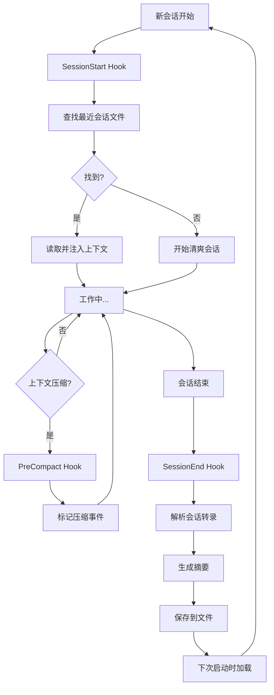

# 内存持久化钩子实现详解

> Everything Claude Code - Memory Persistence Hooks 深度代码分析

**生成时间**: 2026-02-21 18:40:10
**原文来源**: `github.com/affaan-m/everything-claude-code`
**分析范围**: SessionStart, SessionEnd, PreCompact 钩子的完整实现

---

## ❓ 快速问答

**Q: 内存持久化钩子是如何工作的？**

**A: 三个钩子协同工作，实现跨会话记忆**:
- 🚀 **SessionStart Hook** - 新会话开始时自动加载上次的工作状态
- 💾 **SessionEnd Hook** - 会话结束时自动保存摘要（任务、文件、工具）
- 🛡️ **PreCompact Hook** - 上下文压缩前标记事件，防止信息丢失

**核心价值**:
```
第一天工作 → SessionEnd 自动保存
    ↓ 隔天继续
第二天开始 → SessionStart 自动加载
    ↓ 结果
Claude 记得你昨天做了什么 ✅
```

---

## 目录

- [核心架构](#核心架构)
- [SessionStart Hook](#sessionstart-hook)
- [SessionEnd Hook](#sessionend-hook)
- [PreCompact Hook](#precompact-hook)
- [会话文件格式](#会话文件格式)
- [工作流程](#工作流程)
- [实现细节](#实现细节)
- [配置方法](#配置方法)
- [实际使用](#实际使用)
- [最佳实践](#最佳实践)

---

## 核心架构

### 三个钩子的协同工作



### 文件位置

```
everything-claude-code/
├── scripts/
│   ├── hooks/
│   │   ├── session-start.js       ← 81 行（加载上下文）
│   │   ├── session-end.js         ← 235 行（保存摘要）
│   │   └── pre-compact.js         ← 49 行（标记压缩）
│   └── lib/
│       ├── utils.js               ← 工具函数
│       ├── package-manager.js     ← session-start 依赖
│       └── session-aliases.js     ← session-start 依赖
│
└── ~/.claude/
    └── sessions/
        ├── 2026-02-20-abc123-session.tmp
        ├── 2026-02-21-xyz789-session.tmp
        └── compaction-log.txt
```

### Hook 配置

**在 `hooks/hooks.json` 中**:

```json
{
  "hooks": {
    "SessionStart": [{
      "matcher": "*",
      "hooks": [{
        "type": "command",
        "command": "node ${CLAUDE_PLUGIN_ROOT}/scripts/hooks/session-start.js"
      }],
      "description": "Load previous session context"
    }],

    "SessionEnd": [{
      "matcher": "*",
      "hooks": [{
        "type": "command",
        "command": "node ${CLAUDE_PLUGIN_ROOT}/scripts/hooks/session-end.js"
      }],
      "description": "Save session state"
    }],

    "PreCompact": [{
      "matcher": "*",
      "hooks": [{
        "type": "command",
        "command": "node ${CLAUDE_PLUGIN_ROOT}/scripts/hooks/pre-compact.js"
      }],
      "description": "Save state before compaction"
    }]
  }
}
```

---

## SessionStart Hook

### 功能概述

**目的**: 新会话开始时，自动加载上次会话的工作状态

**触发时机**: Claude Code 启动新会话时

**输出目标**: stdout（注入到 Claude 的上下文中）

### 完整代码解析

**文件**: `scripts/hooks/session-start.js` (81 行)

```javascript
#!/usr/bin/env node
/**
 * SessionStart Hook - Load previous context on new session
 *
 * 跨平台 (Windows, macOS, Linux)
 *
 * 功能：
 * - 查找最近 7 天的会话文件
 * - 自动加载最新会话的内容
 * - 报告可用的 learned skills
 * - 检测包管理器
 */

const {
  getSessionsDir,         // 获取 ~/.claude/sessions/
  getLearnedSkillsDir,    // 获取 ~/.claude/skills/learned/
  findFiles,              // 查找匹配的文件
  ensureDir,              // 确保目录存在
  readFile,               // 读取文件
  log,                    // 输出到 stderr（用户可见）
  output                  // 输出到 stdout（传递给 Claude）
} = require('../lib/utils');

const { getPackageManager, getSelectionPrompt } = require('../lib/package-manager');
const { listAliases } = require('../lib/session-aliases');

async function main() {
  // 1. 获取目录路径
  const sessionsDir = getSessionsDir();        // ~/.claude/sessions/
  const learnedDir = getLearnedSkillsDir();    // ~/.claude/skills/learned/

  // 2. 确保目录存在
  ensureDir(sessionsDir);
  ensureDir(learnedDir);

  // 3. 查找最近 7 天的会话文件
  const recentSessions = findFiles(
    sessionsDir,
    '*-session.tmp',
    { maxAge: 7 }  // 7 天内的文件
  );

  // 4. 如果找到会话文件
  if (recentSessions.length > 0) {
    const latest = recentSessions[0];  // findFiles 已按时间排序（最新的第一个）

    log(`[SessionStart] Found ${recentSessions.length} recent session(s)`);
    log(`[SessionStart] Latest: ${latest.path}`);

    // 5. 读取最新会话的内容
    const content = readFile(latest.path);

    // 6. 检查是否是有效内容（不是空模板）
    if (content && !content.includes('[Session context goes here]')) {
      // 7. 注入到 Claude 的上下文中（输出到 stdout）
      output(`Previous session summary:\n${content}`);
    }
  }

  // 8. 报告可用的 learned skills
  const learnedSkills = findFiles(learnedDir, '*.md');
  if (learnedSkills.length > 0) {
    log(`[SessionStart] ${learnedSkills.length} learned skill(s) available in ${learnedDir}`);
  }

  // 9. 报告可用的会话别名
  const aliases = listAliases({ limit: 5 });
  if (aliases.length > 0) {
    const aliasNames = aliases.map(a => a.name).join(', ');
    log(`[SessionStart] ${aliases.length} session alias(es) available: ${aliasNames}`);
    log(`[SessionStart] Use /sessions load <alias> to continue a previous session`);
  }

  // 10. 检测并报告包管理器
  const pm = getPackageManager();
  log(`[SessionStart] Package manager: ${pm.name} (${pm.source})`);

  // 11. 如果未找到包管理器配置，显示选择提示
  if (pm.source === 'default') {
    log('[SessionStart] No package manager preference found.');
    log(getSelectionPrompt());
  }

  process.exit(0);
}

main().catch(err => {
  console.error('[SessionStart] Error:', err.message);
  process.exit(0); // 出错也不阻塞 Claude
});
```

### 关键功能分解

#### 1. 查找最近的会话文件

```javascript
const recentSessions = findFiles(
  sessionsDir,           // 目录: ~/.claude/sessions/
  '*-session.tmp',       // 模式: 匹配所有会话文件
  { maxAge: 7 }          // 选项: 最近 7 天
);

// findFiles 返回结果示例:
[
  {
    path: '~/.claude/sessions/2026-02-21-abc123-session.tmp',
    mtime: 1708531200000  // 修改时间戳（毫秒）
  },
  {
    path: '~/.claude/sessions/2026-02-20-xyz789-session.tmp',
    mtime: 1708444800000
  }
]
// 已按 mtime 降序排序（最新的在前）
```

#### 2. 内容验证

```javascript
// 读取文件内容
const content = readFile(latest.path);

// 检查是否是有效内容
if (content && !content.includes('[Session context goes here]')) {
  // ✅ 有效：包含实际内容
  output(`Previous session summary:\n${content}`);
} else {
  // ❌ 无效：是空模板或不存在
  // 不注入任何内容
}
```

**为什么检查 `[Session context goes here]`？**

会话文件可能处于两种状态：

```markdown
# 状态 1: 空模板（刚创建，还没有内容）
## Current State
[Session context goes here]

### Completed
- [ ]

# 状态 2: 有实际内容
## Session Summary

### Tasks
- 实现了 JWT 认证
- 修复了 token 过期 bug

### Files Modified
- src/auth.js
- src/middleware/auth.js
```

只有状态 2 才应该被注入到新会话中。

#### 3. 输出到不同流

```javascript
// stderr - 用户可见的日志
log(`[SessionStart] Found ${recentSessions.length} recent session(s)`);
// 用户在终端看到：
// [SessionStart] Found 2 recent session(s)

// stdout - 传递给 Claude 的上下文
output(`Previous session summary:\n${content}`);
// Claude 接收到会话内容作为上下文
```

**stderr vs stdout 的区别**:

| 流 | 函数 | 目的 | 谁看到 |
|----|------|------|--------|
| stderr | `log()` | 状态信息、调试日志 | 用户 |
| stdout | `output()` | 传递给 Claude 的数据 | Claude |

---

## SessionEnd Hook

### 功能概述

**目的**: 会话结束时，自动保存会话摘要（任务、文件、工具）

**触发时机**: Claude Code 会话结束时

**数据来源**: 会话转录文件（JSONL 格式）

### 完整代码解析

**文件**: `scripts/hooks/session-end.js` (235 行)

```javascript
#!/usr/bin/env node
/**
 * SessionEnd Hook - Persist learnings when session ends
 *
 * 跨平台 (Windows, macOS, Linux)
 *
 * 功能：
 * - 解析会话转录文件（JSONL 格式）
 * - 提取关键信息：用户消息、工具使用、文件修改
 * - 生成结构化摘要
 * - 保存到会话文件
 */

const path = require('path');
const fs = require('fs');
const {
  getSessionsDir,
  getDateString,
  getTimeString,
  getSessionIdShort,
  ensureDir,
  readFile,
  writeFile,
  replaceInFile,
  log
} = require('../lib/utils');

/**
 * 从转录文件中提取会话摘要
 *
 * @param {string} transcriptPath - 转录文件路径
 * @returns {object|null} - 摘要对象或 null
 */
function extractSessionSummary(transcriptPath) {
  // 1. 读取转录文件
  const content = readFile(transcriptPath);
  if (!content) return null;

  // 2. 解析 JSONL（每行一个 JSON 对象）
  const lines = content.split('\n').filter(Boolean);

  // 3. 初始化收集器
  const userMessages = [];      // 用户消息列表
  const toolsUsed = new Set();  // 使用的工具集合
  const filesModified = new Set(); // 修改的文件集合
  let parseErrors = 0;

  // 4. 遍历每一行
  for (const line of lines) {
    try {
      const entry = JSON.parse(line);

      // ──────────────────────────────────
      // A. 收集用户消息
      // ──────────────────────────────────
      if (entry.type === 'user' || entry.role === 'user' || entry.message?.role === 'user') {
        // 提取文本内容（支持多种格式）
        const rawContent = entry.message?.content ?? entry.content;

        let text = '';
        if (typeof rawContent === 'string') {
          // 简单字符串
          text = rawContent;
        } else if (Array.isArray(rawContent)) {
          // 内容块数组
          text = rawContent.map(c => (c && c.text) || '').join(' ');
        }

        if (text.trim()) {
          userMessages.push(text.trim().slice(0, 200)); // 每条最多 200 字符
        }
      }

      // ──────────────────────────────────
      // B. 收集工具使用（直接 tool_use 条目）
      // ──────────────────────────────────
      if (entry.type === 'tool_use' || entry.tool_name) {
        const toolName = entry.tool_name || entry.name || '';
        if (toolName) toolsUsed.add(toolName);

        // 如果是 Edit 或 Write，记录文件路径
        const filePath = entry.tool_input?.file_path || entry.input?.file_path || '';
        if (filePath && (toolName === 'Edit' || toolName === 'Write')) {
          filesModified.add(filePath);
        }
      }

      // ──────────────────────────────────
      // C. 收集工具使用（assistant 消息中的内容块）
      // ──────────────────────────────────
      if (entry.type === 'assistant' && Array.isArray(entry.message?.content)) {
        for (const block of entry.message.content) {
          if (block.type === 'tool_use') {
            const toolName = block.name || '';
            if (toolName) toolsUsed.add(toolName);

            const filePath = block.input?.file_path || '';
            if (filePath && (toolName === 'Edit' || toolName === 'Write')) {
              filesModified.add(filePath);
            }
          }
        }
      }
    } catch {
      parseErrors++;
    }
  }

  // 5. 报告解析错误（如果有）
  if (parseErrors > 0) {
    log(`[SessionEnd] Skipped ${parseErrors}/${lines.length} unparseable transcript lines`);
  }

  // 6. 验证是否有内容
  if (userMessages.length === 0) return null;

  // 7. 返回摘要对象
  return {
    userMessages: userMessages.slice(-10),          // 最后 10 条用户消息
    toolsUsed: Array.from(toolsUsed).slice(0, 20),  // 最多 20 个工具
    filesModified: Array.from(filesModified).slice(0, 30), // 最多 30 个文件
    totalMessages: userMessages.length
  };
}

// ════════════════════════════════════════════════════════
// 主函数
// ════════════════════════════════════════════════════════

// 读取 hook 输入（从 stdin）
const MAX_STDIN = 1024 * 1024;
let stdinData = '';
process.stdin.setEncoding('utf8');

process.stdin.on('data', chunk => {
  if (stdinData.length < MAX_STDIN) {
    stdinData += chunk;
  }
});

process.stdin.on('end', () => {
  runMain();
});

function runMain() {
  main().catch(err => {
    console.error('[SessionEnd] Error:', err.message);
    process.exit(0);
  });
}

async function main() {
  // 1. 解析 stdin JSON 获取转录文件路径
  let transcriptPath = null;
  try {
    const input = JSON.parse(stdinData);
    transcriptPath = input.transcript_path;
  } catch {
    // 回退：尝试环境变量（向后兼容）
    transcriptPath = process.env.CLAUDE_TRANSCRIPT_PATH;
  }

  // 2. 获取会话信息
  const sessionsDir = getSessionsDir();
  const today = getDateString();           // "2026-02-21"
  const shortId = getSessionIdShort();     // "abc123" 或项目名
  const sessionFile = path.join(sessionsDir, `${today}-${shortId}-session.tmp`);

  ensureDir(sessionsDir);

  const currentTime = getTimeString();     // "18:40"

  // 3. 尝试从转录文件提取摘要
  let summary = null;
  if (transcriptPath) {
    if (fs.existsSync(transcriptPath)) {
      summary = extractSessionSummary(transcriptPath);
    } else {
      log(`[SessionEnd] Transcript not found: ${transcriptPath}`);
    }
  }

  // 4. 更新或创建会话文件
  if (fs.existsSync(sessionFile)) {
    // ──────────────────────────────────
    // 场景 A: 会话文件已存在（更新）
    // ──────────────────────────────────

    // 更新 "Last Updated" 时间戳
    const updated = replaceInFile(
      sessionFile,
      /\*\*Last Updated:\*\*.*/,
      `**Last Updated:** ${currentTime}`
    );

    if (!updated) {
      log(`[SessionEnd] Failed to update timestamp in ${sessionFile}`);
    }

    // 如果有新摘要且文件仍是空模板，替换内容
    if (summary) {
      const existing = readFile(sessionFile);
      if (existing && existing.includes('[Session context goes here]')) {
        const updatedContent = existing.replace(
          /## Current State\s*\n\s*\[Session context goes here\][\s\S]*?### Context to Load\s*\n```\s*\n\[relevant files\]\s*\n```/,
          buildSummarySection(summary)
        );
        writeFile(sessionFile, updatedContent);
      }
    }

    log(`[SessionEnd] Updated session file: ${sessionFile}`);
  } else {
    // ──────────────────────────────────
    // 场景 B: 会话文件不存在（创建）
    // ──────────────────────────────────

    const summarySection = summary
      ? buildSummarySection(summary)
      : `## Current State\n\n[Session context goes here]\n\n### Completed\n- [ ]\n\n### In Progress\n- [ ]\n\n### Notes for Next Session\n-\n\n### Context to Load\n\`\`\`\n[relevant files]\n\`\`\``;

    const template = `# Session: ${today}
**Date:** ${today}
**Started:** ${currentTime}
**Last Updated:** ${currentTime}

---

${summarySection}
`;

    writeFile(sessionFile, template);
    log(`[SessionEnd] Created session file: ${sessionFile}`);
  }

  process.exit(0);
}

/**
 * 构建摘要部分的 Markdown
 *
 * @param {object} summary - 摘要对象
 * @returns {string} - Markdown 格式的摘要
 */
function buildSummarySection(summary) {
  let section = '## Session Summary\n\n';

  // 任务列表（从用户消息生成）
  section += '### Tasks\n';
  for (const msg of summary.userMessages) {
    // 折叠换行符，转义反引号
    section += `- ${msg.replace(/\n/g, ' ').replace(/`/g, '\\`')}\n`;
  }
  section += '\n';

  // 修改的文件
  if (summary.filesModified.length > 0) {
    section += '### Files Modified\n';
    for (const f of summary.filesModified) {
      section += `- ${f}\n`;
    }
    section += '\n';
  }

  // 使用的工具
  if (summary.toolsUsed.length > 0) {
    section += `### Tools Used\n${summary.toolsUsed.join(', ')}\n\n`;
  }

  // 统计信息
  section += `### Stats\n- Total user messages: ${summary.totalMessages}\n`;

  return section;
}
```

### 转录文件格式

**JSONL 格式** (JSON Lines):

```jsonl
{"type":"user","message":{"role":"user","content":"实现 JWT 认证"}}
{"type":"assistant","message":{"role":"assistant","content":[{"type":"text","text":"我会实现 JWT 认证。"},{"type":"tool_use","name":"Edit","input":{"file_path":"src/auth.js","old_string":"...","new_string":"..."}}]}}
{"type":"tool_result","tool_use_id":"123","content":"File edited successfully"}
{"type":"user","message":{"role":"user","content":"添加刷新 token 功能"}}
{"type":"assistant","message":{"role":"assistant","content":[{"type":"tool_use","name":"Write","input":{"file_path":"src/token.js","content":"..."}}]}}
```

**解析逻辑**:

```javascript
// 每一行是独立的 JSON 对象
const lines = content.split('\n').filter(Boolean);

for (const line of lines) {
  const entry = JSON.parse(line);

  // 根据 entry.type 处理
  switch (entry.type) {
    case 'user':
      // 收集用户消息
      break;
    case 'assistant':
      // 从 content blocks 中提取 tool_use
      break;
    case 'tool_use':
      // 直接记录工具使用
      break;
  }
}
```

### 生成的摘要示例

```markdown
## Session Summary

### Tasks
- 实现 JWT 认证
- 修复 token 过期的 bug
- 添加刷新 token 功能
- 实现 token 黑名单

### Files Modified
- src/auth.js
- src/middleware/auth.js
- src/services/token.service.js
- tests/auth.test.js

### Tools Used
Edit, Write, Bash, Read, Grep

### Stats
- Total user messages: 15
```

---

## PreCompact Hook

### 功能概述

**目的**: 上下文压缩前，记录压缩事件并标记时间

**触发时机**: Claude Code 执行上下文压缩前

**输出目标**: 会话文件和压缩日志

### 完整代码解析

**文件**: `scripts/hooks/pre-compact.js` (49 行)

```javascript
#!/usr/bin/env node
/**
 * PreCompact Hook - Save state before context compaction
 *
 * 跨平台 (Windows, macOS, Linux)
 *
 * 功能：
 * - 记录压缩事件到日志
 * - 在活动会话文件中标记压缩时间点
 */

const path = require('path');
const {
  getSessionsDir,
  getDateTimeString,
  getTimeString,
  findFiles,
  ensureDir,
  appendFile,
  log
} = require('../lib/utils');

async function main() {
  // 1. 获取会话目录
  const sessionsDir = getSessionsDir();
  const compactionLog = path.join(sessionsDir, 'compaction-log.txt');

  ensureDir(sessionsDir);

  // 2. 记录压缩事件到日志文件
  const timestamp = getDateTimeString();  // "2026-02-21 18:40:10"
  appendFile(compactionLog, `[${timestamp}] Context compaction triggered\n`);

  // 3. 在活动会话文件中标记
  const sessions = findFiles(sessionsDir, '*-session.tmp');

  if (sessions.length > 0) {
    const activeSession = sessions[0].path;  // 最新的会话文件
    const timeStr = getTimeString();         // "18:40"

    appendFile(
      activeSession,
      `\n---\n**[Compaction occurred at ${timeStr}]** - Context was summarized\n`
    );
  }

  log('[PreCompact] State saved before compaction');
  process.exit(0);
}

main().catch(err => {
  console.error('[PreCompact] Error:', err.message);
  process.exit(0);
});
```

### 关键功能

#### 1. 压缩日志

**文件**: `~/.claude/sessions/compaction-log.txt`

```
[2026-02-21 14:30:15] Context compaction triggered
[2026-02-21 16:45:22] Context compaction triggered
[2026-02-21 18:40:10] Context compaction triggered
```

**用途**:
- 追踪压缩频率
- 调试压缩问题
- 分析上下文使用模式

#### 2. 会话文件标记

**效果** - 在会话文件中添加标记:

```markdown
# Session: 2026-02-21
...

---
**[Compaction occurred at 14:30]** - Context was summarized

[继续工作...]

---
**[Compaction occurred at 16:45]** - Context was summarized

[继续工作...]
```

**价值**:
- 了解哪些信息可能在压缩中丢失
- 追溯问题发生的时间点
- 评估压缩对工作流的影响

---

## 会话文件格式

### 标准模板

**创建时** (SessionEnd, 无转录数据):

```markdown
# Session: 2026-02-21
**Date:** 2026-02-21
**Started:** 18:40
**Last Updated:** 18:40

---

## Current State

[Session context goes here]

### Completed
- [ ]

### In Progress
- [ ]

### Notes for Next Session
-

### Context to Load
```
[relevant files]
```
```

### 有数据的会话文件

**会话结束后** (SessionEnd, 有转录数据):

```markdown
# Session: 2026-02-21
**Date:** 2026-02-21
**Started:** 09:30
**Last Updated:** 17:45

---

## Session Summary

### Tasks
- 实现 JWT 认证功能
- 修复 token 过期的 bug
- 添加刷新 token 逻辑
- 实现 token 黑名单

### Files Modified
- src/auth.js
- src/middleware/auth.js
- src/services/token.service.js
- src/routes/auth.js
- tests/auth.test.js

### Tools Used
Edit, Write, Bash, Read, Grep, Glob

### Stats
- Total user messages: 15

---
**[Compaction occurred at 14:30]** - Context was summarized

---
**[Compaction occurred at 16:45]** - Context was summarized
```

### 手动扩展的会话文件

**用户可以手动添加内容**:

```markdown
# Session: Auth Feature Implementation
**Date:** 2026-02-21
**Started:** 09:30
**Last Updated:** 17:45

---

## Session Summary
[自动生成的摘要]

---

## What Worked ✅
- JWT RS256 签名（使用密钥对）
- Redis 存储刷新 token（7 天 TTL）
- 15 分钟访问 token 过期时间

## What Didn't Work ❌
- HS256 签名
  - 问题：无法安全分发密钥
  - 浪费时间：2 小时

- PostgreSQL 存储刷新 token
  - 问题：高频验证太慢
  - 浪费时间：1 小时

## What's Left to Do 📝
- [ ] 添加速率限制到认证端点
- [ ] 实现 token 黑名单用于登出
- [ ] 添加 CSRF 保护（cookie-based storage）

## Key Decisions 🎯
- 使用 RS256 而不是 HS256（微服务架构）
- 15 分钟访问 token 过期（安全/UX 平衡）
- 刷新 token 轮换（每次使用时）

## Code Locations 📂
- `src/middleware/auth.js` - JWT 验证中间件
- `src/routes/auth.js` - Login/logout/refresh 端点
- `src/services/token.service.js` - Token 生成和验证

## Blockers Encountered 🚧
1. **jsonwebtoken v9.x breaking change**
   - `verify()` 签名变化
   - 解决方案：更新错误处理为 instanceof 检查

2. **Redis TTL 格式混淆**
   - 传入毫秒但期望秒
   - 解决方案：使用字符串格式 `expiresIn: '15m'`

---
**[Compaction occurred at 14:30]** - Context was summarized
```

---

## 工作流程

### 第一天工作

```
09:00 - 启动 Claude
  ↓ SessionStart Hook
  [SessionStart] No recent sessions found

09:05 - 开始工作
  You: "实现 JWT 认证"
  Claude: [实现代码...]

12:00 - 工作中，上下文接近限制
  ↓ PreCompact Hook
  [PreCompact] State saved before compaction
  [会话文件中添加压缩标记]
  ↓ 上下文压缩
  [保留重要信息，清除细节]

17:45 - 结束会话 (Ctrl+D)
  ↓ SessionEnd Hook
  [SessionEnd] Created session file: 2026-02-21-abc123-session.tmp

  生成的会话文件:
  ├─ 任务：实现 JWT 认证, 修复 bug...
  ├─ 文件：src/auth.js, src/middleware/auth.js...
  ├─ 工具：Edit, Write, Bash, Read...
  └─ 统计：15 条用户消息
```

### 第二天继续

```
09:00 - 启动 Claude
  ↓ SessionStart Hook
  [SessionStart] Found 1 recent session(s)
  [SessionStart] Latest: ~/.claude/sessions/2026-02-21-abc123-session.tmp

  ↓ 自动注入上下文
  Previous session summary:
  ## Session Summary
  ### Tasks
  - 实现 JWT 认证
  - 修复 token 过期的 bug
  ...

09:05 - Claude 有上下文
  You: "继续实现速率限制"

  Claude: "根据昨天的工作，你已经完成了 JWT 认证的基础实现。
          我看到你修改了 src/auth.js 和 src/middleware/auth.js。
          现在我会在这些文件的基础上添加速率限制..."

  ✅ Claude 记得昨天做了什么！
```

### 多天项目

```
第 1 天：
2026-02-19-feature-auth.tmp
  ├─ 任务：搭建 JWT 基础结构
  └─ 文件：src/auth.js, src/services/token.service.js

第 2 天：
2026-02-20-feature-auth.tmp
  ├─ 任务：实现刷新 token, 修复 bug
  └─ 文件：src/routes/auth.js, src/middleware/auth.js

第 3 天：
2026-02-21-feature-auth.tmp
  ├─ 任务：添加速率限制, token 黑名单
  └─ 文件：src/middleware/rate-limit.js

第 4 天启动时：
  ↓ SessionStart Hook
  [SessionStart] Found 3 recent session(s)
  [SessionStart] Latest: 2026-02-21-feature-auth.tmp

  ↓ 加载最新会话
  加载第 3 天的工作状态
```

---

## 实现细节

### 1. 文件命名策略

**格式**: `YYYY-MM-DD-{session-id}-session.tmp`

**session-id 来源**:
```javascript
function getSessionIdShort(fallback = 'default') {
  const sessionId = process.env.CLAUDE_SESSION_ID;
  if (sessionId && sessionId.length > 0) {
    return sessionId.slice(-8);  // 最后 8 个字符
  }
  return getProjectName() || fallback;  // 回退到项目名
}

// 示例:
// CLAUDE_SESSION_ID=abc123def456 → "def456"
// 项目名: myapp → "myapp"
// 默认: "default"

// 最终文件名:
// 2026-02-21-def456-session.tmp
// 2026-02-21-myapp-session.tmp
// 2026-02-21-default-session.tmp
```

**为什么这样设计？**
- ✅ 按日期组织（易于查找）
- ✅ 会话隔离（不同项目不混淆）
- ✅ 时间排序（自动按修改时间）

### 2. 7 天过期策略

```javascript
const recentSessions = findFiles(
  sessionsDir,
  '*-session.tmp',
  { maxAge: 7 }  // 7 天内的文件
);

// findFiles 实现:
function findFiles(dir, pattern, options = {}) {
  const { maxAge = null } = options;

  for (const file of files) {
    const stats = fs.statSync(file);

    if (maxAge !== null) {
      const ageInDays = (Date.now() - stats.mtimeMs) / (1000 * 60 * 60 * 24);
      if (ageInDays <= maxAge) {
        results.push(file);  // 只包含 7 天内的
      }
    }
  }

  return results;
}
```

**为什么是 7 天？**
- ✅ 覆盖正常工作周
- ✅ 避免旧会话污染
- ✅ 自动清理（不需要手动删除）

### 3. 转录文件解析的健壮性

```javascript
for (const line of lines) {
  try {
    const entry = JSON.parse(line);
    // 处理 entry...
  } catch {
    parseErrors++;  // 记录错误但继续
  }
}

// 报告但不中断
if (parseErrors > 0) {
  log(`[SessionEnd] Skipped ${parseErrors}/${lines.length} unparseable transcript lines`);
}
```

**为什么这样处理？**
- ✅ 部分损坏的转录不会完全失败
- ✅ 记录问题便于调试
- ✅ 尽可能提取有用信息

### 4. 内容块提取的多种格式支持

```javascript
// 格式 1: 简单字符串
"content": "实现 JWT 认证"

// 格式 2: 内容块数组
"content": [
  { "type": "text", "text": "我会实现..." },
  { "type": "tool_use", "name": "Edit", ... }
]

// 格式 3: 嵌套消息
"message": {
  "role": "user",
  "content": "..."
}

// 统一处理:
const rawContent = entry.message?.content ?? entry.content;

let text = '';
if (typeof rawContent === 'string') {
  text = rawContent;
} else if (Array.isArray(rawContent)) {
  text = rawContent.map(c => (c && c.text) || '').join(' ');
}
```

### 5. 工具使用的两种来源

```javascript
// 来源 1: 直接 tool_use 条目
{
  "type": "tool_use",
  "tool_name": "Edit",
  "tool_input": { "file_path": "src/auth.js" }
}

// 来源 2: assistant 消息的内容块
{
  "type": "assistant",
  "message": {
    "content": [
      {
        "type": "tool_use",
        "name": "Edit",
        "input": { "file_path": "src/auth.js" }
      }
    ]
  }
}

// 两种都要收集
if (entry.type === 'tool_use' || entry.tool_name) {
  // 处理来源 1
}

if (entry.type === 'assistant' && Array.isArray(entry.message?.content)) {
  for (const block of entry.message.content) {
    if (block.type === 'tool_use') {
      // 处理来源 2
    }
  }
}
```

---

## 配置方法

### 基础配置

**在 `~/.claude/settings.json` 中**:

```json
{
  "hooks": {
    "SessionStart": [{
      "matcher": "*",
      "hooks": [{
        "type": "command",
        "command": "node ~/.claude/scripts/hooks/session-start.js"
      }],
      "description": "Load previous session context"
    }],

    "SessionEnd": [{
      "matcher": "*",
      "hooks": [{
        "type": "command",
        "command": "node ~/.claude/scripts/hooks/session-end.js"
      }],
      "description": "Save session state"
    }],

    "PreCompact": [{
      "matcher": "*",
      "hooks": [{
        "type": "command",
        "command": "node ~/.claude/scripts/hooks/pre-compact.js"
      }],
      "description": "Save state before compaction"
    }]
  }
}
```

### 安装步骤

**1. 复制钩子脚本**:

```bash
# 创建目录
mkdir -p ~/.claude/scripts/hooks
mkdir -p ~/.claude/scripts/lib

# 复制钩子脚本
cp everything-claude-code/scripts/hooks/session-start.js ~/.claude/scripts/hooks/
cp everything-claude-code/scripts/hooks/session-end.js ~/.claude/scripts/hooks/
cp everything-claude-code/scripts/hooks/pre-compact.js ~/.claude/scripts/hooks/

# 复制工具库
cp everything-claude-code/scripts/lib/utils.js ~/.claude/scripts/lib/
cp everything-claude-code/scripts/lib/package-manager.js ~/.claude/scripts/lib/
cp everything-claude-code/scripts/lib/session-aliases.js ~/.claude/scripts/lib/

# 设置可执行权限
chmod +x ~/.claude/scripts/hooks/*.js
```

**2. 配置 hooks**:

```bash
# 编辑配置文件
nano ~/.claude/settings.json

# 添加上面的 hooks 配置
```

**3. 创建会话目录**:

```bash
mkdir -p ~/.claude/sessions
```

**4. 测试**:

```bash
# 启动 Claude
claude

# 查看日志
[SessionStart] No recent sessions found
[SessionStart] Package manager: npm (detected)

# 工作一段时间后退出
Ctrl+D

# 查看生成的文件
ls -la ~/.claude/sessions/
# 应该看到: 2026-02-21-xxx-session.tmp

# 再次启动
claude

# 应该看到
[SessionStart] Found 1 recent session(s)
[SessionStart] Latest: ~/.claude/sessions/2026-02-21-xxx-session.tmp
Previous session summary:
...
```

---

## 实际使用

### 场景 1: 跨天继续项目

**第一天**:

```bash
$ cd ~/projects/myapp
$ claude

You: "实现用户认证模块，使用 JWT"

Claude: [实现代码...]
  - 创建 src/auth.js
  - 创建 src/middleware/auth.js
  - 编写测试

You: "运行测试"
Claude: [运行 npm test]

17:00 - 下班
You: Ctrl+D

[SessionEnd] Created session file:
~/.claude/sessions/2026-02-21-myapp-session.tmp
```

**第二天**:

```bash
$ cd ~/projects/myapp
$ claude

[SessionStart] Found 1 recent session(s)
[SessionStart] Latest: ~/.claude/sessions/2026-02-21-myapp-session.tmp

Previous session summary:
## Session Summary

### Tasks
- 实现用户认证模块，使用 JWT
- 运行测试

### Files Modified
- src/auth.js
- src/middleware/auth.js
- tests/auth.test.js

You: "继续，添加刷新 token 功能"

Claude: "根据昨天的工作，你已经实现了基本的 JWT 认证。
        我看到你创建了 src/auth.js 和中间件。
        现在我会添加刷新 token 功能..."

✅ Claude 知道你昨天做了什么！
```

### 场景 2: 上下文压缩的追踪

**工作中**:

```bash
09:00 - 启动并工作
  [大量 Read, Grep, Edit 操作]
  [上下文逐渐增长...]

14:30 - 接近上下文限制
  [PreCompact] State saved before compaction
  [上下文自动压缩]

  会话文件自动添加:
  ---
  **[Compaction occurred at 14:30]** - Context was summarized

14:35 - 继续工作
  [在压缩后的上下文中继续]

16:45 - 再次压缩
  [PreCompact] State saved before compaction

  会话文件再次添加:
  ---
  **[Compaction occurred at 16:45]** - Context was summarized

17:00 - 结束会话
  查看会话文件:

  # Session: 2026-02-21
  ...

  ---
  **[Compaction occurred at 14:30]** - Context was summarized

  ---
  **[Compaction occurred at 16:45]** - Context was summarized

  ✅ 可以追踪哪些时间点发生了压缩
```

### 场景 3: 多项目切换

**项目 A (上午)**:

```bash
$ cd ~/projects/project-a
$ export CLAUDE_SESSION_ID=project-a
$ claude

[工作...]

Ctrl+D
[SessionEnd] Created: 2026-02-21-project-a-session.tmp
```

**项目 B (下午)**:

```bash
$ cd ~/projects/project-b
$ export CLAUDE_SESSION_ID=project-b
$ claude

[工作...]

Ctrl+D
[SessionEnd] Created: 2026-02-21-project-b-session.tmp
```

**第二天，项目 A**:

```bash
$ cd ~/projects/project-a
$ export CLAUDE_SESSION_ID=project-a
$ claude

[SessionStart] Latest: 2026-02-21-project-a-session.tmp
Previous session summary:
[加载项目 A 的上下文]

✅ 只加载项目 A 的会话，不会混入项目 B 的内容
```

---

## 最佳实践

### 1. 手动扩展会话文件

**自动生成的内容** (SessionEnd):
```markdown
## Session Summary

### Tasks
- 实现 JWT 认证
- 修复 bug

### Files Modified
- src/auth.js
```

**手动扩展** (你可以编辑文件添加):
```markdown
## Session Summary
[自动生成的部分]

---

## What Worked ✅
- JWT RS256 signing
  - Evidence: Tests pass, no validation errors

## What Didn't Work ❌
- HS256 signing
  - Problem: Can't distribute keys securely
  - Time wasted: 2 hours
  - Lesson: Use RS256 for microservices

## Next Steps 📝
- [ ] Add rate limiting
- [ ] Implement token blacklist
- [ ] Add CSRF protection

## Key Decisions 🎯
- 15-minute access token expiry (security/UX balance)
- Refresh token rotation (security best practice)
```

**为什么手动扩展？**
- ✅ 记录失败的方法（自动提取不到）
- ✅ 记录关键决策（避免下次重新思考）
- ✅ 记录证据（测试结果、性能数据）
- ✅ 优先级排序（下次从哪里开始）

### 2. 定期清理旧会话

```bash
# 查看所有会话文件
ls -lah ~/.claude/sessions/

# 删除 30 天前的会话
find ~/.claude/sessions -name "*-session.tmp" -mtime +30 -delete

# 或创建自动清理脚本
# ~/.claude/scripts/cleanup-old-sessions.sh
#!/bin/bash
find ~/.claude/sessions -name "*-session.tmp" -mtime +30 -delete
find ~/.claude/sessions -name "compaction-log.txt" -mtime +90 -delete

# 添加到 cron (每周日运行)
0 0 * * 0 ~/.claude/scripts/cleanup-old-sessions.sh
```

### 3. 会话文件命名策略

**使用有意义的 session ID**:

```bash
# 按功能命名
export CLAUDE_SESSION_ID=feature-auth
claude
# 生成: 2026-02-21-feature-auth-session.tmp

# 按 bug 编号
export CLAUDE_SESSION_ID=bug-1234
claude
# 生成: 2026-02-21-bug-1234-session.tmp

# 按任务类型
export CLAUDE_SESSION_ID=refactor-db
claude
# 生成: 2026-02-21-refactor-db-session.tmp
```

**创建别名**:

```bash
# ~/.bashrc
alias claude-feature='export CLAUDE_SESSION_ID=feature-$(date +%Y%m%d) && claude'
alias claude-bugfix='export CLAUDE_SESSION_ID=bugfix-$(date +%Y%m%d) && claude'
alias claude-refactor='export CLAUDE_SESSION_ID=refactor-$(date +%Y%m%d) && claude'
```

### 4. 版本控制会话文件

**对于重要项目**:

```bash
# 在项目中创建会话目录
mkdir -p .claude-sessions

# 复制重要会话
cp ~/.claude/sessions/2026-02-21-myapp-session.tmp \
   .claude-sessions/2026-02-21-auth-implementation.md

# 纳入版本控制
git add .claude-sessions/
git commit -m "docs: add session notes for auth implementation"
```

**好处**:
- ✅ 团队共享知识
- ✅ 追踪决策演变
- ✅ 项目文档的一部分

### 5. 组合其他工具

**与 continuous-learning 配合**:

```
SessionEnd Hook
    ↓ 保存会话摘要
Continuous Learning Skill
    ↓ 评估模式
提取可复用知识
    ↓ 保存为
~/.claude/skills/learned/
    ↓ 下次启动
SessionStart Hook
    ↓ 加载
Skills + 会话上下文
```

**与 strategic-compact 配合**:

```
工作中...
    ↓ 50 次工具调用
Strategic Compact
    ↓ 建议压缩
你决定压缩
    ↓ 执行 /compact
PreCompact Hook
    ↓ 标记事件
会话文件更新
```

---

## 总结

### 核心价值

**解决的核心问题**:

```
传统方式:
  每次启动 Claude → 从零开始
  没有记忆 → 重复解释上下文
  浪费时间 → 低效工作

内存持久化钩子:
  每次启动 Claude → 自动加载上次状态
  有记忆 → 知道你昨天做了什么
  节省时间 → 高效继续工作
```

### 三个钩子的角色

| 钩子 | 触发时机 | 功能 | 输出 |
|------|---------|------|------|
| **SessionStart** | 新会话开始 | 加载上次工作状态 | 注入到 Claude 上下文 |
| **SessionEnd** | 会话结束 | 保存本次工作摘要 | 保存到会话文件 |
| **PreCompact** | 上下文压缩前 | 标记压缩事件 | 更新会话文件和日志 |

### 文件结构

```
~/.claude/
└── sessions/
    ├── 2026-02-19-feature-auth-session.tmp    ← 第 1 天
    ├── 2026-02-20-feature-auth-session.tmp    ← 第 2 天
    ├── 2026-02-21-feature-auth-session.tmp    ← 第 3 天（最新）
    └── compaction-log.txt                     ← 压缩日志
```

### 实施检查清单

**最小设置** (10 分钟):

- [ ] 复制 3 个钩子脚本到 `~/.claude/scripts/hooks/`
- [ ] 复制工具库到 `~/.claude/scripts/lib/`
- [ ] 在 `settings.json` 中配置 hooks
- [ ] 创建 `~/.claude/sessions/` 目录
- [ ] 测试：启动 → 工作 → 退出 → 再启动

**推荐设置** (20 分钟):

- [ ] 设置有意义的 session ID
- [ ] 创建清理旧会话的脚本
- [ ] 手动扩展第一个会话文件（作为模板）
- [ ] 配置自动清理 cron 任务

**高级设置** (30 分钟):

- [ ] 将会话文件纳入项目版本控制
- [ ] 与 continuous-learning 集成
- [ ] 与 strategic-compact 配合使用
- [ ] 创建会话分析脚本

### 最佳实践总结

1. **✅ 让钩子自动工作** - 不需要手动操作
2. **✅ 手动扩展重要会话** - 添加失败的方法、关键决策
3. **✅ 定期清理旧会话** - 避免目录混乱
4. **✅ 使用有意义的命名** - 便于识别和搜索
5. **✅ 重要会话纳入版本控制** - 团队共享知识
6. **❌ 不要依赖自动摘要** - 手动添加上下文更有价值
7. **❌ 不要忽略压缩标记** - 了解信息丢失的时间点
8. **❌ 不要在会话文件中存储敏感信息** - 密码、API 密钥等

---

## 参考资源

### 官方文档

**the-longform-guide.md**:
- 第 77-86 行：内存持久化钩子介绍
- PreCompact, Stop, SessionStart 钩子说明

**hooks/README.md**:
- 第 40-47 行：生命周期钩子列表
- SessionStart, SessionEnd, PreCompact 描述

### 相关文件

**核心实现**:
- `scripts/hooks/session-start.js` (81 行)
- `scripts/hooks/session-end.js` (235 行)
- `scripts/hooks/pre-compact.js` (49 行)

**工具库**:
- `scripts/lib/utils.js` (530 行)
- `scripts/lib/package-manager.js`
- `scripts/lib/session-aliases.js`

**示例**:
- `examples/sessions/` - 会话文件示例

### 相关技术

**配合使用**:
- Continuous Learning - 提取可复用模式
- Strategic Compact - 战略性压缩
- Dynamic System Prompt Injection - 动态上下文

### GitHub Repository

- https://github.com/affaan-m/everything-claude-code
- 完整实现和示例

---

## 附录

### A. 会话文件模板

**基础模板**:

```markdown
# Session: [Feature/Bug Name]
**Date:** YYYY-MM-DD
**Started:** HH:MM
**Last Updated:** HH:MM

---

## What Worked ✅
- [成功的方法]
  - Evidence: [证据]
  - Impact: [影响]

## What Didn't Work ❌
- [失败的方法]
  - Problem: [问题]
  - Time wasted: [浪费时间]
  - Lesson: [经验教训]

## What's Left to Do 📝
- [ ] [待完成任务 1]
- [ ] [待完成任务 2]

## Key Decisions 🎯
- [关键决策 1]
  - Reason: [原因]
  - Trade-off: [权衡]

## Code Locations 📂
- `[file-path]` - [描述]

## Blockers Encountered 🚧
1. **[阻碍名称]**
   - Issue: [问题描述]
   - Solution: [解决方案]

---

## Session Summary (Auto-generated)
[SessionEnd Hook 自动生成的内容]

---
**[Compaction occurred at HH:MM]** - Context was summarized
```

### B. 快速参考卡

```
╔════════════════════════════════════════════════════════╗
║  Memory Persistence Hooks - Quick Reference           ║
╠════════════════════════════════════════════════════════╣
║  三个钩子                                               ║
║  SessionStart  → 加载上次状态（会话开始）               ║
║  SessionEnd    → 保存本次摘要（会话结束）               ║
║  PreCompact    → 标记压缩事件（压缩前）                 ║
║                                                        ║
║  会话文件位置                                           ║
║  ~/.claude/sessions/YYYY-MM-DD-{id}-session.tmp       ║
║                                                        ║
║  自动提取内容                                           ║
║  - 用户消息（任务）                                     ║
║  - 工具使用（Edit, Write, Bash...）                    ║
║  - 文件修改（file_path）                               ║
║                                                        ║
║  手动扩展建议                                           ║
║  - What Worked ✅                                      ║
║  - What Didn't Work ❌                                 ║
║  - Key Decisions 🎯                                    ║
║  - Blockers 🚧                                         ║
╚════════════════════════════════════════════════════════╝
```

---

**文档生成时间**: 2026-02-21 18:40:10
**分析作者**: Claude Sonnet 4.5 (AI Assistant)
**基于版本**: everything-claude-code (latest commit)
**总代码量**: 365 行（3 个钩子 + 依赖库）
