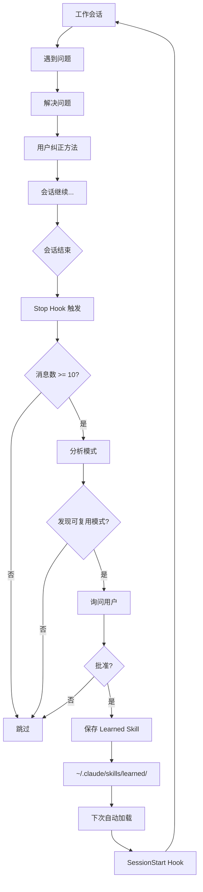
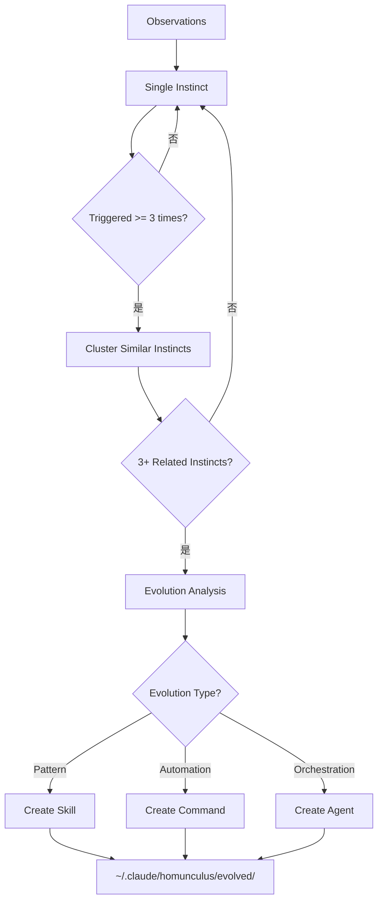

# 持续学习系统完整实现

> Everything Claude Code - Continuous Learning System 深度解析

**生成时间**: 2026-02-21 19:24:10
**原文来源**: `github.com/affaan-m/everything-claude-code/skills/continuous-learning`
**分析范围**: v1 和 v2 架构、实现代码、配置方法、最佳实践

---

## ❓ 快速问答

**Q: 持续学习系统是什么？**

**A: 自动将重复出现的解决方案转化为可复用知识**

```
传统方式:
  问题 1 → 手动解决 (30 分钟)
  问题 2 (相同) → 再次手动 (20 分钟)
  问题 3 (相同) → 又手动 (15 分钟)
  ❌ 浪费: 65 分钟

持续学习:
  问题 1-2 → 手动解决
  系统自动学习 → 保存为 skill
  问题 3+ → 自动应用 (2 分钟) ✅
  💰 节省: 每次 13 分钟
```

**核心机制**:
- 🔍 **观察**: 会话结束时分析转录
- 🧠 **识别**: 发现可复用的模式
- 💾 **保存**: 存为 learned skill
- 🚀 **应用**: 下次自动加载

---

## 目录

- [核心概念](#核心概念)
- [两个版本对比](#两个版本对比)
- [v1 详解](#v1-详解)
- [v2 详解](#v2-详解)
- [最小安装方案](#最小安装方案)
- [配置详解](#配置详解)
- [实际使用](#实际使用)
- [模式类型](#模式类型)
- [最佳实践](#最佳实践)
- [故障排除](#故障排除)

---

## 核心概念

### 什么是持续学习？

**定义**: 一个自动化系统，通过观察你的工作会话，识别可复用的模式，并将其保存为可加载的 skills。

**核心价值**:

```
问题: 重复浪费时间
  ├─ 遇到相同问题多次
  ├─ 每次都要重新解决
  ├─ Claude 不记得上次的解决方案
  └─ 浪费大量时间和 token

解决方案: 持续学习
  ├─ 自动识别重复模式
  ├─ 保存为可复用 skill
  ├─ 下次自动应用
  └─ 积累式工作，不是重复式工作
```

### 工作原理



### 关键组件

| 组件 | 功能 | 触发时机 |
|------|------|---------|
| **Stop Hook** | 触发评估 | 会话结束 |
| **evaluate-session** | 分析转录 | Hook 调用 |
| **Pattern Detection** | 识别模式 | 分析过程 |
| **Learned Skills** | 存储知识 | 保存后 |
| **SessionStart Hook** | 加载知识 | 新会话 |

---

## 两个版本对比

### 概览表

| 特性 | v1 (Simple) | v2 (Instinct-Based) |
|------|------------|---------------------|
| **观察方式** | Stop hook（会话结束） | PreToolUse/PostToolUse（实时） |
| **分析方式** | 主会话上下文 | 后台 Haiku 代理 |
| **学习单元** | 完整 skills | 原子 "instincts" |
| **粒度** | 粗（一个 skill） | 细（多个 instincts） |
| **置信度** | 无 | 0.3-0.9 加权 |
| **演化路径** | 直接 → skill | instincts → cluster → skill |
| **共享机制** | 手动复制 | 导出/导入 instincts |
| **复杂度** | ⭐ 简单 | ⭐⭐⭐⭐ 复杂 |
| **可靠性** | ~80%（基于 skill 触发） | ~100%（基于 hook） |
| **token 成本** | 低 | 中（后台代理） |
| **适用场景** | ✅ 日常使用 | 🔬 高级研究 |
| **推荐** | ✅ 初学者 | 高级用户 |

### 架构对比

**v1 架构**:
```
会话 → Stop Hook → 分析（主会话）→ Skill → ~/.claude/skills/learned/
```

**v2 架构**:
```
会话 → PreToolUse/PostToolUse Hooks → observations.jsonl
                                             ↓
                    后台 Haiku 代理 → 分析 observations
                                             ↓
                                      Instincts (atomic)
                                             ↓
                                      Clustering
                                             ↓
                    Skills/Commands/Agents (evolved)
```

### 选择建议

**选择 v1 如果**:
- ✅ 刚开始使用 Claude Code
- ✅ 想要简单、可靠的解决方案
- ✅ 不想花时间配置复杂系统
- ✅ 日常工作足够

**选择 v2 如果**:
- 🔬 想要最先进的学习系统
- 🔬 愿意投入时间配置和调优
- 🔬 需要精细控制学习过程
- 🔬 想要导出/导入知识库

**推荐路径**: **先用 v1，熟悉后再考虑 v2**

---

## v1 详解

### 文件结构

```
skills/continuous-learning/
├── SKILL.md              ← 文档（119 行）
├── config.json           ← 配置（18 行）
└── evaluate-session.sh   ← 核心脚本（70 行）
```

### evaluate-session.sh 完整解析

```bash
#!/bin/bash
# Continuous Learning - Session Evaluator
# Runs on Stop hook to extract reusable patterns

set -e

# ════════════════════════════════════════════════════════
# 1. 初始化配置
# ════════════════════════════════════════════════════════

SCRIPT_DIR="$(cd "$(dirname "${BASH_SOURCE[0]}")" && pwd)"
CONFIG_FILE="$SCRIPT_DIR/config.json"
LEARNED_SKILLS_PATH="${HOME}/.claude/skills/learned"
MIN_SESSION_LENGTH=10

# ════════════════════════════════════════════════════════
# 2. 加载配置文件
# ════════════════════════════════════════════════════════

if [ -f "$CONFIG_FILE" ]; then
  # 检查 jq 是否安装
  if ! command -v jq &>/dev/null; then
    echo "[ContinuousLearning] jq is required but not installed, using defaults" >&2
  else
    # 从 config.json 读取配置
    MIN_SESSION_LENGTH=$(jq -r '.min_session_length // 10' "$CONFIG_FILE")

    # 处理 ~ 在路径中
    LEARNED_SKILLS_PATH=$(jq -r '.learned_skills_path // "~/.claude/skills/learned/"' "$CONFIG_FILE" | sed "s|~|$HOME|")
  fi
fi

# ════════════════════════════════════════════════════════
# 3. 确保目录存在
# ════════════════════════════════════════════════════════

mkdir -p "$LEARNED_SKILLS_PATH"

# ════════════════════════════════════════════════════════
# 4. 获取转录文件路径
# ════════════════════════════════════════════════════════

# 从 stdin 读取 JSON（Claude Code hook 输入）
stdin_data=$(cat)

# 提取 transcript_path
transcript_path=$(echo "$stdin_data" | grep -o '"transcript_path":"[^"]*"' | head -1 | cut -d'"' -f4)

# 回退到环境变量（向后兼容）
if [ -z "$transcript_path" ]; then
  transcript_path="${CLAUDE_TRANSCRIPT_PATH:-}"
fi

# 如果仍然没有路径，退出
if [ -z "$transcript_path" ] || [ ! -f "$transcript_path" ]; then
  exit 0
fi

# ════════════════════════════════════════════════════════
# 5. 计算会话长度
# ════════════════════════════════════════════════════════

# 统计用户消息数量
message_count=$(grep -c '"type":"user"' "$transcript_path" 2>/dev/null || echo "0")

# ════════════════════════════════════════════════════════
# 6. 检查阈值
# ════════════════════════════════════════════════════════

if [ "$message_count" -lt "$MIN_SESSION_LENGTH" ]; then
  echo "[ContinuousLearning] Session too short ($message_count messages), skipping" >&2
  exit 0
fi

# ════════════════════════════════════════════════════════
# 7. 提示 Claude 评估模式
# ════════════════════════════════════════════════════════

# 输出到 stderr（用户可见）
echo "[ContinuousLearning] Session has $message_count messages - evaluate for extractable patterns" >&2
echo "[ContinuousLearning] Save learned skills to: $LEARNED_SKILLS_PATH" >&2

# 实际的模式提取由 Claude 在主会话中完成
# 这个脚本只是触发评估的信号
```

### 关键设计决策

#### 1. 为什么用 Stop Hook 而不是 UserPromptSubmit？

| Hook 类型 | 触发频率 | 性能影响 | 上下文 |
|-----------|---------|---------|--------|
| **UserPromptSubmit** | 每条消息 | ❌ 增加延迟 | 部分会话 |
| **Stop Hook** | 会话结束 | ✅ 无延迟 | 完整会话 |

**Stop Hook 的优势**:
- ✅ 轻量级：只运行一次
- ✅ 无阻塞：不影响交互体验
- ✅ 完整上下文：可以看到整个会话

#### 2. 为什么只是"提示"而不是直接提取？

```bash
# 脚本输出
echo "[ContinuousLearning] evaluate for extractable patterns" >&2

# 实际提取由 Claude 完成
# 因为 Claude 才能真正理解模式的语义
```

**原因**:
- 🧠 **语义理解**: 模式识别需要 AI 的理解能力
- 🎯 **上下文感知**: Claude 知道对话的完整上下文
- 💡 **智能判断**: 判断模式是否值得保存需要推理

#### 3. 为什么需要 >= 10 条消息？

```bash
MIN_SESSION_LENGTH=10  # 默认阈值
```

**原因**:
- ❌ **太短（< 5）**: 可能是简单查询，无可学习模式
- ✅ **中等（10-20）**: 通常包含完整的问题-解决过程
- ⚠️ **太长（> 50）**: 可能包含多个不相关主题

**可调整**:
```json
{
  "min_session_length": 15  // 提高到 15 减少噪音
}
```

### config.json 详解

```json
{
  // ────────────────────────────────────────
  // 会话长度阈值
  // ────────────────────────────────────────
  "min_session_length": 10,
  // 至少 10 条用户消息才评估
  // 太短的会话通常没有可学习的模式

  // ────────────────────────────────────────
  // 提取阈值
  // ────────────────────────────────────────
  "extraction_threshold": "medium",
  // low: 更容易提取（可能有噪音）
  // medium: 平衡（推荐）
  // high: 只提取明显模式（可能遗漏）

  // ────────────────────────────────────────
  // 自动批准
  // ────────────────────────────────────────
  "auto_approve": false,
  // false: 每次询问是否保存（推荐初学者）
  // true: 自动保存（高级用户）

  // ────────────────────────────────────────
  // 存储路径
  // ────────────────────────────────────────
  "learned_skills_path": "~/.claude/skills/learned/",

  // ────────────────────────────────────────
  // 检测的模式类型
  // ────────────────────────────────────────
  "patterns_to_detect": [
    "error_resolution",      // 错误解决方案
    "user_corrections",      // 用户纠正
    "workarounds",          // 变通方案
    "debugging_techniques",  // 调试技术
    "project_specific"      // 项目特定
  ],

  // ────────────────────────────────────────
  // 忽略的模式类型
  // ────────────────────────────────────────
  "ignore_patterns": [
    "simple_typos",         // 简单拼写错误
    "one_time_fixes",       // 一次性修复
    "external_api_issues"   // 外部 API 问题
  ]
}
```

### Learned Skill 格式

**文件**: `~/.claude/skills/learned/jwt-expiry-format.md`

```markdown
---
name: jwt-expiry-format
description: JWT token expiresIn parameter must use string format
pattern: error_resolution
confidence: high
created: 2026-02-18
updated: 2026-02-21
observations: 3
---

# JWT Token Expiry Format Issue

## Problem
JWT tokens expire immediately when using millisecond numbers for `expiresIn`.

## Root Cause
jsonwebtoken v9.x changed the `expiresIn` parameter to require string format instead of numeric milliseconds.

## Solution

❌ **Wrong (causes immediate expiry)**:
```javascript
const token = jwt.sign(payload, secret, {
  expiresIn: Date.now() + 900000  // Milliseconds
});
```

✅ **Correct**:
```javascript
const token = jwt.sign(payload, secret, {
  expiresIn: '15m'  // String format
});
```

## Valid String Formats
- `'60s'` - 60 seconds
- `'15m'` - 15 minutes
- `'2h'` - 2 hours
- `'7d'` - 7 days

## Evidence
- Observed in 3 sessions
- Dates: 2026-02-15, 2026-02-18, 2026-02-21
- User corrected this approach twice
- Tests confirmed string format works

## Related
- jsonwebtoken v9.x migration guide
- src/services/token.service.js (line 45)

## When to Apply
- Implementing JWT authentication
- Upgrading from jsonwebtoken v8 to v9
- Debugging token expiry issues
```

---

## v2 详解

### 文件结构

```
skills/continuous-learning-v2/
├── SKILL.md              ← 文档（200+ 行）
├── config.json           ← 配置（42 行）
├── hooks/
│   ├── pre-tool-use.js   ← 观察工具调用前
│   └── post-tool-use.js  ← 观察工具调用后
├── scripts/
│   ├── observer.js       ← 后台分析代理
│   ├── instinct-manager.js
│   └── evolution.js
└── agents/
    └── observer-agent.md ← 观察者代理配置
```

### Instinct 模型

**核心理念**: 用小的、原子化的"本能"替代大的 skills

**Instinct 示例**:

```yaml
---
id: prefer-functional-style
trigger: "when writing new functions"
confidence: 0.7
domain: "code-style"
source: "session-observation"
created: 2026-02-15
last_triggered: 2026-02-21
trigger_count: 5
success_rate: 0.8
evidence:
  - session: 2026-02-15-abc123
    observation: "User corrected class to functional"
  - session: 2026-02-18-def456
    observation: "Repeated functional preference"
---

# Prefer Functional Style

## Action
Use functional patterns over classes when appropriate.

## Context
- Pure functions for data transformation
- Avoid stateful classes unless necessary
- Prefer composition over inheritance

## Example

❌ **Class-based**:
```javascript
class Calculator {
  add(a, b) {
    return a + b;
  }
}
```

✅ **Functional**:
```javascript
const add = (a, b) => a + b;
```

## Confidence Rationale
- 0.7 confidence based on 5 observations
- User explicitly corrected 2 times
- Pattern consistent across sessions
```

### Instinct 属性

| 属性 | 类型 | 说明 |
|------|------|------|
| **id** | string | 唯一标识符 |
| **trigger** | string | 触发条件 |
| **confidence** | 0.3-0.9 | 置信度 |
| **domain** | string | 领域标签 |
| **source** | string | 来源（observation/manual） |
| **created** | date | 创建时间 |
| **last_triggered** | date | 最后触发时间 |
| **trigger_count** | number | 触发次数 |
| **success_rate** | 0-1 | 成功率 |
| **evidence** | array | 证据列表 |

### 置信度系统

**置信度范围**:

| 范围 | 含义 | 行为 |
|------|------|------|
| **0.3-0.4** | 试探性 | 仅建议，不主动触发 |
| **0.5-0.6** | 中等 | 在相关情况下建议 |
| **0.7-0.8** | 高 | 主动应用 |
| **0.9+** | 非常高 | 几乎总是应用 |

**置信度更新**:

```javascript
// 成功应用时
confidence = confidence + 0.05;  // 最高到 0.9

// 用户纠正/否定时
confidence = confidence - 0.1;   // 衰减

// 长时间未触发
confidence = confidence * 0.98;  // 每周衰减 2%
```

### 演化路径



**示例演化**:

```
Instinct 1: "prefer-functional-style" (confidence: 0.8)
Instinct 2: "avoid-stateful-classes" (confidence: 0.7)
Instinct 3: "use-pure-functions" (confidence: 0.75)
        ↓ Cluster
Evolved Skill: "functional-programming-patterns"
```

### 后台观察者

**observer.js 核心逻辑**:

```javascript
// 1. 定期读取 observations.jsonl
const observations = readObservations();

// 2. 分析模式
const patterns = analyzePatterns(observations);
// patterns = [
//   {
//     type: 'user_correction',
//     pattern: 'Functional over Class',
//     confidence: 0.7,
//     evidence: [...]
//   }
// ]

// 3. 创建或更新 instincts
for (const pattern of patterns) {
  const existingInstinct = findInstinct(pattern);

  if (existingInstinct) {
    // 更新现有 instinct
    updateInstinct(existingInstinct, pattern);
  } else {
    // 创建新 instinct
    createInstinct(pattern);
  }
}

// 4. 检查演化条件
checkEvolution();
```

### config.json v2 详解

```json
{
  "version": "2.0",

  // ────────────────────────────────────────
  // 观察配置
  // ────────────────────────────────────────
  "observation": {
    "enabled": true,
    "store_path": "~/.claude/homunculus/observations.jsonl",
    "max_file_size_mb": 10,      // 观察文件最大 10MB
    "archive_after_days": 7,     // 7 天后归档
    "capture_tools": [           // 捕获的工具
      "Edit", "Write", "Bash",
      "Read", "Grep", "Glob"
    ],
    "ignore_tools": ["TodoWrite"] // 忽略的工具
  },

  // ────────────────────────────────────────
  // Instinct 配置
  // ────────────────────────────────────────
  "instincts": {
    "personal_path": "~/.claude/homunculus/instincts/personal/",
    "inherited_path": "~/.claude/homunculus/instincts/inherited/",
    "min_confidence": 0.3,        // 最低置信度
    "auto_approve_threshold": 0.7, // 自动批准阈值
    "confidence_decay_rate": 0.02, // 置信度衰减率（每周）
    "max_instincts": 100          // 最多 100 个 instincts
  },

  // ────────────────────────────────────────
  // 观察者配置
  // ────────────────────────────────────────
  "observer": {
    "enabled": false,             // 默认禁用（需要手动启用）
    "model": "haiku",            // 使用 Haiku 模型（便宜）
    "run_interval_minutes": 5,    // 每 5 分钟运行一次
    "min_observations_to_analyze": 20,  // 至少 20 个观察再分析
    "patterns_to_detect": [
      "user_corrections",
      "error_resolutions",
      "repeated_workflows",
      "tool_preferences",
      "file_patterns"
    ]
  },

  // ────────────────────────────────────────
  // 演化配置
  // ────────────────────────────────────────
  "evolution": {
    "cluster_threshold": 3,       // 3 个相关 instincts 触发演化
    "evolved_path": "~/.claude/homunculus/evolved/",
    "auto_evolve": false          // 手动批准演化
  },

  // ────────────────────────────────────────
  // 集成配置
  // ────────────────────────────────────────
  "integration": {
    "skill_creator_api": "https://skill-creator.app/api",
    "backward_compatible_v1": true  // 兼容 v1 learned skills
  }
}
```

---

## 最小安装方案

### 方案 A: 使用现有 SessionEnd Hook（最简单）

**前提**: 已安装 memory persistence hooks

**步骤**:

```bash
# 1. 检查是否已有 evaluate-session.js
ls ~/.claude/scripts/hooks/evaluate-session.js

# 2. 如果有，只需添加 Stop hook 配置
# 编辑 ~/.claude/settings.json
{
  "hooks": {
    "Stop": [{
      "matcher": "*",
      "hooks": [{
        "type": "command",
        "command": "node ~/.claude/scripts/hooks/evaluate-session.js"
      }],
      "description": "Evaluate session for patterns"
    }]
  }
}

# 3. 创建 learned skills 目录
mkdir -p ~/.claude/skills/learned

# 4. 完成！
```

**时间**: 2 分钟

---

### 方案 B: 独立安装 v1（推荐）

**步骤**:

```bash
# ════════════════════════════════════════════════════════
# 1. 创建目录结构
# ════════════════════════════════════════════════════════

mkdir -p ~/.claude/skills/continuous-learning
mkdir -p ~/.claude/skills/learned

# ════════════════════════════════════════════════════════
# 2. 复制文件
# ════════════════════════════════════════════════════════

cd everything-claude-code

# 复制 skill 文件
cp skills/continuous-learning/SKILL.md \
   ~/.claude/skills/continuous-learning/

cp skills/continuous-learning/config.json \
   ~/.claude/skills/continuous-learning/

cp skills/continuous-learning/evaluate-session.sh \
   ~/.claude/skills/continuous-learning/

# ════════════════════════════════════════════════════════
# 3. 设置权限
# ════════════════════════════════════════════════════════

chmod +x ~/.claude/skills/continuous-learning/evaluate-session.sh

# ════════════════════════════════════════════════════════
# 4. 配置 Hook
# ════════════════════════════════════════════════════════

# 编辑 ~/.claude/settings.json，添加:
{
  "hooks": {
    "Stop": [{
      "matcher": "*",
      "hooks": [{
        "type": "command",
        "command": "bash ~/.claude/skills/continuous-learning/evaluate-session.sh"
      }],
      "description": "Continuous learning - extract reusable patterns"
    }]
  }
}

# ════════════════════════════════════════════════════════
# 5. 验证安装
# ════════════════════════════════════════════════════════

# 测试脚本
bash ~/.claude/skills/continuous-learning/evaluate-session.sh <<< '{}'
# 应该输出: [ContinuousLearning] Session too short...

# 检查目录
ls -la ~/.claude/skills/learned/
```

**时间**: 5 分钟

---

### 方案 C: 完整安装 v2（高级用户）

**警告**: ⚠️ v2 较复杂，建议先熟悉 v1

**步骤**:

```bash
# 1. 复制整个 v2 目录
cp -r everything-claude-code/skills/continuous-learning-v2 \
      ~/.claude/skills/

# 2. 安装依赖
cd ~/.claude/skills/continuous-learning-v2
npm install

# 3. 配置 hooks（需要多个）
# 编辑 ~/.claude/settings.json
{
  "hooks": {
    "PreToolUse": [{
      "matcher": "Edit|Write|Bash",
      "hooks": [{
        "type": "command",
        "command": "node ~/.claude/skills/continuous-learning-v2/hooks/pre-tool-use.js"
      }]
    }],
    "PostToolUse": [{
      "matcher": "Edit|Write|Bash",
      "hooks": [{
        "type": "command",
        "command": "node ~/.claude/skills/continuous-learning-v2/hooks/post-tool-use.js"
      }]
    }]
  }
}

# 4. 启动后台观察者（可选）
node ~/.claude/skills/continuous-learning-v2/scripts/observer.js --daemon

# 5. 创建目录
mkdir -p ~/.claude/homunculus/{observations,instincts/personal,instincts/inherited,evolved}
```

**时间**: 15 分钟

**推荐**: **先用方案 B（v1），熟悉后再考虑 v2**

---

## 配置详解

### 调优建议

#### 1. 调整会话长度阈值

```json
// 默认配置
{
  "min_session_length": 10
}

// 场景: 提取太多噪音
{
  "min_session_length": 20  // 提高到 20
}

// 场景: 提取太少
{
  "min_session_length": 5   // 降低到 5
}
```

#### 2. 调整提取阈值

```json
// 保守（减少噪音）
{
  "extraction_threshold": "high",
  "min_session_length": 15
}

// 激进（捕获更多）
{
  "extraction_threshold": "low",
  "min_session_length": 5
}

// 平衡（推荐）
{
  "extraction_threshold": "medium",
  "min_session_length": 10
}
```

#### 3. 自动批准设置

```json
// 初学者（手动批准）
{
  "auto_approve": false
}
// 每次询问: "是否保存这个模式？"

// 高级用户（自动批准）
{
  "auto_approve": true
}
// 自动保存，定期审查
```

### 模式过滤

#### patterns_to_detect（要检测的）

```json
{
  "patterns_to_detect": [
    // ✅ 推荐启用
    "error_resolution",      // 错误解决方案（高价值）
    "user_corrections",      // 用户纠正（高价值）
    "workarounds",          // 变通方案（中价值）
    "debugging_techniques",  // 调试技术（中价值）

    // ⚠️ 可选
    "project_specific",     // 项目特定（可能噪音）
    "tool_preferences",     // 工具偏好（低价值）
    "file_patterns"        // 文件模式（低价值）
  ]
}
```

#### ignore_patterns（要忽略的）

```json
{
  "ignore_patterns": [
    // ✅ 推荐忽略
    "simple_typos",         // 拼写错误
    "one_time_fixes",       // 一次性修复
    "external_api_issues",  // 外部 API（你无法控制）

    // ⚠️ 考虑忽略
    "temporary_debugging",  // 临时调试代码
    "experimental_code"    // 实验性代码
  ]
}
```

---

## 实际使用

### 完整工作流程

#### 第一次遇到问题

```bash
$ claude

You: "实现 JWT 认证，token 15 分钟过期"

Claude: "我会使用 jsonwebtoken 库实现..."

[实现代码]
const token = jwt.sign(payload, secret, {
  expiresIn: Date.now() + 900000  // 15 分钟 = 900000 毫秒
});

You: "测试一下"

Claude: [运行测试]
❌ 测试失败: Token 立即过期

You: "为什么 token 立即过期？"

Claude: "让我检查... 可能是 expiresIn 格式问题..."

[调试 30 分钟]

You: "应该用字符串格式 '15m'，不是毫秒数"

Claude: "明白了，修复：
const token = jwt.sign(payload, secret, {
  expiresIn: '15m'  // 字符串格式
});

✅ 测试通过

Ctrl+D
[Stop Hook] Session has 12 messages - evaluate for extractable patterns
```

**会话摘要**:
- 消息数: 12
- 问题: JWT token 立即过期
- 解决: 使用字符串格式 `'15m'` 而不是毫秒数
- 时间: 30 分钟

---

#### 第二次遇到问题（几天后）

```bash
$ claude

You: "添加刷新 token 功能，7 天过期"

Claude: "实现刷新 token..."

[实现代码]
const refreshToken = jwt.sign(payload, secret, {
  expiresIn: Date.now() + 604800000  // 7 天毫秒
});

You: "测试"

❌ 又是立即过期

You: "又是这个问题，应该用字符串 '7d'"

Claude: "对不起，修复：
const refreshToken = jwt.sign(payload, secret, {
  expiresIn: '7d'
});

✅ 测试通过

Ctrl+D
[Stop Hook] Session has 10 messages - evaluate for extractable patterns
```

**会话摘要**:
- 消息数: 10
- 问题: 相同问题（JWT expiry format）
- 解决: 相同方案（字符串格式）
- 时间: 20 分钟

---

#### 系统学习（会话结束后）

```bash
[Continuous Learning 分析两次会话]

发现模式:
- 问题: JWT expiresIn 格式错误
- 出现次数: 2
- 解决方案: 使用字符串格式
- 用户纠正次数: 2

Claude: "我注意到一个可复用的模式：

**JWT Token Expiry Format**
- 问题: 使用毫秒数导致立即过期
- 解决: 使用字符串格式 ('15m', '7d')
- 出现: 2 次
- 置信度: 高

是否保存为 learned skill？ [y/n]"

You: "y"

[创建文件]
~/.claude/skills/learned/jwt-expiry-format.md

✅ Learned skill 已保存
```

---

#### 第三次（自动应用）

```bash
$ claude

[SessionStart 加载 learned skills]
[SessionStart] 5 learned skill(s) available
  - jwt-expiry-format
  - ...

You: "实现 API 密钥的过期机制，30 天有效期"

Claude: "实现 API 密钥过期机制。

注意：根据之前学到的 jwt-expiry-format 模式，
我会直接使用字符串格式避免过期问题。

const apiKey = generateApiKey(userId, {
  expiresIn: '30d'  // ✅ 字符串格式
});

✅ 2 分钟完成，无需调试
```

**效果**:
- ✅ 自动应用 learned skill
- ✅ 避免了 30 分钟的调试
- ✅ 第一次就正确

---

### 实际输出示例

#### Stop Hook 输出

```
[ContinuousLearning] Session has 15 messages - evaluate for extractable patterns
[ContinuousLearning] Save learned skills to: ~/.claude/skills/learned/
```

#### 模式识别输出

```
[Pattern Detection] Analyzing session transcript...

Found potential patterns:
1. error_resolution: JWT expiresIn format (confidence: high)
   - Observed: 2 times
   - User corrections: 2 times
   - Consistent solution: Use string format

2. debugging_technique: Check version mismatch (confidence: medium)
   - Observed: 1 time
   - Context: jsonwebtoken v9 breaking change

Recommend saving pattern #1 as learned skill.
```

#### Learned Skill 创建

```
Creating learned skill: jwt-expiry-format.md

Content:
---
name: jwt-expiry-format
description: JWT token expiresIn must use string format
pattern: error_resolution
confidence: high
observations: 2
---

# JWT Token Expiry Format Issue
...

✅ Saved to: ~/.claude/skills/learned/jwt-expiry-format.md
```

---

## 模式类型

### 详细分类

#### 1. error_resolution（错误解决）

**特征**:
- 遇到错误
- 调试过程
- 找到解决方案

**示例**:
```markdown
# Pattern: Module Import Error in Node.js

## Problem
Error: Cannot find module 'X'

## Cause
Using ES6 import syntax in CommonJS project

## Solution
Use require() instead:
```javascript
// ❌ Error
import X from 'X';

// ✅ Works
const X = require('X');
```

## When to Apply
- Node.js projects without "type": "module"
- CommonJS environment
```

---

#### 2. user_corrections（用户纠正）

**特征**:
- Claude 建议 A
- 用户纠正为 B
- B 被证明正确

**示例**:
```markdown
# Pattern: Prefer Immutable Updates

## Claude's Initial Approach
```javascript
// Claude 建议：直接修改
array.push(item);
```

## User Correction
```javascript
// 用户纠正：不可变更新
const newArray = [...array, item];
```

## Rationale
- Avoids side effects
- Easier to debug
- Better for React state

## When to Apply
- State management
- Functional programming contexts
```

---

#### 3. workarounds（变通方案）

**特征**:
- 框架/库的限制或 bug
- 找到替代方案

**示例**:
```markdown
# Pattern: Next.js Dynamic Import with SSR

## Problem
Component uses browser-only APIs, breaks SSR

## Workaround
Use dynamic import with ssr: false:
```javascript
const ClientComponent = dynamic(
  () => import('./ClientComponent'),
  { ssr: false }
);
```

## When to Apply
- Components using window, document, localStorage
- Third-party libraries without SSR support
```

---

#### 4. debugging_techniques（调试技术）

**特征**:
- 有效的调试方法
- 可复用的调试步骤

**示例**:
```markdown
# Pattern: Debug React Re-renders

## Technique
Use why-did-you-render library:

```javascript
import whyDidYouRender from '@welldone-software/why-did-you-render';

if (process.env.NODE_ENV === 'development') {
  whyDidYouRender(React, {
    trackAllPureComponents: true,
  });
}
```

## What It Shows
- Which components re-rendered
- Why they re-rendered
- Props that changed

## When to Apply
- Performance debugging
- Unexpected re-renders
```

---

#### 5. project_specific（项目特定）

**特征**:
- 项目特有的约定
- 团队偏好
- 代码风格

**示例**:
```markdown
# Pattern: API Error Handling in Our Project

## Convention
All API errors follow this format:

```typescript
interface ApiError {
  code: string;        // ERROR_CODE_FORMAT
  message: string;     // User-friendly message
  details?: object;    // Debug info (dev only)
  timestamp: string;   // ISO 8601
}
```

## Usage
```typescript
throw new ApiError({
  code: 'AUTH_TOKEN_EXPIRED',
  message: 'Your session has expired',
  details: { tokenAge: '3600s' },
  timestamp: new Date().toISOString()
});
```

## When to Apply
- All API routes in src/api/
- Error middleware
```

---

### 优先级建议

| 模式类型 | 价值 | 优先保存 |
|---------|------|---------|
| **error_resolution** | ⭐⭐⭐⭐⭐ | 总是 |
| **user_corrections** | ⭐⭐⭐⭐⭐ | 总是 |
| **workarounds** | ⭐⭐⭐⭐ | 通常 |
| **debugging_techniques** | ⭐⭐⭐ | 有用时 |
| **project_specific** | ⭐⭐ | 谨慎（可能噪音） |

---

## 最佳实践

### 1. 从保守设置开始

```json
{
  "min_session_length": 15,          // 较高阈值
  "extraction_threshold": "high",    // 只提取明显模式
  "auto_approve": false              // 手动审查
}
```

**原因**:
- ✅ 减少噪音
- ✅ 建立信任
- ✅ 学习识别好模式

**逐步放宽**:
```
第 1 周: high threshold, manual approve
第 2 周: medium threshold, manual approve
第 3+ 周: medium threshold, auto approve (可选)
```

### 2. 定期审查 Learned Skills

```bash
# 每周审查一次
cd ~/.claude/skills/learned

# 查看所有 skills
ls -lah

# 审查每个 skill
for skill in *.md; do
  echo "=== $skill ==="
  head -20 "$skill"
  echo ""
done

# 删除过时的
rm obsolete-pattern.md

# 编辑改进
nano useful-pattern.md
```

**审查清单**:
- [ ] 模式是否仍然相关？
- [ ] 描述是否清晰？
- [ ] 示例是否有效？
- [ ] 置信度是否准确？
- [ ] 触发条件是否明确？

### 3. 给 Skills 添加上下文

**基础 skill** (自动生成):
```markdown
# JWT Expiry Format

## Solution
Use string format for expiresIn:
```javascript
expiresIn: '15m'
```
```

**改进 skill** (手动增强):
```markdown
# JWT Expiry Format Issue

## Problem Context
jsonwebtoken v9.x breaking change from v8.x

## Root Cause
v9 changed expiresIn to require string format.
v8 accepted both numbers and strings.

## Solution
❌ v8 style (breaks in v9):
```javascript
expiresIn: Date.now() + 900000
expiresIn: 900000
```

✅ v9 style (works in both):
```javascript
expiresIn: '15m'
expiresIn: '7d'
expiresIn: '2h'
```

## Valid Formats
- Seconds: '60s'
- Minutes: '15m', '30m'
- Hours: '1h', '2h'
- Days: '7d', '30d'

## Related Files
- src/services/token.service.js
- tests/auth/token.test.js

## Migration Guide
If upgrading from v8:
1. Search for: `expiresIn:\s*\d+`
2. Replace with string format
3. Run tests

## When to Apply
- Implementing JWT auth
- Upgrading jsonwebtoken
- Debugging token expiry
- Code reviews (check format)
```

**价值**:
- ✅ 更清晰的上下文
- ✅ 可操作的步骤
- ✅ 相关文件引用
- ✅ 迁移指南

### 4. 版本控制 Learned Skills

**项目级 skills**:

```bash
# 在项目中创建目录
mkdir -p .claude/skills/learned

# 复制重要的项目特定 skills
cp ~/.claude/skills/learned/project-* .claude/skills/learned/

# 纳入版本控制
git add .claude/skills/learned/
git commit -m "docs: add learned skills for team"

# .gitignore 中排除个人 skills
echo ".claude/skills/learned/personal-*" >> .gitignore
```

**好处**:
- ✅ 团队共享知识
- ✅ 新成员快速上手
- ✅ 追踪模式演变
- ✅ 代码审查参考

### 5. 与其他系统配合

**与 Memory Persistence 配合**:

```
SessionEnd Hook
    ↓ 保存会话摘要
Continuous Learning
    ↓ 评估模式
    ↓ 保存 Learned Skills
SessionStart Hook
    ↓ 加载
    - 会话摘要
    - Learned skills
    ↓ 完整上下文
```

**与 Strategic Compact 配合**:

```
工作中... (工具调用计数)
    ↓ 达到 50 次
Strategic Compact 建议
    ↓ 用户决定
/compact
    ↓ 压缩前
PreCompact Hook 保存状态
    ↓ 压缩后继续
继续工作...
    ↓ 会话结束
Continuous Learning 评估
```

**协同效果**:
- 📝 会话摘要 → 知道你做了什么
- 🧠 Learned skills → 知道如何做
- 🔄 Strategic compact → 高效的上下文管理

---

## 故障排除

### 问题 1: Hook 不触发

**症状**:
```bash
# 会话结束后没有看到
[ContinuousLearning] Session has X messages...
```

**诊断**:

```bash
# 1. 检查 hook 配置
cat ~/.claude/settings.json | grep -A 10 "Stop"

# 2. 检查脚本存在
ls -la ~/.claude/skills/continuous-learning/evaluate-session.sh

# 3. 检查权限
ls -l ~/.claude/skills/continuous-learning/evaluate-session.sh
# 应该显示 -rwxr-xr-x (可执行)

# 4. 手动测试脚本
bash ~/.claude/skills/continuous-learning/evaluate-session.sh <<< '{}'
```

**解决方案**:
```bash
# 修复权限
chmod +x ~/.claude/skills/continuous-learning/evaluate-session.sh

# 验证 hook 配置
nano ~/.claude/settings.json
# 确保路径正确
```

---

### 问题 2: 会话太短被跳过

**症状**:
```
[ContinuousLearning] Session too short (5 messages), skipping
```

**原因**:
- 会话消息数 < min_session_length（默认 10）

**解决方案**:

```json
// 降低阈值
{
  "min_session_length": 5  // 从 10 降到 5
}
```

**或**: 进行更长的会话（>= 10 条消息）

---

### 问题 3: 没有识别到模式

**症状**:
- Hook 触发了
- 但 Claude 没有识别到可复用模式

**可能原因**:

1. **模式不够明显**
   - 只出现 1 次
   - 没有用户纠正
   - 解决方案不一致

2. **extraction_threshold 太高**
   ```json
   {
     "extraction_threshold": "high"  // 太保守
   }
   ```

3. **模式被忽略**
   ```json
   {
     "ignore_patterns": ["..."]  // 检查是否过度忽略
   }
   ```

**解决方案**:

```json
// 降低阈值
{
  "extraction_threshold": "medium",
  "min_session_length": 10
}

// 减少忽略模式
{
  "ignore_patterns": [
    "simple_typos"  // 只保留明确要忽略的
  ]
}
```

---

### 问题 4: 提取了太多噪音

**症状**:
- 每次会话都创建 skill
- 很多 skill 不实用

**解决方案**:

```json
// 提高阈值
{
  "min_session_length": 20,
  "extraction_threshold": "high",
  "auto_approve": false  // 手动批准
}

// 增加忽略模式
{
  "ignore_patterns": [
    "simple_typos",
    "one_time_fixes",
    "external_api_issues",
    "temporary_debugging",    // 新增
    "experimental_code"       // 新增
  ]
}
```

**定期清理**:
```bash
# 删除低价值 skills
cd ~/.claude/skills/learned
rm noise-pattern-*.md
```

---

### 问题 5: jq 未安装（Bash 版本）

**症状**:
```
[ContinuousLearning] jq is required but not installed, using defaults
```

**影响**: 无法读取 config.json，使用默认值

**解决方案**:

```bash
# macOS
brew install jq

# Ubuntu/Debian
sudo apt-get install jq

# CentOS/RHEL
sudo yum install jq

# Windows (WSL)
sudo apt-get install jq

# 验证安装
jq --version
```

---

## 总结

### 核心价值主张

```
没有持续学习:
  问题 1: 30 分钟
  问题 2: 20 分钟
  问题 3: 15 分钟
  问题 4+: 每次 15 分钟
  ❌ 持续浪费时间

有持续学习:
  问题 1-2: 50 分钟（学习期）
  问题 3+: 2 分钟/次
  ✅ 节省: 13 分钟/次 × N 次

  10 次后: 节省 130 分钟 💰
  50 次后: 节省 650 分钟 💰💰
  100 次后: 节省 1300 分钟 💰💰💰
```

### 版本选择

| 场景 | 推荐版本 | 原因 |
|------|---------|------|
| **初学者** | v1 | 简单、可靠、够用 |
| **日常使用** | v1 | 最佳性价比 |
| **高级用户** | v2 | 更精细控制 |
| **研究/实验** | v2 | 最先进特性 |

**推荐路径**: v1 → (熟悉后) → v2

### 最小安装清单

**文件**:
- [ ] `~/.claude/skills/continuous-learning/evaluate-session.sh`
- [ ] `~/.claude/skills/continuous-learning/config.json`
- [ ] `~/.claude/skills/learned/` 目录

**配置**:
- [ ] `~/.claude/settings.json` 中的 Stop hook

**测试**:
- [ ] 进行 >= 10 消息的会话
- [ ] 看到 `[ContinuousLearning]` 日志
- [ ] 创建第一个 learned skill

### 最佳实践清单

- [ ] 从保守设置开始
- [ ] 定期审查 learned skills
- [ ] 手动增强 skill 内容
- [ ] 版本控制项目 skills
- [ ] 与其他系统配合使用
- [ ] 监控和调优阈值
- [ ] 团队共享有价值的 skills

### 关键指标

**成功标志**:
- ✅ 每月创建 2-5 个 learned skills
- ✅ 重复问题解决时间减少 > 50%
- ✅ Skills 被实际应用（不只是存储）
- ✅ 团队成员报告生产力提升

**警告信号**:
- ❌ 每周创建 > 10 个 skills（可能太多噪音）
- ❌ Skills 从不被使用（提取不当）
- ❌ Skills 内容太简单（阈值太低）
- ❌ Hook 频繁失败（配置问题）

---

## 参考资源

### 官方文档

**Repo 位置**:
- v1: `skills/continuous-learning/`
- v2: `skills/continuous-learning-v2/`

**引用**:
- `the-longform-guide.md` (第 89-102 行)
- `hooks/README.md`

### 相关项目

**Homunculus v2** (灵感来源):
- https://github.com/humanplane/homunculus
- Instinct-based learning 的先驱

### 社区资源

**讨论**:
- [Anthropic: Demystifying evals](https://www.anthropic.com/engineering/demystifying-evals-for-ai-agents)
- [Session Reflection Pattern](https://rlancemartin.github.io/2025/12/01/claude_diary/)

---

## 附录

### A. Learned Skill 模板

```markdown
---
name: [pattern-name]
description: [brief description]
pattern: [error_resolution|user_corrections|workarounds|debugging_techniques|project_specific]
confidence: [low|medium|high]
created: YYYY-MM-DD
updated: YYYY-MM-DD
observations: N
---

# [Pattern Title]

## Problem
[What goes wrong]

## Root Cause
[Why it happens]

## Solution

❌ **Wrong**:
```[language]
[incorrect code]
```

✅ **Correct**:
```[language]
[correct code]
```

## Evidence
- Observed in N sessions
- Dates: [dates]
- User corrections: N times
- Tests confirmed: [yes/no]

## Related
- [Related files/docs]

## When to Apply
- [Specific scenarios]
```

### B. 快速参考卡

```
╔════════════════════════════════════════════════════════╗
║  Continuous Learning - Quick Reference                ║
╠════════════════════════════════════════════════════════╣
║  版本选择                                               ║
║  v1: Simple, reliable (推荐初学者)                     ║
║  v2: Advanced, instinct-based (高级用户)              ║
║                                                        ║
║  最小安装 (v1)                                         ║
║  1. 复制 evaluate-session.sh                          ║
║  2. 配置 Stop hook                                     ║
║  3. 创建 learned 目录                                  ║
║                                                        ║
║  配置调优                                               ║
║  保守: min_length=15, threshold=high                   ║
║  平衡: min_length=10, threshold=medium  ✅             ║
║  激进: min_length=5, threshold=low                     ║
║                                                        ║
║  模式优先级                                             ║
║  ⭐⭐⭐⭐⭐ error_resolution                              ║
║  ⭐⭐⭐⭐⭐ user_corrections                              ║
║  ⭐⭐⭐⭐  workarounds                                   ║
║  ⭐⭐⭐   debugging_techniques                          ║
║  ⭐⭐    project_specific                               ║
║                                                        ║
║  文件位置                                               ║
║  ~/.claude/skills/learned/                            ║
╚════════════════════════════════════════════════════════╝
```

---

**文档生成时间**: 2026-02-21 19:24:10
**分析作者**: Claude Sonnet 4.5 (AI Assistant)
**基于版本**: everything-claude-code (latest commit)
**推荐版本**: v1 (Simple & Reliable)
