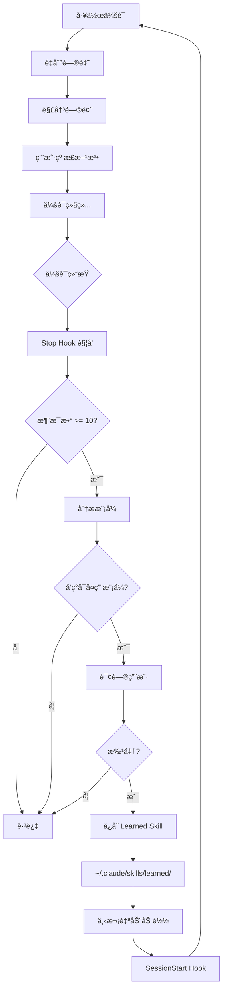

# æŒç»­å­¦ä¹ ç³»ç»Ÿå®Œæ•´å®ç°

> Everything Claude Code - Continuous Learning System 深度解æ

**生æˆæ—¶é—´**: 2026-02-21 19:24:10
**åŸæ–‡æ¥æº**: `github.com/affaan-m/everything-claude-code/skills/continuous-learning`
**分æ范围**: v1 å’Œ v2 æ¶æ„ã€å®ç°ä»£ç ã€é…置方法ã€æœ€ä½³å®è·µ

---

## ⓠ快速问答

**Q: æŒç»­å­¦ä¹ ç³»ç»Ÿæ˜¯ä»€ä¹ˆï¼Ÿ**

**A: 自动将é‡å¤å‡ºç°çš„解决方案转化为å¯å¤ç”¨çŸ¥è¯†**

```
传统方å¼:
  问题 1 → 手动解决 (30 分钟)
  问题 2 (相åŒ) → å†æ¬¡æ‰‹åŠ¨ (20 分钟)
  问题 3 (相åŒ) → åˆæ‰‹åŠ¨ (15 分钟)
  ⌠浪费: 65 分钟

æŒç»­å­¦ä¹ :
  问题 1-2 → 手动解决
  系统自动学习 → ä¿å­˜ä¸º skill
  问题 3+ → 自动应用 (2 分钟) ✅
  💰 节çœ: æ¯æ¬¡ 13 分钟
```

**核心机制**:
- 🔠**观察**: 会è¯ç»“æŸæ—¶åˆ†æ转录
- 🧠 **识别**: å‘ç°å¯å¤ç”¨çš„模å¼
- 💾 **ä¿å­˜**: 存为 learned skill
- 🚀 **应用**: 下次自动加载

---

## 目录

- [核心概念](#核心概念)
- [两个版本对比](#两个版本对比)
- [v1 详解](#v1-详解)
- [v2 详解](#v2-详解)
- [最å°å®‰è£…方案](#最å°å®‰è£…方案)
- [é…置详解](#é…置详解)
- [å®é™…使用](#å®é™…使用)
- [模å¼ç±»å‹](#模å¼ç±»å‹)
- [最佳å®è·µ](#最佳å®è·µ)
- [æ•…éšœæ’除](#æ•…éšœæ’除)

---

## 核心概念

### 什么是æŒç»­å­¦ä¹ ï¼Ÿ

**定义**: 一个自动化系统，通过观察你的工作会è¯ï¼Œè¯†åˆ«å¯å¤ç”¨çš„模å¼ï¼Œå¹¶å°†å…¶ä¿å­˜ä¸ºå¯åŠ è½½çš„ skills。

**核心价值**:

```
问题: é‡å¤æµªè´¹æ—¶é—´
  ├─ é‡åˆ°ç›¸åŒé—®é¢˜å¤šæ¬¡
  ├─ æ¯æ¬¡éƒ½è¦é‡æ–°è§£å†³
  ├─ Claude ä¸è®°å¾—上次的解决方案
  └─ 浪费大é‡æ—¶é—´å’Œ token

解决方案: æŒç»­å­¦ä¹ 
  ├─ 自动识别é‡å¤æ¨¡å¼
  ├─ ä¿å­˜ä¸ºå¯å¤ç”¨ skill
  ├─ 下次自动应用
  └─ 积累å¼å·¥ä½œï¼Œä¸æ˜¯é‡å¤å¼å·¥ä½œ
```

### 工作åŸç†



### 关键组件

| 组件 | 功能 | 触å‘时机 |
|------|------|---------|
| **Stop Hook** | 触å‘评估 | 会è¯ç»“æŸ |
| **evaluate-session** | 分æ转录 | Hook 调用 |
| **Pattern Detection** | è¯†åˆ«æ¨¡å¼ | 分æ过程 |
| **Learned Skills** | 存储知识 | ä¿å­˜å |
| **SessionStart Hook** | 加载知识 | æ–°ä¼šè¯ |

---

## 两个版本对比

### 概览表

| 特性 | v1 (Simple) | v2 (Instinct-Based) |
|------|------------|---------------------|
| **观察方å¼** | Stop hook（会è¯ç»“æŸï¼‰ | PreToolUse/PostToolUse（å®æ—¶ï¼‰ |
| **分ææ–¹å¼** | 主会è¯ä¸Šä¸‹æ–‡ | åå° Haiku ä»£ç† |
| **学习å•å…ƒ** | 完整 skills | åŸå­ "instincts" |
| **粒度** | 粗（一个 skill） | 细（多个 instincts） |
| **置信度** | æ—  | 0.3-0.9 åŠ æƒ |
| **演化路径** | ç›´æ¥ â†’ skill | instincts → cluster → skill |
| **共享机制** | 手动å¤åˆ¶ | 导出/导入 instincts |
| **å¤æ‚度** | â­ ç®€å• | â­â­â­â­ å¤æ‚ |
| **å¯é æ€§** | ~80%ï¼ˆåŸºäº skill 触å‘） | ~100%ï¼ˆåŸºäº hook） |
| **token æˆæœ¬** | ä½ | 中（åå°ä»£ç†ï¼‰ |
| **适用场景** | ✅ 日常使用 | 🔬 高级研究 |
| **æ¨è** | ✅ åˆå­¦è€… | 高级用户 |

### æ¶æ„对比

**v1 æ¶æ„**:
```
ä¼šè¯ â†’ Stop Hook → 分æ（主会è¯ï¼‰â†’ Skill → ~/.claude/skills/learned/
```

**v2 æ¶æ„**:
```
ä¼šè¯ â†’ PreToolUse/PostToolUse Hooks → observations.jsonl
                                             ↓
                    åå° Haiku ä»£ç† â†’ 分æ observations
                                             ↓
                                      Instincts (atomic)
                                             ↓
                                      Clustering
                                             ↓
                    Skills/Commands/Agents (evolved)
```

### 选择建议

**选择 v1 如æœ**:
- ✅ 刚开始使用 Claude Code
- ✅ 想è¦ç®€å•ã€å¯é çš„解决方案
- ✅ ä¸æƒ³èŠ±æ—¶é—´é…ç½®å¤æ‚系统
- ✅ 日常工作足够

**选择 v2 如æœ**:
- 🔬 想è¦æœ€å…ˆè¿›çš„学习系统
- 🔬 æ„¿æ„投入时间é…置和调优
- 🔬 需è¦ç²¾ç»†æ§åˆ¶å­¦ä¹ è¿‡ç¨‹
- 🔬 想è¦å¯¼å‡º/导入知识库

**æ¨è路径**: **先用 v1，熟悉åå†è€ƒè™‘ v2**

---

## v1 详解

### 文件结æ„

```
skills/continuous-learning/
├── SKILL.md              ↠文档（119 行）
├── config.json           ↠é…置（18 行）
└── evaluate-session.sh   ↠核心脚本（70 行）
```

### evaluate-session.sh 完整解æ

```bash
#!/bin/bash
# Continuous Learning - Session Evaluator
# Runs on Stop hook to extract reusable patterns

set -e

# â•â•â•â•â•â•â•â•â•â•â•â•â•â•â•â•â•â•â•â•â•â•â•â•â•â•â•â•â•â•â•â•â•â•â•â•â•â•â•â•â•â•â•â•â•â•â•â•â•â•â•â•â•â•â•â•
# 1. åˆå§‹åŒ–é…ç½®
# â•â•â•â•â•â•â•â•â•â•â•â•â•â•â•â•â•â•â•â•â•â•â•â•â•â•â•â•â•â•â•â•â•â•â•â•â•â•â•â•â•â•â•â•â•â•â•â•â•â•â•â•â•â•â•â•

SCRIPT_DIR="$(cd "$(dirname "${BASH_SOURCE[0]}")" && pwd)"
CONFIG_FILE="$SCRIPT_DIR/config.json"
LEARNED_SKILLS_PATH="${HOME}/.claude/skills/learned"
MIN_SESSION_LENGTH=10

# â•â•â•â•â•â•â•â•â•â•â•â•â•â•â•â•â•â•â•â•â•â•â•â•â•â•â•â•â•â•â•â•â•â•â•â•â•â•â•â•â•â•â•â•â•â•â•â•â•â•â•â•â•â•â•â•
# 2. 加载é…置文件
# â•â•â•â•â•â•â•â•â•â•â•â•â•â•â•â•â•â•â•â•â•â•â•â•â•â•â•â•â•â•â•â•â•â•â•â•â•â•â•â•â•â•â•â•â•â•â•â•â•â•â•â•â•â•â•â•

if [ -f "$CONFIG_FILE" ]; then
  # 检查 jq 是å¦å®‰è£…
  if ! command -v jq &>/dev/null; then
    echo "[ContinuousLearning] jq is required but not installed, using defaults" >&2
  else
    # ä» config.json 读å–é…ç½®
    MIN_SESSION_LENGTH=$(jq -r '.min_session_length // 10' "$CONFIG_FILE")

    # å¤„ç† ~ 在路径中
    LEARNED_SKILLS_PATH=$(jq -r '.learned_skills_path // "~/.claude/skills/learned/"' "$CONFIG_FILE" | sed "s|~|$HOME|")
  fi
fi

# â•â•â•â•â•â•â•â•â•â•â•â•â•â•â•â•â•â•â•â•â•â•â•â•â•â•â•â•â•â•â•â•â•â•â•â•â•â•â•â•â•â•â•â•â•â•â•â•â•â•â•â•â•â•â•â•
# 3. ç¡®ä¿ç›®å½•å­˜åœ¨
# â•â•â•â•â•â•â•â•â•â•â•â•â•â•â•â•â•â•â•â•â•â•â•â•â•â•â•â•â•â•â•â•â•â•â•â•â•â•â•â•â•â•â•â•â•â•â•â•â•â•â•â•â•â•â•â•

mkdir -p "$LEARNED_SKILLS_PATH"

# â•â•â•â•â•â•â•â•â•â•â•â•â•â•â•â•â•â•â•â•â•â•â•â•â•â•â•â•â•â•â•â•â•â•â•â•â•â•â•â•â•â•â•â•â•â•â•â•â•â•â•â•â•â•â•â•
# 4. è·å–转录文件路径
# â•â•â•â•â•â•â•â•â•â•â•â•â•â•â•â•â•â•â•â•â•â•â•â•â•â•â•â•â•â•â•â•â•â•â•â•â•â•â•â•â•â•â•â•â•â•â•â•â•â•â•â•â•â•â•â•

# ä» stdin è¯»å– JSON（Claude Code hook 输入）
stdin_data=$(cat)

# æå– transcript_path
transcript_path=$(echo "$stdin_data" | grep -o '"transcript_path":"[^"]*"' | head -1 | cut -d'"' -f4)

# å›é€€åˆ°ç¯å¢ƒå˜é‡ï¼ˆå‘å兼容）
if [ -z "$transcript_path" ]; then
  transcript_path="${CLAUDE_TRANSCRIPT_PATH:-}"
fi

# 如æœä»ç„¶æ²¡æœ‰è·¯å¾„，退出
if [ -z "$transcript_path" ] || [ ! -f "$transcript_path" ]; then
  exit 0
fi

# â•â•â•â•â•â•â•â•â•â•â•â•â•â•â•â•â•â•â•â•â•â•â•â•â•â•â•â•â•â•â•â•â•â•â•â•â•â•â•â•â•â•â•â•â•â•â•â•â•â•â•â•â•â•â•â•
# 5. 计算会è¯é•¿åº¦
# â•â•â•â•â•â•â•â•â•â•â•â•â•â•â•â•â•â•â•â•â•â•â•â•â•â•â•â•â•â•â•â•â•â•â•â•â•â•â•â•â•â•â•â•â•â•â•â•â•â•â•â•â•â•â•â•

# 统计用户消æ¯æ•°é‡
message_count=$(grep -c '"type":"user"' "$transcript_path" 2>/dev/null || echo "0")

# â•â•â•â•â•â•â•â•â•â•â•â•â•â•â•â•â•â•â•â•â•â•â•â•â•â•â•â•â•â•â•â•â•â•â•â•â•â•â•â•â•â•â•â•â•â•â•â•â•â•â•â•â•â•â•â•
# 6. 检查阈值
# â•â•â•â•â•â•â•â•â•â•â•â•â•â•â•â•â•â•â•â•â•â•â•â•â•â•â•â•â•â•â•â•â•â•â•â•â•â•â•â•â•â•â•â•â•â•â•â•â•â•â•â•â•â•â•â•

if [ "$message_count" -lt "$MIN_SESSION_LENGTH" ]; then
  echo "[ContinuousLearning] Session too short ($message_count messages), skipping" >&2
  exit 0
fi

# â•â•â•â•â•â•â•â•â•â•â•â•â•â•â•â•â•â•â•â•â•â•â•â•â•â•â•â•â•â•â•â•â•â•â•â•â•â•â•â•â•â•â•â•â•â•â•â•â•â•â•â•â•â•â•â•
# 7. æ示 Claude 评估模å¼
# â•â•â•â•â•â•â•â•â•â•â•â•â•â•â•â•â•â•â•â•â•â•â•â•â•â•â•â•â•â•â•â•â•â•â•â•â•â•â•â•â•â•â•â•â•â•â•â•â•â•â•â•â•â•â•â•

# 输出到 stderr（用户å¯è§ï¼‰
echo "[ContinuousLearning] Session has $message_count messages - evaluate for extractable patterns" >&2
echo "[ContinuousLearning] Save learned skills to: $LEARNED_SKILLS_PATH" >&2

# å®é™…的模å¼æå–ç”± Claude 在主会è¯ä¸­å®Œæˆ
# 这个脚本åªæ˜¯è§¦å‘评估的信å·
```

### 关键设计决策

#### 1. 为什么用 Stop Hook 而ä¸æ˜¯ UserPromptSubmit？

| Hook ç±»å‹ | 触å‘é¢‘ç‡ | æ€§èƒ½å½±å“ | 上下文 |
|-----------|---------|---------|--------|
| **UserPromptSubmit** | æ¯æ¡æ¶ˆæ¯ | ⌠å¢åŠ å»¶è¿Ÿ | éƒ¨åˆ†ä¼šè¯ |
| **Stop Hook** | 会è¯ç»“æŸ | ✅ 无延迟 | å®Œæ•´ä¼šè¯ |

**Stop Hook 的优势**:
- ✅ è½»é‡çº§ï¼šåªè¿è¡Œä¸€æ¬¡
- ✅ 无阻å¡ï¼šä¸å½±å“交互体验
- ✅ 完整上下文：å¯ä»¥çœ‹åˆ°æ•´ä¸ªä¼šè¯

#### 2. 为什么åªæ˜¯"æ示"而ä¸æ˜¯ç›´æ¥æå–？

```bash
# 脚本输出
echo "[ContinuousLearning] evaluate for extractable patterns" >&2

# å®é™…æå–ç”± Claude 完æˆ
# 因为 Claude æ‰èƒ½çœŸæ­£ç†è§£æ¨¡å¼çš„语义
```

**åŸå› **:
- 🧠 **语义ç†è§£**: 模å¼è¯†åˆ«éœ€è¦ AI çš„ç†è§£èƒ½åŠ›
- 🯠**上下文感知**: Claude 知é“对è¯çš„完整上下文
- 💡 **智能判断**: 判断模å¼æ˜¯å¦å€¼å¾—ä¿å­˜éœ€è¦æ¨ç†

#### 3. ä¸ºä»€ä¹ˆéœ€è¦ >= 10 æ¡æ¶ˆæ¯ï¼Ÿ

```bash
MIN_SESSION_LENGTH=10  # 默认阈值
```

**åŸå› **:
- ⌠**太短（< 5）**: å¯èƒ½æ˜¯ç®€å•æŸ¥è¯¢ï¼Œæ— å¯å­¦ä¹ æ¨¡å¼
- ✅ **中等（10-20）**: 通常包å«å®Œæ•´çš„问题-解决过程
- âš ï¸ **太长（> 50）**: å¯èƒ½åŒ…å«å¤šä¸ªä¸ç›¸å…³ä¸»é¢˜

**å¯è°ƒæ•´**:
```json
{
  "min_session_length": 15  // æ高到 15 å‡å°‘噪音
}
```

### config.json 详解

```json
{
  // ────────────────────────────────────────
  // 会è¯é•¿åº¦é˜ˆå€¼
  // ────────────────────────────────────────
  "min_session_length": 10,
  // 至少 10 æ¡ç”¨æˆ·æ¶ˆæ¯æ‰è¯„ä¼°
  // 太短的会è¯é€šå¸¸æ²¡æœ‰å¯å­¦ä¹ çš„模å¼

  // ────────────────────────────────────────
  // æå–阈值
  // ────────────────────────────────────────
  "extraction_threshold": "medium",
  // low: 更容易æå–（å¯èƒ½æœ‰å™ªéŸ³ï¼‰
  // medium: 平衡（æ¨è）
  // high: åªæå–æ˜æ˜¾æ¨¡å¼ï¼ˆå¯èƒ½é—æ¼ï¼‰

  // ────────────────────────────────────────
  // 自动批准
  // ────────────────────────────────────────
  "auto_approve": false,
  // false: æ¯æ¬¡è¯¢é—®æ˜¯å¦ä¿å­˜ï¼ˆæ¨èåˆå­¦è€…）
  // true: 自动ä¿å­˜ï¼ˆé«˜çº§ç”¨æˆ·ï¼‰

  // ────────────────────────────────────────
  // 存储路径
  // ────────────────────────────────────────
  "learned_skills_path": "~/.claude/skills/learned/",

  // ────────────────────────────────────────
  // 检测的模å¼ç±»å‹
  // ────────────────────────────────────────
  "patterns_to_detect": [
    "error_resolution",      // 错误解决方案
    "user_corrections",      // 用户纠正
    "workarounds",          // å˜é€šæ–¹æ¡ˆ
    "debugging_techniques",  // 调试技术
    "project_specific"      // 项目特定
  ],

  // ────────────────────────────────────────
  // 忽略的模å¼ç±»å‹
  // ────────────────────────────────────────
  "ignore_patterns": [
    "simple_typos",         // 简å•æ‹¼å†™é”™è¯¯
    "one_time_fixes",       // 一次性修å¤
    "external_api_issues"   // 外部 API 问题
  ]
}
```

### Learned Skill æ ¼å¼

**文件**: `~/.claude/skills/learned/jwt-expiry-format.md`

```markdown
---
name: jwt-expiry-format
description: JWT token expiresIn parameter must use string format
pattern: error_resolution
confidence: high
created: 2026-02-18
updated: 2026-02-21
observations: 3
---

# JWT Token Expiry Format Issue

## Problem
JWT tokens expire immediately when using millisecond numbers for `expiresIn`.

## Root Cause
jsonwebtoken v9.x changed the `expiresIn` parameter to require string format instead of numeric milliseconds.

## Solution

⌠**Wrong (causes immediate expiry)**:
```javascript
const token = jwt.sign(payload, secret, {
  expiresIn: Date.now() + 900000  // Milliseconds
});
```

✅ **Correct**:
```javascript
const token = jwt.sign(payload, secret, {
  expiresIn: '15m'  // String format
});
```

## Valid String Formats
- `'60s'` - 60 seconds
- `'15m'` - 15 minutes
- `'2h'` - 2 hours
- `'7d'` - 7 days

## Evidence
- Observed in 3 sessions
- Dates: 2026-02-15, 2026-02-18, 2026-02-21
- User corrected this approach twice
- Tests confirmed string format works

## Related
- jsonwebtoken v9.x migration guide
- src/services/token.service.js (line 45)

## When to Apply
- Implementing JWT authentication
- Upgrading from jsonwebtoken v8 to v9
- Debugging token expiry issues
```

---

## v2 详解

### 文件结æ„

```
skills/continuous-learning-v2/
├── SKILL.md              ↠文档（200+ 行）
├── config.json           ↠é…置（42 行）
├── hooks/
│   ├── pre-tool-use.js   ↠观察工具调用å‰
│   └── post-tool-use.js  ↠观察工具调用å
├── scripts/
│   ├── observer.js       ↠åå°åˆ†æ代ç†
│   ├── instinct-manager.js
│   └── evolution.js
└── agents/
    └── observer-agent.md ↠观察者代ç†é…ç½®
```

### Instinct 模å‹

**核心ç†å¿µ**: 用å°çš„ã€åŸå­åŒ–çš„"本能"替代大的 skills

**Instinct 示例**:

```yaml
---
id: prefer-functional-style
trigger: "when writing new functions"
confidence: 0.7
domain: "code-style"
source: "session-observation"
created: 2026-02-15
last_triggered: 2026-02-21
trigger_count: 5
success_rate: 0.8
evidence:
  - session: 2026-02-15-abc123
    observation: "User corrected class to functional"
  - session: 2026-02-18-def456
    observation: "Repeated functional preference"
---

# Prefer Functional Style

## Action
Use functional patterns over classes when appropriate.

## Context
- Pure functions for data transformation
- Avoid stateful classes unless necessary
- Prefer composition over inheritance

## Example

⌠**Class-based**:
```javascript
class Calculator {
  add(a, b) {
    return a + b;
  }
}
```

✅ **Functional**:
```javascript
const add = (a, b) => a + b;
```

## Confidence Rationale
- 0.7 confidence based on 5 observations
- User explicitly corrected 2 times
- Pattern consistent across sessions
```

### Instinct å±æ€§

| å±æ€§ | ç±»å‹ | è¯´æ˜ |
|------|------|------|
| **id** | string | 唯一标识符 |
| **trigger** | string | 触å‘æ¡ä»¶ |
| **confidence** | 0.3-0.9 | 置信度 |
| **domain** | string | 领域标签 |
| **source** | string | æ¥æºï¼ˆobservation/manual） |
| **created** | date | 创建时间 |
| **last_triggered** | date | 最å触å‘时间 |
| **trigger_count** | number | 触å‘次数 |
| **success_rate** | 0-1 | æˆåŠŸç‡ |
| **evidence** | array | è¯æ®åˆ—表 |

### 置信度系统

**置信度范围**:

| 范围 | å«ä¹‰ | 行为 |
|------|------|------|
| **0.3-0.4** | 试æ¢æ€§ | 仅建议，ä¸ä¸»åŠ¨è§¦å‘ |
| **0.5-0.6** | 中等 | 在相关情况下建议 |
| **0.7-0.8** | 高 | 主动应用 |
| **0.9+** | é常高 | 几ä¹æ€»æ˜¯åº”用 |

**置信度更新**:

```javascript
// æˆåŠŸåº”用时
confidence = confidence + 0.05;  // 最高到 0.9

// 用户纠正/å¦å®šæ—¶
confidence = confidence - 0.1;   // è¡°å‡

// 长时间未触å‘
confidence = confidence * 0.98;  // æ¯å‘¨è¡°å‡ 2%
```

### 演化路径


**示例演化**:

```
Instinct 1: "prefer-functional-style" (confidence: 0.8)
Instinct 2: "avoid-stateful-classes" (confidence: 0.7)
Instinct 3: "use-pure-functions" (confidence: 0.75)
        ↓ Cluster
Evolved Skill: "functional-programming-patterns"
```

### åå°è§‚察者

**observer.js 核心逻辑**:

```javascript
// 1. å®šæœŸè¯»å– observations.jsonl
const observations = readObservations();

// 2. 分æ模å¼
const patterns = analyzePatterns(observations);
// patterns = [
//   {
//     type: 'user_correction',
//     pattern: 'Functional over Class',
//     confidence: 0.7,
//     evidence: [...]
//   }
// ]

// 3. 创建或更新 instincts
for (const pattern of patterns) {
  const existingInstinct = findInstinct(pattern);

  if (existingInstinct) {
    // æ›´æ–°ç°æœ‰ instinct
    updateInstinct(existingInstinct, pattern);
  } else {
    // 创建新 instinct
    createInstinct(pattern);
  }
}

// 4. 检查演化æ¡ä»¶
checkEvolution();
```

### config.json v2 详解

```json
{
  "version": "2.0",

  // ────────────────────────────────────────
  // 观察é…ç½®
  // ────────────────────────────────────────
  "observation": {
    "enabled": true,
    "store_path": "~/.claude/homunculus/observations.jsonl",
    "max_file_size_mb": 10,      // 观察文件最大 10MB
    "archive_after_days": 7,     // 7 天åå½’æ¡£
    "capture_tools": [           // æ•è·çš„工具
      "Edit", "Write", "Bash",
      "Read", "Grep", "Glob"
    ],
    "ignore_tools": ["TodoWrite"] // 忽略的工具
  },

  // ────────────────────────────────────────
  // Instinct é…ç½®
  // ────────────────────────────────────────
  "instincts": {
    "personal_path": "~/.claude/homunculus/instincts/personal/",
    "inherited_path": "~/.claude/homunculus/instincts/inherited/",
    "min_confidence": 0.3,        // 最ä½ç½®ä¿¡åº¦
    "auto_approve_threshold": 0.7, // 自动批准阈值
    "confidence_decay_rate": 0.02, // 置信度衰å‡ç‡ï¼ˆæ¯å‘¨ï¼‰
    "max_instincts": 100          // 最多 100 个 instincts
  },

  // ────────────────────────────────────────
  // 观察者é…ç½®
  // ────────────────────────────────────────
  "observer": {
    "enabled": false,             // 默认ç¦ç”¨ï¼ˆéœ€è¦æ‰‹åŠ¨å¯ç”¨ï¼‰
    "model": "haiku",            // 使用 Haiku 模å‹ï¼ˆä¾¿å®œï¼‰
    "run_interval_minutes": 5,    // æ¯ 5 分钟è¿è¡Œä¸€æ¬¡
    "min_observations_to_analyze": 20,  // 至少 20 个观察å†åˆ†æ
    "patterns_to_detect": [
      "user_corrections",
      "error_resolutions",
      "repeated_workflows",
      "tool_preferences",
      "file_patterns"
    ]
  },

  // ────────────────────────────────────────
  // 演化é…ç½®
  // ────────────────────────────────────────
  "evolution": {
    "cluster_threshold": 3,       // 3 个相关 instincts 触å‘演化
    "evolved_path": "~/.claude/homunculus/evolved/",
    "auto_evolve": false          // 手动批准演化
  },

  // ────────────────────────────────────────
  // 集æˆé…ç½®
  // ────────────────────────────────────────
  "integration": {
    "skill_creator_api": "https://skill-creator.app/api",
    "backward_compatible_v1": true  // 兼容 v1 learned skills
  }
}
```

---

## 最å°å®‰è£…方案

### 方案 A: 使用ç°æœ‰ SessionEnd Hook（最简å•ï¼‰

**å‰æ**: 已安装 memory persistence hooks

**步骤**:

```bash
# 1. 检查是å¦å·²æœ‰ evaluate-session.js
ls ~/.claude/scripts/hooks/evaluate-session.js

# 2. 如æœæœ‰ï¼Œåªéœ€æ·»åŠ  Stop hook é…ç½®
# 编辑 ~/.claude/settings.json
{
  "hooks": {
    "Stop": [{
      "matcher": "*",
      "hooks": [{
        "type": "command",
        "command": "node ~/.claude/scripts/hooks/evaluate-session.js"
      }],
      "description": "Evaluate session for patterns"
    }]
  }
}

# 3. 创建 learned skills 目录
mkdir -p ~/.claude/skills/learned

# 4. 完æˆï¼
```

**时间**: 2 分钟

---

### 方案 B: 独立安装 v1（æ¨è）

**步骤**:

```bash
# â•â•â•â•â•â•â•â•â•â•â•â•â•â•â•â•â•â•â•â•â•â•â•â•â•â•â•â•â•â•â•â•â•â•â•â•â•â•â•â•â•â•â•â•â•â•â•â•â•â•â•â•â•â•â•â•
# 1. 创建目录结æ„
# â•â•â•â•â•â•â•â•â•â•â•â•â•â•â•â•â•â•â•â•â•â•â•â•â•â•â•â•â•â•â•â•â•â•â•â•â•â•â•â•â•â•â•â•â•â•â•â•â•â•â•â•â•â•â•â•

mkdir -p ~/.claude/skills/continuous-learning
mkdir -p ~/.claude/skills/learned

# â•â•â•â•â•â•â•â•â•â•â•â•â•â•â•â•â•â•â•â•â•â•â•â•â•â•â•â•â•â•â•â•â•â•â•â•â•â•â•â•â•â•â•â•â•â•â•â•â•â•â•â•â•â•â•â•
# 2. å¤åˆ¶æ–‡ä»¶
# â•â•â•â•â•â•â•â•â•â•â•â•â•â•â•â•â•â•â•â•â•â•â•â•â•â•â•â•â•â•â•â•â•â•â•â•â•â•â•â•â•â•â•â•â•â•â•â•â•â•â•â•â•â•â•â•

cd everything-claude-code

# å¤åˆ¶ skill 文件
cp skills/continuous-learning/SKILL.md \
   ~/.claude/skills/continuous-learning/

cp skills/continuous-learning/config.json \
   ~/.claude/skills/continuous-learning/

cp skills/continuous-learning/evaluate-session.sh \
   ~/.claude/skills/continuous-learning/

# â•â•â•â•â•â•â•â•â•â•â•â•â•â•â•â•â•â•â•â•â•â•â•â•â•â•â•â•â•â•â•â•â•â•â•â•â•â•â•â•â•â•â•â•â•â•â•â•â•â•â•â•â•â•â•â•
# 3. 设置æƒé™
# â•â•â•â•â•â•â•â•â•â•â•â•â•â•â•â•â•â•â•â•â•â•â•â•â•â•â•â•â•â•â•â•â•â•â•â•â•â•â•â•â•â•â•â•â•â•â•â•â•â•â•â•â•â•â•â•

chmod +x ~/.claude/skills/continuous-learning/evaluate-session.sh

# â•â•â•â•â•â•â•â•â•â•â•â•â•â•â•â•â•â•â•â•â•â•â•â•â•â•â•â•â•â•â•â•â•â•â•â•â•â•â•â•â•â•â•â•â•â•â•â•â•â•â•â•â•â•â•â•
# 4. é…ç½® Hook
# â•â•â•â•â•â•â•â•â•â•â•â•â•â•â•â•â•â•â•â•â•â•â•â•â•â•â•â•â•â•â•â•â•â•â•â•â•â•â•â•â•â•â•â•â•â•â•â•â•â•â•â•â•â•â•â•

# 编辑 ~/.claude/settings.json，添加:
{
  "hooks": {
    "Stop": [{
      "matcher": "*",
      "hooks": [{
        "type": "command",
        "command": "bash ~/.claude/skills/continuous-learning/evaluate-session.sh"
      }],
      "description": "Continuous learning - extract reusable patterns"
    }]
  }
}

# â•â•â•â•â•â•â•â•â•â•â•â•â•â•â•â•â•â•â•â•â•â•â•â•â•â•â•â•â•â•â•â•â•â•â•â•â•â•â•â•â•â•â•â•â•â•â•â•â•â•â•â•â•â•â•â•
# 5. 验è¯å®‰è£…
# â•â•â•â•â•â•â•â•â•â•â•â•â•â•â•â•â•â•â•â•â•â•â•â•â•â•â•â•â•â•â•â•â•â•â•â•â•â•â•â•â•â•â•â•â•â•â•â•â•â•â•â•â•â•â•â•

# 测试脚本
bash ~/.claude/skills/continuous-learning/evaluate-session.sh <<< '{}'
# 应该输出: [ContinuousLearning] Session too short...

# 检查目录
ls -la ~/.claude/skills/learned/
```

**时间**: 5 分钟

---

### 方案 C: 完整安装 v2（高级用户）

**警告**: âš ï¸ v2 较å¤æ‚，建议先熟悉 v1

**步骤**:

```bash
# 1. å¤åˆ¶æ•´ä¸ª v2 目录
cp -r everything-claude-code/skills/continuous-learning-v2 \
      ~/.claude/skills/

# 2. 安装ä¾èµ–
cd ~/.claude/skills/continuous-learning-v2
npm install

# 3. é…ç½® hooks（需è¦å¤šä¸ªï¼‰
# 编辑 ~/.claude/settings.json
{
  "hooks": {
    "PreToolUse": [{
      "matcher": "Edit|Write|Bash",
      "hooks": [{
        "type": "command",
        "command": "node ~/.claude/skills/continuous-learning-v2/hooks/pre-tool-use.js"
      }]
    }],
    "PostToolUse": [{
      "matcher": "Edit|Write|Bash",
      "hooks": [{
        "type": "command",
        "command": "node ~/.claude/skills/continuous-learning-v2/hooks/post-tool-use.js"
      }]
    }]
  }
}

# 4. å¯åŠ¨åå°è§‚察者（å¯é€‰ï¼‰
node ~/.claude/skills/continuous-learning-v2/scripts/observer.js --daemon

# 5. 创建目录
mkdir -p ~/.claude/homunculus/{observations,instincts/personal,instincts/inherited,evolved}
```

**时间**: 15 分钟

**æ¨è**: **先用方案 B（v1），熟悉åå†è€ƒè™‘ v2**

---

## é…置详解

### 调优建议

#### 1. 调整会è¯é•¿åº¦é˜ˆå€¼

```json
// 默认é…ç½®
{
  "min_session_length": 10
}

// 场景: æå–太多噪音
{
  "min_session_length": 20  // æ高到 20
}

// 场景: æå–太少
{
  "min_session_length": 5   // é™ä½åˆ° 5
}
```

#### 2. 调整æå–阈值

```json
// ä¿å®ˆï¼ˆå‡å°‘噪音）
{
  "extraction_threshold": "high",
  "min_session_length": 15
}

// 激进（æ•è·æ›´å¤šï¼‰
{
  "extraction_threshold": "low",
  "min_session_length": 5
}

// 平衡（æ¨è）
{
  "extraction_threshold": "medium",
  "min_session_length": 10
}
```

#### 3. 自动批准设置

```json
// åˆå­¦è€…（手动批准）
{
  "auto_approve": false
}
// æ¯æ¬¡è¯¢é—®: "是å¦ä¿å­˜è¿™ä¸ªæ¨¡å¼ï¼Ÿ"

// 高级用户（自动批准）
{
  "auto_approve": true
}
// 自动ä¿å­˜ï¼Œå®šæœŸå®¡æŸ¥
```

### 模å¼è¿‡æ»¤

#### patterns_to_detect（è¦æ£€æµ‹çš„）

```json
{
  "patterns_to_detect": [
    // ✅ æ¨èå¯ç”¨
    "error_resolution",      // 错误解决方案（高价值）
    "user_corrections",      // 用户纠正（高价值）
    "workarounds",          // å˜é€šæ–¹æ¡ˆï¼ˆä¸­ä»·å€¼ï¼‰
    "debugging_techniques",  // 调试技术（中价值）

    // âš ï¸ å¯é€‰
    "project_specific",     // 项目特定（å¯èƒ½å™ªéŸ³ï¼‰
    "tool_preferences",     // 工具å好（ä½ä»·å€¼ï¼‰
    "file_patterns"        // 文件模å¼ï¼ˆä½ä»·å€¼ï¼‰
  ]
}
```

#### ignore_patterns（è¦å¿½ç•¥çš„）

```json
{
  "ignore_patterns": [
    // ✅ æ¨è忽略
    "simple_typos",         // 拼写错误
    "one_time_fixes",       // 一次性修å¤
    "external_api_issues",  // 外部 API（你无法æ§åˆ¶ï¼‰

    // âš ï¸ è€ƒè™‘å¿½ç•¥
    "temporary_debugging",  // 临时调试代ç 
    "experimental_code"    // å®éªŒæ€§ä»£ç 
  ]
}
```

---

## å®é™…使用

### 完整工作æµç¨‹

#### 第一次é‡åˆ°é—®é¢˜

```bash
$ claude

You: "å®ç° JWT 认è¯ï¼Œtoken 15 分钟过期"

Claude: "我会使用 jsonwebtoken 库å®ç°..."

[å®ç°ä»£ç ]
const token = jwt.sign(payload, secret, {
  expiresIn: Date.now() + 900000  // 15 分钟 = 900000 毫秒
});

You: "测试一下"

Claude: [è¿è¡Œæµ‹è¯•]
⌠测试失败: Token ç«‹å³è¿‡æœŸ

You: "为什么 token ç«‹å³è¿‡æœŸï¼Ÿ"

Claude: "让我检查... å¯èƒ½æ˜¯ expiresIn æ ¼å¼é—®é¢˜..."

[调试 30 分钟]

You: "åº”è¯¥ç”¨å­—ç¬¦ä¸²æ ¼å¼ '15m'，ä¸æ˜¯æ¯«ç§’æ•°"

Claude: "æ˜ç™½äº†ï¼Œä¿®å¤ï¼š
const token = jwt.sign(payload, secret, {
  expiresIn: '15m'  // 字符串格å¼
});

✅ 测试通过

Ctrl+D
[Stop Hook] Session has 12 messages - evaluate for extractable patterns
```

**会è¯æ‘˜è¦**:
- 消æ¯æ•°: 12
- 问题: JWT token ç«‹å³è¿‡æœŸ
- 解决: ä½¿ç”¨å­—ç¬¦ä¸²æ ¼å¼ `'15m'` 而ä¸æ˜¯æ¯«ç§’æ•°
- 时间: 30 分钟

---

#### 第二次é‡åˆ°é—®é¢˜ï¼ˆå‡ å¤©å）

```bash
$ claude

You: "添加刷新 token 功能，7 天过期"

Claude: "å®ç°åˆ·æ–° token..."

[å®ç°ä»£ç ]
const refreshToken = jwt.sign(payload, secret, {
  expiresIn: Date.now() + 604800000  // 7 天毫秒
});

You: "测试"

⌠åˆæ˜¯ç«‹å³è¿‡æœŸ

You: "åˆæ˜¯è¿™ä¸ªé—®é¢˜ï¼Œåº”该用字符串 '7d'"

Claude: "对ä¸èµ·ï¼Œä¿®å¤ï¼š
const refreshToken = jwt.sign(payload, secret, {
  expiresIn: '7d'
});

✅ 测试通过

Ctrl+D
[Stop Hook] Session has 10 messages - evaluate for extractable patterns
```

**会è¯æ‘˜è¦**:
- 消æ¯æ•°: 10
- 问题: 相åŒé—®é¢˜ï¼ˆJWT expiry format）
- 解决: 相åŒæ–¹æ¡ˆï¼ˆå­—符串格å¼ï¼‰
- 时间: 20 分钟

---

#### 系统学习（会è¯ç»“æŸå）

```bash
[Continuous Learning 分æ两次会è¯]

å‘ç°æ¨¡å¼:
- 问题: JWT expiresIn æ ¼å¼é”™è¯¯
- 出ç°æ¬¡æ•°: 2
- 解决方案: 使用字符串格å¼
- 用户纠正次数: 2

Claude: "我注æ„到一个å¯å¤ç”¨çš„模å¼ï¼š

**JWT Token Expiry Format**
- 问题: 使用毫秒数导致立å³è¿‡æœŸ
- 解决: ä½¿ç”¨å­—ç¬¦ä¸²æ ¼å¼ ('15m', '7d')
- 出ç°: 2 次
- 置信度: 高

是å¦ä¿å­˜ä¸º learned skill？ [y/n]"

You: "y"

[创建文件]
~/.claude/skills/learned/jwt-expiry-format.md

✅ Learned skill å·²ä¿å­˜
```

---

#### 第三次（自动应用）

```bash
$ claude

[SessionStart 加载 learned skills]
[SessionStart] 5 learned skill(s) available
  - jwt-expiry-format
  - ...

You: "å®ç° API 密钥的过期机制，30 天有效期"

Claude: "å®ç° API 密钥过期机制。

注æ„：根æ®ä¹‹å‰å­¦åˆ°çš„ jwt-expiry-format 模å¼ï¼Œ
我会直æ¥ä½¿ç”¨å­—符串格å¼é¿å…过期问题。

const apiKey = generateApiKey(userId, {
  expiresIn: '30d'  // ✅ 字符串格å¼
});

✅ 2 分钟完æˆï¼Œæ— éœ€è°ƒè¯•
```

**效æœ**:
- ✅ 自动应用 learned skill
- ✅ é¿å…了 30 分钟的调试
- ✅ 第一次就正确

---

### å®é™…输出示例

#### Stop Hook 输出

```
[ContinuousLearning] Session has 15 messages - evaluate for extractable patterns
[ContinuousLearning] Save learned skills to: ~/.claude/skills/learned/
```

#### 模å¼è¯†åˆ«è¾“出

```
[Pattern Detection] Analyzing session transcript...

Found potential patterns:
1. error_resolution: JWT expiresIn format (confidence: high)
   - Observed: 2 times
   - User corrections: 2 times
   - Consistent solution: Use string format

2. debugging_technique: Check version mismatch (confidence: medium)
   - Observed: 1 time
   - Context: jsonwebtoken v9 breaking change

Recommend saving pattern #1 as learned skill.
```

#### Learned Skill 创建

```
Creating learned skill: jwt-expiry-format.md

Content:
---
name: jwt-expiry-format
description: JWT token expiresIn must use string format
pattern: error_resolution
confidence: high
observations: 2
---

# JWT Token Expiry Format Issue
...

✅ Saved to: ~/.claude/skills/learned/jwt-expiry-format.md
```

---

## 模å¼ç±»å‹

### 详细分类

#### 1. error_resolution（错误解决）

**特å¾**:
- é‡åˆ°é”™è¯¯
- 调试过程
- 找到解决方案

**示例**:
```markdown
# Pattern: Module Import Error in Node.js

## Problem
Error: Cannot find module 'X'

## Cause
Using ES6 import syntax in CommonJS project

## Solution
Use require() instead:
```javascript
// ⌠Error
import X from 'X';

// ✅ Works
const X = require('X');
```

## When to Apply
- Node.js projects without "type": "module"
- CommonJS environment
```

---

#### 2. user_corrections（用户纠正）

**特å¾**:
- Claude 建议 A
- 用户纠正为 B
- B 被è¯æ˜æ­£ç¡®

**示例**:
```markdown
# Pattern: Prefer Immutable Updates

## Claude's Initial Approach
```javascript
// Claude 建议：直æ¥ä¿®æ”¹
array.push(item);
```

## User Correction
```javascript
// 用户纠正：ä¸å¯å˜æ›´æ–°
const newArray = [...array, item];
```

## Rationale
- Avoids side effects
- Easier to debug
- Better for React state

## When to Apply
- State management
- Functional programming contexts
```

---

#### 3. workarounds（å˜é€šæ–¹æ¡ˆï¼‰

**特å¾**:
- 框æ¶/库的é™åˆ¶æˆ– bug
- 找到替代方案

**示例**:
```markdown
# Pattern: Next.js Dynamic Import with SSR

## Problem
Component uses browser-only APIs, breaks SSR

## Workaround
Use dynamic import with ssr: false:
```javascript
const ClientComponent = dynamic(
  () => import('./ClientComponent'),
  { ssr: false }
);
```

## When to Apply
- Components using window, document, localStorage
- Third-party libraries without SSR support
```

---

#### 4. debugging_techniques（调试技术）

**特å¾**:
- 有效的调试方法
- å¯å¤ç”¨çš„调试步骤

**示例**:
```markdown
# Pattern: Debug React Re-renders

## Technique
Use why-did-you-render library:

```javascript
import whyDidYouRender from '@welldone-software/why-did-you-render';

if (process.env.NODE_ENV === 'development') {
  whyDidYouRender(React, {
    trackAllPureComponents: true,
  });
}
```

## What It Shows
- Which components re-rendered
- Why they re-rendered
- Props that changed

## When to Apply
- Performance debugging
- Unexpected re-renders
```

---

#### 5. project_specific（项目特定）

**特å¾**:
- 项目特有的约定
- 团队å好
- 代ç é£æ ¼

**示例**:
```markdown
# Pattern: API Error Handling in Our Project

## Convention
All API errors follow this format:

```typescript
interface ApiError {
  code: string;        // ERROR_CODE_FORMAT
  message: string;     // User-friendly message
  details?: object;    // Debug info (dev only)
  timestamp: string;   // ISO 8601
}
```

## Usage
```typescript
throw new ApiError({
  code: 'AUTH_TOKEN_EXPIRED',
  message: 'Your session has expired',
  details: { tokenAge: '3600s' },
  timestamp: new Date().toISOString()
});
```

## When to Apply
- All API routes in src/api/
- Error middleware
```

---

### 优先级建议

| 模å¼ç±»å‹ | 价值 | 优先ä¿å­˜ |
|---------|------|---------|
| **error_resolution** | â­â­â­â­â­ | 总是 |
| **user_corrections** | â­â­â­â­â­ | 总是 |
| **workarounds** | â­â­â­â­ | 通常 |
| **debugging_techniques** | â­â­â­ | 有用时 |
| **project_specific** | â­â­ | è°¨æ…（å¯èƒ½å™ªéŸ³ï¼‰ |

---

## 最佳å®è·µ

### 1. ä»ä¿å®ˆè®¾ç½®å¼€å§‹

```json
{
  "min_session_length": 15,          // 较高阈值
  "extraction_threshold": "high",    // åªæå–æ˜æ˜¾æ¨¡å¼
  "auto_approve": false              // 手动审查
}
```

**åŸå› **:
- ✅ å‡å°‘噪音
- ✅ 建立信任
- ✅ 学习识别好模å¼

**é€æ­¥æ”¾å®½**:
```
第 1 周: high threshold, manual approve
第 2 周: medium threshold, manual approve
第 3+ 周: medium threshold, auto approve (å¯é€‰)
```

### 2. 定期审查 Learned Skills

```bash
# æ¯å‘¨å®¡æŸ¥ä¸€æ¬¡
cd ~/.claude/skills/learned

# 查看所有 skills
ls -lah

# 审查æ¯ä¸ª skill
for skill in *.md; do
  echo "=== $skill ==="
  head -20 "$skill"
  echo ""
done

# 删除过时的
rm obsolete-pattern.md

# 编辑改进
nano useful-pattern.md
```

**审查清å•**:
- [ ] 模å¼æ˜¯å¦ä»ç„¶ç›¸å…³ï¼Ÿ
- [ ] æ述是å¦æ¸…晰？
- [ ] 示例是å¦æœ‰æ•ˆï¼Ÿ
- [ ] 置信度是å¦å‡†ç¡®ï¼Ÿ
- [ ] 触å‘æ¡ä»¶æ˜¯å¦æ˜ç¡®ï¼Ÿ

### 3. 给 Skills 添加上下文

**基础 skill** (自动生æˆ):
```markdown
# JWT Expiry Format

## Solution
Use string format for expiresIn:
```javascript
expiresIn: '15m'
```
```

**改进 skill** (手动å¢å¼º):
```markdown
# JWT Expiry Format Issue

## Problem Context
jsonwebtoken v9.x breaking change from v8.x

## Root Cause
v9 changed expiresIn to require string format.
v8 accepted both numbers and strings.

## Solution
⌠v8 style (breaks in v9):
```javascript
expiresIn: Date.now() + 900000
expiresIn: 900000
```

✅ v9 style (works in both):
```javascript
expiresIn: '15m'
expiresIn: '7d'
expiresIn: '2h'
```

## Valid Formats
- Seconds: '60s'
- Minutes: '15m', '30m'
- Hours: '1h', '2h'
- Days: '7d', '30d'

## Related Files
- src/services/token.service.js
- tests/auth/token.test.js

## Migration Guide
If upgrading from v8:
1. Search for: `expiresIn:\s*\d+`
2. Replace with string format
3. Run tests

## When to Apply
- Implementing JWT auth
- Upgrading jsonwebtoken
- Debugging token expiry
- Code reviews (check format)
```

**价值**:
- ✅ 更清晰的上下文
- ✅ å¯æ“作的步骤
- ✅ 相关文件引用
- ✅ è¿ç§»æŒ‡å—

### 4. 版本æ§åˆ¶ Learned Skills

**项目级 skills**:

```bash
# 在项目中创建目录
mkdir -p .claude/skills/learned

# å¤åˆ¶é‡è¦çš„项目特定 skills
cp ~/.claude/skills/learned/project-* .claude/skills/learned/

# 纳入版本æ§åˆ¶
git add .claude/skills/learned/
git commit -m "docs: add learned skills for team"

# .gitignore 中æ’除个人 skills
echo ".claude/skills/learned/personal-*" >> .gitignore
```

**好处**:
- ✅ 团队共享知识
- ✅ æ–°æˆå‘˜å¿«é€Ÿä¸Šæ‰‹
- ✅ 追踪模å¼æ¼”å˜
- ✅ 代ç å®¡æŸ¥å‚考

### 5. ä¸å…¶ä»–系统é…åˆ

**ä¸ Memory Persistence é…åˆ**:

```
SessionEnd Hook
    ↓ ä¿å­˜ä¼šè¯æ‘˜è¦
Continuous Learning
    ↓ 评估模å¼
    ↓ ä¿å­˜ Learned Skills
SessionStart Hook
    ↓ 加载
    - 会è¯æ‘˜è¦
    - Learned skills
    ↓ 完整上下文
```

**ä¸ Strategic Compact é…åˆ**:

```
工作中... (工具调用计数)
    ↓ 达到 50 次
Strategic Compact 建议
    ↓ 用户决定
/compact
    ↓ å‹ç¼©å‰
PreCompact Hook ä¿å­˜çŠ¶æ€
    ↓ å‹ç¼©å继续
继续工作...
    ↓ 会è¯ç»“æŸ
Continuous Learning 评估
```

**ååŒæ•ˆæœ**:
- 📠会è¯æ‘˜è¦ → 知é“ä½ åšäº†ä»€ä¹ˆ
- 🧠 Learned skills → 知é“如何åš
- 🔄 Strategic compact → 高效的上下文管ç†

---

## æ•…éšœæ’除

### 问题 1: Hook ä¸è§¦å‘

**症状**:
```bash
# 会è¯ç»“æŸå没有看到
[ContinuousLearning] Session has X messages...
```

**诊断**:

```bash
# 1. 检查 hook é…ç½®
cat ~/.claude/settings.json | grep -A 10 "Stop"

# 2. 检查脚本存在
ls -la ~/.claude/skills/continuous-learning/evaluate-session.sh

# 3. 检查æƒé™
ls -l ~/.claude/skills/continuous-learning/evaluate-session.sh
# 应该显示 -rwxr-xr-x (å¯æ‰§è¡Œ)

# 4. 手动测试脚本
bash ~/.claude/skills/continuous-learning/evaluate-session.sh <<< '{}'
```

**解决方案**:
```bash
# ä¿®å¤æƒé™
chmod +x ~/.claude/skills/continuous-learning/evaluate-session.sh

# éªŒè¯ hook é…ç½®
nano ~/.claude/settings.json
# ç¡®ä¿è·¯å¾„正确
```

---

### 问题 2: 会è¯å¤ªçŸ­è¢«è·³è¿‡

**症状**:
```
[ContinuousLearning] Session too short (5 messages), skipping
```

**åŸå› **:
- 会è¯æ¶ˆæ¯æ•° < min_session_length（默认 10）

**解决方案**:

```json
// é™ä½é˜ˆå€¼
{
  "min_session_length": 5  // ä» 10 é™åˆ° 5
}
```

**或**: 进行更长的会è¯ï¼ˆ>= 10 æ¡æ¶ˆæ¯ï¼‰

---

### 问题 3: 没有识别到模å¼

**症状**:
- Hook 触å‘了
- 但 Claude 没有识别到å¯å¤ç”¨æ¨¡å¼

**å¯èƒ½åŸå› **:

1. **模å¼ä¸å¤Ÿæ˜æ˜¾**
   - åªå‡ºç° 1 次
   - 没有用户纠正
   - 解决方案ä¸ä¸€è‡´

2. **extraction_threshold 太高**
   ```json
   {
     "extraction_threshold": "high"  // 太ä¿å®ˆ
   }
   ```

3. **模å¼è¢«å¿½ç•¥**
   ```json
   {
     "ignore_patterns": ["..."]  // 检查是å¦è¿‡åº¦å¿½ç•¥
   }
   ```

**解决方案**:

```json
// é™ä½é˜ˆå€¼
{
  "extraction_threshold": "medium",
  "min_session_length": 10
}

// å‡å°‘忽略模å¼
{
  "ignore_patterns": [
    "simple_typos"  // åªä¿ç•™æ˜ç¡®è¦å¿½ç•¥çš„
  ]
}
```

---

### 问题 4: æå–了太多噪音

**症状**:
- æ¯æ¬¡ä¼šè¯éƒ½åˆ›å»º skill
- 很多 skill ä¸å®ç”¨

**解决方案**:

```json
// æ高阈值
{
  "min_session_length": 20,
  "extraction_threshold": "high",
  "auto_approve": false  // 手动批准
}

// å¢åŠ å¿½ç•¥æ¨¡å¼
{
  "ignore_patterns": [
    "simple_typos",
    "one_time_fixes",
    "external_api_issues",
    "temporary_debugging",    // æ–°å¢
    "experimental_code"       // æ–°å¢
  ]
}
```

**定期清ç†**:
```bash
# 删除ä½ä»·å€¼ skills
cd ~/.claude/skills/learned
rm noise-pattern-*.md
```

---

### 问题 5: jq 未安装（Bash 版本）

**症状**:
```
[ContinuousLearning] jq is required but not installed, using defaults
```

**å½±å“**: æ— æ³•è¯»å– config.json，使用默认值

**解决方案**:

```bash
# macOS
brew install jq

# Ubuntu/Debian
sudo apt-get install jq

# CentOS/RHEL
sudo yum install jq

# Windows (WSL)
sudo apt-get install jq

# 验è¯å®‰è£…
jq --version
```

---

## 总结

### 核心价值主张

```
没有æŒç»­å­¦ä¹ :
  问题 1: 30 分钟
  问题 2: 20 分钟
  问题 3: 15 分钟
  问题 4+: æ¯æ¬¡ 15 分钟
  ⌠æŒç»­æµªè´¹æ—¶é—´

有æŒç»­å­¦ä¹ :
  问题 1-2: 50 分钟（学习期）
  问题 3+: 2 分钟/次
  ✅ 节çœ: 13 分钟/次 × N 次

  10 次å: èŠ‚çœ 130 分钟 💰
  50 次å: èŠ‚çœ 650 分钟 💰💰
  100 次å: èŠ‚çœ 1300 分钟 💰💰💰
```

### 版本选择

| 场景 | æ¨è版本 | åŸå›  |
|------|---------|------|
| **åˆå­¦è€…** | v1 | 简å•ã€å¯é ã€å¤Ÿç”¨ |
| **日常使用** | v1 | 最佳性价比 |
| **高级用户** | v2 | 更精细æ§åˆ¶ |
| **研究/å®éªŒ** | v2 | 最先进特性 |

**æ¨è路径**: v1 → (熟悉å) → v2

### 最å°å®‰è£…清å•

**文件**:
- [ ] `~/.claude/skills/continuous-learning/evaluate-session.sh`
- [ ] `~/.claude/skills/continuous-learning/config.json`
- [ ] `~/.claude/skills/learned/` 目录

**é…ç½®**:
- [ ] `~/.claude/settings.json` 中的 Stop hook

**测试**:
- [ ] 进行 >= 10 消æ¯çš„会è¯
- [ ] 看到 `[ContinuousLearning]` 日志
- [ ] 创建第一个 learned skill

### 最佳å®è·µæ¸…å•

- [ ] ä»ä¿å®ˆè®¾ç½®å¼€å§‹
- [ ] 定期审查 learned skills
- [ ] 手动å¢å¼º skill 内容
- [ ] 版本æ§åˆ¶é¡¹ç›® skills
- [ ] ä¸å…¶ä»–系统é…åˆä½¿ç”¨
- [ ] 监æ§å’Œè°ƒä¼˜é˜ˆå€¼
- [ ] 团队共享有价值的 skills

### 关键指标

**æˆåŠŸæ ‡å¿—**:
- ✅ æ¯æœˆåˆ›å»º 2-5 个 learned skills
- ✅ é‡å¤é—®é¢˜è§£å†³æ—¶é—´å‡å°‘ > 50%
- ✅ Skills 被å®é™…应用（ä¸åªæ˜¯å­˜å‚¨ï¼‰
- ✅ 团队æˆå‘˜æŠ¥å‘Šç”Ÿäº§åŠ›æå‡

**警告信å·**:
- ⌠æ¯å‘¨åˆ›å»º > 10 个 skills（å¯èƒ½å¤ªå¤šå™ªéŸ³ï¼‰
- ⌠Skills ä»ä¸è¢«ä½¿ç”¨ï¼ˆæå–ä¸å½“）
- ⌠Skills 内容太简å•ï¼ˆé˜ˆå€¼å¤ªä½ï¼‰
- ⌠Hook 频ç¹å¤±è´¥ï¼ˆé…置问题）

---

## å‚考资æº

### 官方文档

**Repo ä½ç½®**:
- v1: `skills/continuous-learning/`
- v2: `skills/continuous-learning-v2/`

**引用**:
- `the-longform-guide.md` (第 89-102 行)
- `hooks/README.md`

### 相关项目

**Homunculus v2** (çµæ„Ÿæ¥æº):
- https://github.com/humanplane/homunculus
- Instinct-based learning 的先驱

### 社区资æº

**讨论**:
- [Anthropic: Demystifying evals](https://www.anthropic.com/engineering/demystifying-evals-for-ai-agents)
- [Session Reflection Pattern](https://rlancemartin.github.io/2025/12/01/claude_diary/)

---

## 附录

### A. Learned Skill 模æ¿

```markdown
---
name: [pattern-name]
description: [brief description]
pattern: [error_resolution|user_corrections|workarounds|debugging_techniques|project_specific]
confidence: [low|medium|high]
created: YYYY-MM-DD
updated: YYYY-MM-DD
observations: N
---

# [Pattern Title]

## Problem
[What goes wrong]

## Root Cause
[Why it happens]

## Solution

⌠**Wrong**:
```[language]
[incorrect code]
```

✅ **Correct**:
```[language]
[correct code]
```

## Evidence
- Observed in N sessions
- Dates: [dates]
- User corrections: N times
- Tests confirmed: [yes/no]

## Related
- [Related files/docs]

## When to Apply
- [Specific scenarios]
```

### B. 快速å‚考å¡

```
â•”â•â•â•â•â•â•â•â•â•â•â•â•â•â•â•â•â•â•â•â•â•â•â•â•â•â•â•â•â•â•â•â•â•â•â•â•â•â•â•â•â•â•â•â•â•â•â•â•â•â•â•â•â•â•â•â•â•—
â•‘  Continuous Learning - Quick Reference                â•‘
â• â•â•â•â•â•â•â•â•â•â•â•â•â•â•â•â•â•â•â•â•â•â•â•â•â•â•â•â•â•â•â•â•â•â•â•â•â•â•â•â•â•â•â•â•â•â•â•â•â•â•â•â•â•â•â•â•â•£
║  版本选择                                               ║
â•‘  v1: Simple, reliable (æ¨èåˆå­¦è€…)                     â•‘
║  v2: Advanced, instinct-based (高级用户)              ║
â•‘                                                        â•‘
â•‘  最å°å®‰è£… (v1)                                         â•‘
â•‘  1. å¤åˆ¶ evaluate-session.sh                          â•‘
â•‘  2. é…ç½® Stop hook                                     â•‘
║  3. 创建 learned 目录                                  ║
â•‘                                                        â•‘
â•‘  é…置调优                                               â•‘
â•‘  ä¿å®ˆ: min_length=15, threshold=high                   â•‘
║  平衡: min_length=10, threshold=medium  ✅             ║
║  激进: min_length=5, threshold=low                     ║
â•‘                                                        â•‘
â•‘  模å¼ä¼˜å…ˆçº§                                             â•‘
â•‘  â­â­â­â­â­ error_resolution                              â•‘
â•‘  â­â­â­â­â­ user_corrections                              â•‘
â•‘  â­â­â­â­  workarounds                                   â•‘
â•‘  â­â­â­   debugging_techniques                          â•‘
â•‘  â­â­    project_specific                               â•‘
â•‘                                                        â•‘
â•‘  文件ä½ç½®                                               â•‘
â•‘  ~/.claude/skills/learned/                            â•‘
â•šâ•â•â•â•â•â•â•â•â•â•â•â•â•â•â•â•â•â•â•â•â•â•â•â•â•â•â•â•â•â•â•â•â•â•â•â•â•â•â•â•â•â•â•â•â•â•â•â•â•â•â•â•â•â•â•â•â•
```

---

**文档生æˆæ—¶é—´**: 2026-02-21 19:24:10
**分æ作者**: Claude Sonnet 4.5 (AI Assistant)
**基äºç‰ˆæœ¬**: everything-claude-code (latest commit)
**æ¨è版本**: v1 (Simple & Reliable)
