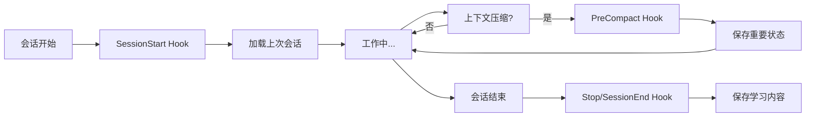
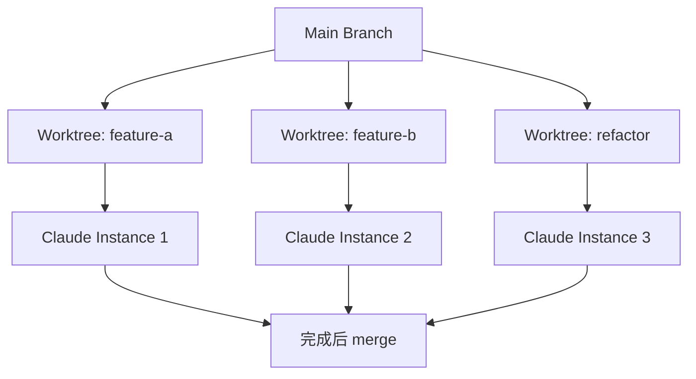
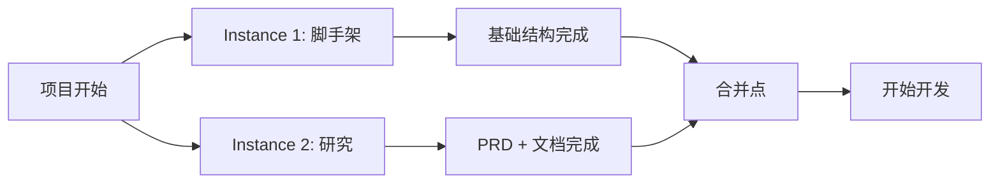

# The Longform Guide 完整解读

> Everything Claude Code 长篇指南的深度解析和实践建议

**生成时间**: 2026-02-16 00:39:59
**原文来源**: `github.com/affaan-m/everything-claude-code/the-longform-guide.md`
**前置要求**: 需要先阅读 The Shorthand Guide 并完成基础配置

---

## 目录

- [指南定位](#指南定位)
- [核心主题](#核心主题)
  - [1. MCP 优化策略](#1-mcp-优化策略)
  - [2. 上下文和内存管理](#2-上下文和内存管理)
  - [3. 持续学习与自动化](#3-持续学习与自动化)
  - [4. Token 优化](#4-token-优化)
  - [5. 验证循环和评估](#5-验证循环和评估)
  - [6. 并行化策略](#6-并行化策略)
  - [7. 项目启动模式](#7-项目启动模式)
  - [8. 代理最佳实践](#8-代理最佳实践)
- [实用技巧](#实用技巧)
- [资源和参考](#资源和参考)

---

## 指南定位

### 与 Shorthand Guide 的关系

- **Shorthand Guide**: 基础设施和配置（skills, hooks, subagents, MCPs, plugins）
- **Longform Guide**: 生产力技巧和模式，将"能用"提升到"高效"

### 核心目标

> 这些是经过 10+ 个月日常使用提炼出的模式，让你从"第一个小时就遭遇上下文腐烂"变成"保持数小时的生产力会话"。

### 五大主题

1. **Token 经济学** - 如何最小化成本
2. **内存持久化** - 跨会话的记忆管理
3. **验证模式** - 确保代码质量
4. **并行化策略** - 多实例协作
5. **可复用工作流的复利效应** - 投资回报最大化

---

## 核心主题

### 1. MCP 优化策略

#### 问题识别

很多 MCP（如 GitHub, Supabase, Vercel, Railway）本质上只是 CLI 的包装器：

```
MCP = CLI 包装器 + 上下文窗口占用 + Token 消耗
```

#### 优化方案

**替代方案**: CLI + Skills + Commands

```bash
# 传统方式：加载 GitHub MCP
# 成本：持续占用上下文窗口

# 优化方式：创建命令
/gh-pr → 包装 gh pr create --title "..." --body "..."
/gh-review → 包装 gh pr review ...
```

#### 具体实现示例

**创建 `/gh-pr` 命令**:
```json
{
  "commands": {
    "gh-pr": {
      "description": "Create GitHub PR with standard template",
      "command": "gh pr create --title \"$1\" --body \"$(cat .github/pr-template.md)\" --assignee @me"
    }
  }
}
```

**创建 Supabase Skill**:
```markdown
---
name: supabase-deploy
description: Deploy to Supabase using CLI
---

# Supabase Deployment

Always use the Supabase CLI instead of the MCP:

\`\`\`bash
# Link project
supabase link --project-ref $PROJECT_REF

# Push migrations
supabase db push

# Deploy functions
supabase functions deploy
\`\`\`
```

#### 效果对比

| 方法 | 上下文占用 | Token 使用 | 灵活性 |
|------|-----------|-----------|--------|
| MCP 全加载 | 高（始终加载） | 高 | 中 |
| Lazy Loading MCP | 中（按需加载） | 中 | 中 |
| CLI + Skills | 低（仅在使用时） | 低 | 高 |

**结论**: 即使有 lazy loading，CLI + skills 方法在 token 优化和成本控制上仍然更优。

---

### 2. 上下文和内存管理

这是 Longform Guide 的核心部分。

#### 2.1 会话存储系统

**核心理念**: 在 `~/.claude/` 文件夹中使用 `.tmp` 文件存储会话状态

**文件结构**:
```
~/.claude/
└── sessions/
    ├── 2026-02-14-feature-auth.tmp
    ├── 2026-02-15-bugfix-api.tmp
    └── 2026-02-16-refactor-db.tmp
```

**会话文件模板**:
```markdown
# Session: Auth Feature Implementation
**Date:** 2026-02-15
**Started:** 09:30
**Last Updated:** 17:45

---

## What Worked (with Evidence)
- ✅ JWT RS256 signing with key rotation
  - Evidence: Tests pass, no token validation errors in logs
- ✅ Redis for refresh token storage (7-day TTL)
  - Evidence: `redis-cli TTL refresh:user:123` shows correct expiry

## What Didn't Work
- ❌ HS256 signature (tried first)
  - Problem: Can't distribute keys securely across services
  - Time wasted: 2 hours
- ❌ Storing refresh tokens in PostgreSQL
  - Problem: Too slow for high-frequency validation
  - Time wasted: 1 hour

## What's Left to Do
- [ ] Add rate limiting to auth endpoints
- [ ] Implement token blacklist for logout
- [ ] Add CSRF protection for cookie-based storage

## Code Locations
- `src/middleware/auth.js` - JWT verification
- `src/routes/auth.js` - Login/logout/refresh endpoints
- `src/services/token.service.js` - Token generation

## Key Decisions
- Using RS256 over HS256 for microservices architecture
- 15-minute access token expiry (balance security/UX)
- Refresh token rotation on every use (security best practice)
```

#### 2.2 战略性上下文清理

**问题**: 探索阶段积累大量上下文，但执行时不再需要

**解决方案**:

```bash
# 1. 完成探索和计划
# 2. 使用 Plan Mode 清理上下文（现在是默认选项）
# 3. 从计划文档开始执行

# 或者：手动压缩
# - 禁用 auto compact
# - 在逻辑间隔手动 /compact
# - 或创建 skill 自动化
```

**Strategic Compact Skill 示例**:
```markdown
---
name: strategic-compact
description: Suggest compaction at logical intervals
---

Monitor tool usage count. When it reaches ~50 edits/writes, suggest:

"Consider running /compact now. You've made 50+ changes.
Compacting will preserve key decisions while clearing exploration context."
```

#### 2.3 动态系统提示注入

**传统方法问题**:
- `CLAUDE.md` (用户级) 和 `.claude/rules/` (项目级) 每次都加载
- 无法根据任务类型动态调整上下文

**高级方法**: 使用 CLI 参数动态注入

```bash
# 基础语法
claude --system-prompt "$(cat memory.md)"
```

**实战设置**:

```bash
# ~/.bashrc 或 ~/.zshrc

# 开发模式
alias claude-dev='claude --system-prompt "$(cat ~/.claude/contexts/dev.md)"'

# PR 审查模式
alias claude-review='claude --system-prompt "$(cat ~/.claude/contexts/review.md)"'

# 研究/探索模式
alias claude-research='claude --system-prompt "$(cat ~/.claude/contexts/research.md)"'

# 调试模式
alias claude-debug='claude --system-prompt "$(cat ~/.claude/contexts/debug.md)"'

# 重构模式
alias claude-refactor='claude --system-prompt "$(cat ~/.claude/contexts/refactor.md)"'
```

**上下文文件示例**:

**`~/.claude/contexts/dev.md`**:
```markdown
# Development Mode

You are in active development mode. Priorities:
1. Write tests first (TDD)
2. Keep files under 400 lines
3. Document key decisions in code comments
4. No console.log in production code

Project context loaded from: ./CLAUDE.md
Previous session: $(cat ~/.claude/sessions/latest.tmp)
```

**`~/.claude/contexts/review.md`**:
```markdown
# PR Review Mode

Focus on:
- Security vulnerabilities (OWASP Top 10)
- Performance issues (N+1 queries, memory leaks)
- Test coverage gaps
- Breaking changes to public APIs
- Documentation completeness

Be thorough but constructive. Suggest improvements, not just criticisms.
```

**提示权限层级**:
```
System Prompt > User Messages > Tool Results
     ↑              ↑                ↑
  最高权限      中等权限         最低权限
```

#### 2.4 内存持久化钩子

**三个关键钩子**:

1. **PreCompact Hook** - 压缩前保存状态
2. **Stop Hook (Session End)** - 会话结束时持久化学习
3. **SessionStart Hook** - 新会话时自动加载上下文

**实现位置**: `github.com/affaan-m/everything-claude-code/tree/main/hooks/memory-persistence`

**配置示例**:
```json
{
  "hooks": {
    "PreCompact": [{
      "matcher": "*",
      "hooks": [{
        "type": "command",
        "command": "~/.claude/scripts/hooks/pre-compact.js"
      }],
      "description": "Save state before context compaction"
    }],
    "SessionEnd": [{
      "matcher": "*",
      "hooks": [{
        "type": "command",
        "command": "~/.claude/scripts/hooks/session-end.js"
      }],
      "description": "Persist learnings to session file"
    }],
    "SessionStart": [{
      "matcher": "*",
      "hooks": [{
        "type": "command",
        "command": "~/.claude/scripts/hooks/session-start.js"
      }],
      "description": "Load previous context automatically"
    }]
  }
}
```

**工作流程**:



---

### 3. 持续学习与自动化

#### 问题陈述

**症状**: 你多次重复相同的提示，Claude 给出相同的错误或响应

**成本**:
- 浪费 Token
- 浪费上下文
- 浪费时间

#### 解决方案架构

**持续学习系统**: 自动将非平凡的知识保存为 Skills

```
发现模式 → 评估价值 → 保存为 Skill → 下次自动加载
```

**实现**: `github.com/affaan-m/everything-claude-code/tree/main/skills/continuous-learning`

#### 关键设计决策：Stop Hook vs UserPromptSubmit

| 钩子类型 | 触发时机 | 性能影响 | 适用场景 |
|---------|---------|---------|---------|
| **UserPromptSubmit** | 每条消息 | ❌ 增加延迟 | 实时拦截 |
| **Stop Hook** | 会话结束 | ✅ 无延迟 | 批量分析 |

**为什么选择 Stop Hook**:
- 轻量级：会话结束运行一次
- 非阻塞：不影响交互体验
- 完整上下文：可以访问整个会话记录

#### 持续学习工作流

```javascript
// evaluate-session.js (Stop Hook)

// 1. 检查会话长度
const messageCount = countMessagesInTranscript();
if (messageCount < 10) {
  return; // 短会话不评估
}

// 2. 分析模式
const patterns = extractPatterns(transcript);
// patterns = [
//   { type: 'error_resolution', pattern: 'JWT v9 breaking change', confidence: 0.9 },
//   { type: 'workaround', pattern: 'Redis TTL format', confidence: 0.8 }
// ]

// 3. 保存为 Skill
for (const pattern of patterns) {
  if (pattern.confidence > 0.7) {
    saveAsSkill(pattern);
  }
}
```

**配置文件** (`config.json`):
```json
{
  "min_session_length": 10,
  "extraction_threshold": "medium",
  "learned_skills_path": "~/.claude/skills/learned/",
  "patterns_to_detect": [
    "error_resolution",        // 错误解决方案
    "user_corrections",        // 用户纠正
    "workarounds",            // 变通方案
    "debugging_techniques",    // 调试技术
    "project_specific"        // 项目特定模式
  ],
  "ignore_patterns": [
    "simple_typos",           // 简单拼写错误
    "one_time_fixes",         // 一次性修复
    "external_api_issues"     // 外部 API 问题
  ]
}
```

#### 实际例子

**第一次遇到问题**:
```
User: "为什么 JWT token 立即过期？"
Claude: "检查 expiresIn 参数，应该使用秒数不是毫秒..."
[手动解决，耗时 30 分钟]
```

**第二次遇到**:
```
User: "又是 token 过期问题..."
Claude: "检查 expiresIn 参数..."
[再次手动解决，耗时 20 分钟]
```

**第三次** (达到阈值，自动学习):
```
[SessionEnd Hook 检测到模式重复]
[ContinuousLearning] Detected pattern: jwt-expiry-common-mistake
[ContinuousLearning] Saved to ~/.claude/skills/learned/jwt-expiry-fix.md
```

**第四次** (自动应用知识):
```
User: "JWT token 过期问题"
[SessionStart 加载 learned skills]
Claude: "根据之前的经验，这通常是 expiresIn 参数格式问题。
       jsonwebtoken v9+ 需要字符串格式：expiresIn: '15m'
       而不是毫秒数：expiresIn: 900000

       检查你的代码中是否使用了 Date.now() + milliseconds 的形式。"
[直接解决，耗时 2 分钟]
```

**ROI 计算**:
- 第一次：30 分钟
- 第二次：20 分钟
- 第三次：25 分钟（构建 skill）
- 第四次：2 分钟 ✅
- **总计**: 从第四次开始，每次节省 28 分钟

---

### 4. Token 优化

#### 4.1 子代理架构

**核心策略**: 使用最便宜且足够的模型

**模型选择矩阵**:

| 任务类型 | 推荐模型 | 理由 | 成本 |
|---------|---------|------|------|
| **探索/搜索** | Haiku | 快速、便宜，找文件够用 | $ |
| **简单编辑** | Haiku | 单文件修改，指令清晰 | $ |
| **文档编写** | Haiku | 结构简单 | $ |
| **多文件实现** | Sonnet | 编码最佳平衡 | $$ |
| **PR 审查** | Sonnet | 理解上下文，捕获细微问题 | $$ |
| **复杂架构** | Opus | 需要深度推理 | $$$ |
| **安全分析** | Opus | 不能错过漏洞 | $$$ |
| **调试复杂 Bug** | Opus | 需要在脑中保持整个系统 | $$$ |

**定价参考** (2026-02-16):

| 模型 | Input ($/M tokens) | Output ($/M tokens) |
|------|-------------------|---------------------|
| **Claude 3.5 Haiku** | $1 | $5 |
| **Claude 3.5 Sonnet** | $3 | $15 |
| **Claude 3.5 Opus** | $15 | $75 |

**实践建议**:
- 默认使用 **Sonnet** 处理 90% 的编码任务
- 升级到 **Opus** 的场景：
  - 首次尝试失败
  - 任务跨越 5+ 文件
  - 架构决策
  - 安全关键代码

#### 4.2 工具特定优化

**mgrep vs ripgrep**:

```bash
# 传统方式
rg "pattern" --json | process...
# Token 使用：~1000 tokens（大量 JSON 元数据）

# 优化方式
mgrep "pattern"
# Token 使用：~500 tokens（智能摘要）
# Token 减少：~50%
```

**基准测试结果**:
> 在 50 个任务的基准测试中，mgrep + Claude Code 使用的 token 约为 grep-based 工作流的 **一半**，质量相同或更好。

**来源**: https://github.com/mixedbread-ai/mgrep

**安装 mgrep**:
```bash
# macOS
brew install mgrep

# Linux
cargo install mgrep

# 配置 Claude Code 使用 mgrep
echo 'export CLAUDE_GREP_TOOL=mgrep' >> ~/.bashrc
```

#### 4.3 代码库模块化

**原则**: 主文件保持在数百行，而不是数千行

**为什么**:
1. **Token 优化**: 读取和上下文更小
2. **首次成功率更高**: Claude 更容易理解整个文件
3. **更好的可维护性**: 人类和 AI 都受益

**文件大小指南**:

| 文件大小 | 状态 | 操作 |
|---------|------|------|
| < 200 行 | ✅ 理想 | 无 |
| 200-400 行 | ✅ 良好 | 无 |
| 400-800 行 | ⚠️ 可接受 | 考虑拆分 |
| > 800 行 | ❌ 过大 | 必须重构 |

**重构策略**:

```javascript
// ❌ 之前：一个 1500 行的 UserController.js

// ✅ 之后：拆分为多个模块
src/controllers/user/
├── index.js           (50 行 - 入口)
├── auth.js            (200 行 - 认证逻辑)
├── profile.js         (150 行 - 用户资料)
├── settings.js        (180 行 - 设置管理)
└── validation.js      (120 行 - 输入验证)
```

**Hook 示例** (阻止大文件创建):
```json
{
  "matcher": "Write",
  "hooks": [{
    "type": "command",
    "command": "node -e \"let d='';process.stdin.on('data',c=>d+=c);process.stdin.on('end',()=>{const i=JSON.parse(d);const c=i.tool_input?.content||'';const lines=c.split('\\n').length;if(lines>800){console.error('[Hook] BLOCKED: File exceeds 800 lines ('+lines+')');console.error('[Hook] Split into smaller modules');process.exit(2)}console.log(d)})\""
  }],
  "description": "Block creation of files > 800 lines"
}
```

---

### 5. 验证循环和评估

#### 5.1 基准测试工作流

**Fork 对比法**:

```bash
# 1. Fork 当前对话
/fork

# 2. 在一个分支使用 skill
[Branch A] 使用 /tdd skill

# 3. 在另一个分支不使用 skill
[Branch B] 手动操作

# 4. 对比结果
git worktree add ../test-a feature-a
git worktree add ../test-b feature-b

# 在两个目录中运行 Claude
cd ../test-a && claude  # 使用 skill
cd ../test-b && claude  # 不使用 skill

# 5. 比较差异
diff -r ../test-a ../test-b
```

**评估维度**:
- ✅ 功能完整性
- ✅ 代码质量
- ✅ Token 使用量
- ✅ 完成时间
- ✅ Bug 数量

#### 5.2 评估模式类型

**1. Checkpoint-Based Evals（检查点评估）**:

```markdown
# 检查点 1: 基础结构
- [ ] 项目初始化完成
- [ ] 依赖安装成功
- [ ] 测试框架配置
→ 验证通过才继续

# 检查点 2: 核心功能
- [ ] API 端点实现
- [ ] 单元测试通过
- [ ] 集成测试通过
→ 验证通过才继续

# 检查点 3: 边界情况
- [ ] 错误处理完整
- [ ] 边界值测试
- [ ] 性能测试
→ 验证通过才继续
```

**2. Continuous Evals（持续评估）**:

```bash
# 每 N 分钟或每次重大更改后运行
watch -n 300 "npm test && npm run lint"

# 或使用 Hook
{
  "matcher": "Edit",
  "hooks": [{
    "type": "command",
    "command": "npm test",
    "async": true,
    "condition": "files_changed >= 3"
  }]
}
```

#### 5.3 关键指标

**pass@k** (至少一次成功):
```
k=1: 70%  (单次尝试成功率)
k=3: 91%  (三次中至少一次成功)
k=5: 97%  (五次中至少一次成功)
```

**pass^k** (全部成功):
```
k=1: 70%  (单次尝试成功率)
k=3: 34%  (三次全部成功率)
k=5: 17%  (五次全部成功率)
```

**使用场景**:
- **pass@k**: "我只需要它能工作" → 适合原型、POC
- **pass^k**: "我需要一致性" → 适合生产代码、关键功能

**实际应用**:

```bash
# 使用 pass@3 策略（运行 3 次，至少 1 次成功）
for i in {1..3}; do
  echo "Attempt $i..."
  if npm test; then
    echo "✅ Tests passed on attempt $i"
    break
  fi
done

# 使用 pass^3 策略（运行 3 次，全部必须成功）
success_count=0
for i in {1..3}; do
  echo "Attempt $i..."
  if npm test; then
    ((success_count++))
  fi
done

if [ $success_count -eq 3 ]; then
  echo "✅ All 3 attempts passed"
else
  echo "❌ Only $success_count/3 passed"
fi
```

---

### 6. 并行化策略

#### 6.1 核心原则

**首要目标**:
> 用最少的并行化完成最多的工作

**反模式**:
```bash
# ❌ 错误：盲目开启多个终端
# 5 个本地 + 5 个云端 = 10 个实例
# 问题：协调成本 > 并行收益
```

**正确方式**:
```bash
# ✅ 正确：根据真实需求添加实例
# 主终端：代码修改
# 终端 2：仅在需要时用于研究/文档查询
```

#### 6.2 分工模式

**推荐模式**:

```
┌─────────────────┬─────────────────┐
│  主终端         │  辅助终端        │
│  (代码修改)     │  (问答/研究)     │
├─────────────────┼─────────────────┤
│ - Edit          │ - Read          │
│ - Write         │ - Grep          │
│ - Bash (build)  │ - WebSearch     │
│ - Test          │ - Documentation │
└─────────────────┴─────────────────┘
```

**关键规则**:
- ✅ 主终端负责所有代码更改
- ✅ 辅助终端仅用于只读查询
- ❌ 避免多个终端修改重叠的文件

#### 6.3 Git Worktrees 实现真并行

**场景**: 需要多个终端同时修改代码

**解决方案**: Git Worktrees

```bash
# 创建 worktrees
git worktree add ../project-feature-a feature-a
git worktree add ../project-feature-b feature-b
git worktree add ../project-refactor refactor-branch

# 目录结构
~/projects/
├── myapp/                  (main branch)
├── myapp-feature-a/        (feature-a branch)
├── myapp-feature-b/        (feature-b branch)
└── myapp-refactor/         (refactor-branch)

# 在每个目录中启动 Claude
cd ~/projects/myapp-feature-a && claude
cd ~/projects/myapp-feature-b && claude
cd ~/projects/myapp-refactor && claude
```

**使用 `/rename` 标识会话**:
```
Terminal 1: /rename feature-auth
Terminal 2: /rename feature-payment
Terminal 3: /rename refactor-db
```

**工作流程**:


#### 6.4 Cascade Method（瀑布法）

**组织多个实例**:

```
Tab 1: Main Code (oldest)
  ↓
Tab 2: Research
  ↓
Tab 3: Testing
  ↓
Tab 4: New Feature (newest)

扫描方向: ← 从左到右，从旧到新
```

**规则**:
1. 新任务在右侧新建标签
2. 从左到右扫描，处理旧任务
3. 同时关注最多 3-4 个任务
4. 完成的任务关闭，释放注意力

#### 6.5 Fork 的正确使用

**场景 1: 探索性问题**
```
主对话: 正在实现功能
  ↓ /fork
分支: "这个库的 API 是怎么设计的？"
  ↓ 回答后关闭分支
主对话: 继续实现
```

**场景 2: 并行研究**
```
主对话: 实现支付集成
  ↓ /fork
分支 A: "研究 Stripe API 最佳实践"
  ↓ /fork
分支 B: "查看我们的错误处理模式"
  ↓ 合并发现
主对话: 应用研究结果实现
```

---

### 7. 项目启动模式

#### 7.1 双实例启动模式

**场景**: 启动一个新项目

**设置**: 2 个 Claude 实例

**Instance 1: Scaffolding Agent（脚手架代理）**

职责:
- 🏗️ 创建项目结构
- 📝 设置配置文件
- 🛠️ 初始化工具链

```bash
# Terminal 1
cd ~/projects/new-project
claude

# 指令
"设置一个 Next.js + TypeScript + Tailwind 项目，包括：
- 项目结构（按功能组织）
- CLAUDE.md 配置
- .claude/rules/ 规则
- .claude/agents/ 代理配置
- ESLint + Prettier
- 测试框架（Vitest）
"
```

**Instance 2: Deep Research Agent（深度研究代理）**

职责:
- 🔍 连接到服务和 API
- 📚 创建详细的 PRD
- 📊 绘制架构图（Mermaid）
- 📖 收集文档片段

```bash
# Terminal 2
cd ~/projects/new-project
claude

# 指令
"创建项目文档：
1. 连接到 Supabase、Stripe、SendGrid
2. 编写详细的 PRD（产品需求文档）
3. 绘制系统架构 Mermaid 图
   - 数据流图
   - 组件关系图
   - API 端点地图
4. 整理关键文档片段
   - Next.js App Router 最佳实践
   - Supabase 认证模式
   - Stripe 订阅集成指南
"
```

**协调流程**:



**时间估算**:
- Instance 1: 15-20 分钟（脚手架）
- Instance 2: 20-30 分钟（研究和文档）
- **并行总时间**: ~25 分钟（vs 顺序 ~45 分钟）

#### 7.2 llms.txt 模式

**发现 llms.txt**:

```bash
# 许多文档网站提供 LLM 优化版本
https://docs.example.com/llms.txt

# 常见位置
https://nextjs.org/llms.txt
https://supabase.com/llms.txt
https://stripe.com/llms.txt
```

**使用方法**:

```bash
# 1. 获取 llms.txt
curl https://docs.framework.com/llms.txt > framework-docs.txt

# 2. 在 Claude Code 中使用
"参考 framework-docs.txt，实现用户认证流程"

# 或者：添加到系统提示
claude --system-prompt "$(cat framework-docs.txt)" \
      --system-prompt "$(cat memory.md)"
```

**优势**:
- ✅ 专为 LLM 优化的格式
- ✅ 去除了无关的 UI/营销内容
- ✅ 结构清晰，易于解析
- ✅ Token 使用更少

#### 7.3 复利效应哲学

**引用** (@omarsar0):
> "早期，我花时间构建可复用的工作流/模式。构建过程很繁琐，但随着模型和代理工具的改进，产生了巨大的复利效应。"

**投资优先级**:

1. **Subagents（子代理）** - ROI: ⭐⭐⭐⭐⭐
   - 可复用性高
   - 模型改进时自动受益
   - 示例：tdd-agent, code-reviewer, build-fixer

2. **Skills（技能）** - ROI: ⭐⭐⭐⭐⭐
   - 编码模式和最佳实践
   - 项目特定知识
   - 示例：django-patterns, react-best-practices

3. **Commands（命令）** - ROI: ⭐⭐⭐⭐
   - 高频操作的快捷方式
   - 减少重复输入
   - 示例：/gh-pr, /db-migrate, /deploy

4. **Planning Patterns（规划模式）** - ROI: ⭐⭐⭐⭐
   - 结构化问题解决
   - 可重复的工作流
   - 示例：5-phase implementation, research-plan-implement

5. **MCP Tools（MCP 工具）** - ROI: ⭐⭐⭐
   - 外部服务集成
   - 上下文占用成本
   - 权衡：功能 vs 成本

6. **Context Engineering Patterns（上下文工程模式）** - ROI: ⭐⭐⭐⭐⭐
   - 最大化 token 效率
   - 提高响应质量
   - 示例：dynamic prompts, strategic compaction

**时间投资建议**:

```
第 1 周: 基础设施设置
- 配置 hooks
- 创建 5-10 个常用 skills
- 设置 2-3 个 subagents

第 2-4 周: 迭代改进
- 根据实际使用优化 skills
- 添加项目特定模式
- 建立 continuous learning

第 2-6 月: 复利阶段
- Skills 自动积累
- Patterns 逐渐成熟
- 生产力显著提升
```

---

### 8. 代理最佳实践

#### 8.1 子代理上下文问题

**核心问题**:

```
Orchestrator: "分析 auth 模块的性能问题"
  ↓ 传递给子代理
Sub-agent: "分析 auth 模块"  ← 缺少 PURPOSE（目的）
  ↓ 返回
Sub-agent: "auth 模块有 5 个文件，共 1200 行..."  ← 缺少针对性

问题：子代理只知道字面查询，不知道背后的目的
```

**解决方案**: 传递目标上下文

```
Orchestrator: "分析 auth 模块的性能问题"
  ↓ 增强的提示
Sub-agent:
  查询: "auth 模块"
  目标: "识别性能瓶颈，特别是：
         - 数据库查询效率
         - 缓存使用
         - Token 验证开销"
  背景: "用户报告登录延迟 2-3 秒"
  ↓ 返回
Sub-agent:
  "发现 3 个性能问题：
   1. auth.js:45 - N+1 查询（用户权限）
   2. token.service.js:120 - 缺少 Redis 缓存
   3. middleware/auth.js:30 - 每次请求都验证签名"
```

#### 8.2 迭代检索模式

**流程**:

```
1. Orchestrator 发送查询（带目标上下文）
   ↓
2. Sub-agent 返回初步结果
   ↓
3. Orchestrator 评估结果
   ↓
4. 不足？提出跟进问题
   ↓
5. Sub-agent 回到源头，获取更多细节
   ↓
6. 循环直到满足（最多 3 轮）
```

**实现示例**:

```javascript
// orchestrator.js

async function analyzeWithIterativeRetrieval(query, objective, maxRounds = 3) {
  let round = 0;
  let result = null;
  let followUpQuestions = [];

  while (round < maxRounds) {
    round++;

    // 调用子代理
    result = await subAgent.analyze({
      query,
      objective,
      followUp: followUpQuestions,
      round
    });

    // 评估结果
    const evaluation = evaluateCompleteness(result, objective);

    if (evaluation.complete) {
      console.log(`✅ Satisfied after ${round} round(s)`);
      return result;
    }

    // 生成跟进问题
    followUpQuestions = generateFollowUpQuestions(result, evaluation.missing);
    console.log(`🔄 Round ${round}: ${followUpQuestions.length} follow-up questions`);
  }

  console.log(`⚠️ Max rounds (${maxRounds}) reached`);
  return result;
}
```

**具体例子**:

```
Round 1:
  Query: "分析 auth 模块"
  Return: "auth 模块包含 login, logout, refresh 功能"
  Evaluation: 缺少性能数据

Round 2:
  Follow-up: "login 函数的平均执行时间和数据库查询数量？"
  Return: "login 平均 2.3s，执行 15 个数据库查询"
  Evaluation: 缺少具体查询位置

Round 3:
  Follow-up: "15 个查询的具体位置和 SQL 语句？"
  Return: "auth.js:45-67 - N+1 问题，循环查询用户角色"
  Evaluation: ✅ 完整
```

#### 8.3 编排器顺序阶段模式

**架构**:

```markdown
Phase 1: RESEARCH
  Agent: Explore
  Input: 项目需求文档
  Output: research-summary.md
  Exit Criteria: ✅ 技术栈确定，✅ 关键风险识别

Phase 2: PLAN
  Agent: Planner
  Input: research-summary.md
  Output: plan.md
  Exit Criteria: ✅ 任务分解完成，✅ 依赖关系明确

Phase 3: IMPLEMENT
  Agent: TDD-Guide
  Input: plan.md
  Output: 代码 + 测试
  Exit Criteria: ✅ 所有测试通过，✅ 代码覆盖率 > 80%

Phase 4: REVIEW
  Agent: Code-Reviewer
  Input: 代码变更 diff
  Output: review-comments.md
  Exit Criteria: ✅ 无关键问题，✅ 最佳实践遵循

Phase 5: VERIFY
  Agent: Build-Error-Resolver (if needed)
  Input: 构建/测试错误
  Output: 修复 + 验证
  Exit Criteria: ✅ 构建成功，✅ 所有测试通过

  Success → DONE
  Failure → 回到 Phase 3
```

**关键规则**:

1. **每个代理一个明确的输入和输出**
   ```
   ✅ Input: research-summary.md → Output: plan.md
   ❌ Input: "一些上下文" → Output: "一些代码"
   ```

2. **输出成为下一阶段的输入**
   ```
   research-summary.md → plan.md → code + tests → review-comments.md
   ```

3. **永远不要跳过阶段**
   ```
   ❌ Research → Implement (跳过 Plan)
   ✅ Research → Plan → Implement
   ```

4. **在代理之间使用 `/clear`**
   ```bash
   # Phase 1 完成
   /clear

   # Phase 2 开始（清理的上下文）
   "根据 research-summary.md，创建实施计划..."
   ```

5. **将中间输出存储在文件中**
   ```bash
   ~/.claude/sessions/current/
   ├── research-summary.md
   ├── plan.md
   ├── implementation-log.md
   ├── review-comments.md
   └── verification-results.md
   ```

**编排器实现** (伪代码):

```javascript
// orchestrator.js

const phases = [
  {
    name: 'RESEARCH',
    agent: 'explore',
    input: 'requirements.md',
    output: 'research-summary.md',
    exitCriteria: ['tech_stack_decided', 'risks_identified']
  },
  {
    name: 'PLAN',
    agent: 'planner',
    input: 'research-summary.md',
    output: 'plan.md',
    exitCriteria: ['tasks_decomposed', 'dependencies_clear']
  },
  {
    name: 'IMPLEMENT',
    agent: 'tdd-guide',
    input: 'plan.md',
    output: 'code_changes',
    exitCriteria: ['tests_pass', 'coverage_above_80']
  },
  {
    name: 'REVIEW',
    agent: 'code-reviewer',
    input: 'git diff HEAD',
    output: 'review-comments.md',
    exitCriteria: ['no_critical_issues', 'best_practices_followed']
  },
  {
    name: 'VERIFY',
    agent: 'build-error-resolver',
    input: 'build_output',
    output: 'fixes',
    exitCriteria: ['build_success', 'tests_pass'],
    onFailure: 'goto IMPLEMENT'
  }
];

async function runOrchestrator() {
  for (const phase of phases) {
    console.log(`\n=== Phase: ${phase.name} ===`);

    // 清理上下文
    await claude.clear();

    // 运行代理
    const result = await claude.runAgent(phase.agent, {
      input: readFile(phase.input),
      goal: phase.exitCriteria
    });

    // 保存输出
    writeFile(phase.output, result);

    // 检查退出标准
    const criteriaMet = await checkExitCriteria(result, phase.exitCriteria);

    if (!criteriaMet && phase.onFailure) {
      console.log(`⚠️ Criteria not met, ${phase.onFailure}`);
      // 处理失败逻辑
    }
  }

  console.log('\n✅ All phases complete');
}
```

---

## 实用技巧

### 自定义状态栏

**设置**:
```bash
/statusline
```

Claude 会提示你配置想要显示的信息：
- 当前 Git 分支
- 未提交的更改数
- 最后一次测试结果
- Token 使用量
- 当前时间

**第三方实现**: https://github.com/sirmalloc/ccstatusline

### 语音转录

**工具推荐**:
- **macOS**: superwhisper, MacWhisper
- **Windows**: (待补充)
- **Linux**: (待补充)

**优势**:
- 比打字快（对许多人来说）
- 即使有转录错误，Claude 也能理解意图
- 适合长时间工作会话

**使用方式**:
```
[启动语音转录]
"打开 auth.js 文件，找到 login 函数，
把 HS256 改成 RS256，然后更新相关的密钥加载逻辑"
[Claude 理解并执行]
```

### 终端别名

**基础别名**:
```bash
# ~/.bashrc 或 ~/.zshrc

# Claude Code
alias c='claude'
alias cdev='claude --system-prompt "$(cat ~/.claude/contexts/dev.md)"'
alias cpr='claude --system-prompt "$(cat ~/.claude/contexts/review.md)"'

# Git 快捷方式
alias gs='git status'
alias gd='git diff'
alias gc='git commit'
alias gp='git push'

# 项目导航
alias proj='cd ~/projects'
alias work='cd ~/workspace'

# 工具
alias gh='github'
alias co='code'
```

**组合别名**:
```bash
# 开启开发会话（带 tmux）
alias dev='tmux new-session -d -s dev "npm run dev" && claude'

# 快速 PR 创建
alias pr='git push && gh pr create --fill'

# 测试 + 覆盖率
alias tc='npm test -- --coverage'
```

---

## 资源和参考

### 代理编排

**Claude Flow**:
- URL: https://github.com/ruvnet/claude-flow
- 描述: 企业级编排平台，包含 54+ 专用代理
- 适用场景: 大型项目，复杂工作流

### 自我改进记忆

**Continuous Learning Skill**:
- URL: https://github.com/affaan-m/everything-claude-code/tree/main/skills/continuous-learning
- 描述: 本指南中介绍的持续学习系统

**Session Reflection Pattern**:
- URL: https://rlancemartin.github.io/2025/12/01/claude_diary/
- 描述: 会话反思模式，记录学习和改进

### 系统提示参考

**System Prompts Collection**:
- URL: https://github.com/x1xhlol/system-prompts-and-models-of-ai-tools
- Stars: 110k+
- 描述: 各种 AI 工具的系统提示集合

### 官方资源

**Anthropic Academy**:
- URL: https://anthropic.skilljar.com
- 描述: 官方培训和认证

**Claude API 文档**:
- URL: https://platform.claude.com/docs
- 描述: API 参考和定价

### 社区贡献

**核心参考文献**:
- [Anthropic: Demystifying evals for AI agents](https://www.anthropic.com/engineering/demystifying-evals-for-ai-agents)
- [YK: 32 Claude Code Tips](https://agenticcoding.substack.com/p/32-claude-code-tips-from-basics-to)
- [RLanceMartin: Session Reflection Pattern](https://rlancemartin.github.io/2025/12/01/claude_diary/)

**社区贡献者**:
- @PerceptualPeak: 子代理上下文协商
- @menhguin: 代理抽象分级
- @omarsar0: 复利效应哲学

---

## 里程碑

**Everything Claude Code 项目**:
- ⭐ 25,000+ GitHub stars
- 🕐 < 1 周内达成
- 🌟 社区驱动的增长

---

## 总结

### 关键要点

1. **MCP 不是免费的** - 考虑 CLI + Skills 替代方案
2. **内存持久化是核心** - 使用 hooks 自动化跨会话记忆
3. **持续学习避免重复** - 将发现转化为可复用 skills
4. **Token 优化靠架构** - 正确的模型选择 + mgrep + 模块化代码
5. **验证是必需的** - pass@k vs pass^k，知道何时使用哪个
6. **并行化需要纪律** - 最少必要实例，明确分工
7. **投资复利效应** - 早期构建模式，长期收益

### 下一步行动

**立即开始**:
1. ✅ 安装 memory persistence hooks
2. ✅ 创建 5 个最常用的 skills
3. ✅ 设置动态系统提示别名
4. ✅ 配置 continuous learning

**第一周目标**:
- 记录至少 3 个会话
- 提取至少 1 个 learned skill
- 优化至少 1 个 MCP → CLI + Skill

**第一月目标**:
- 建立完整的 5-phase orchestration
- 积累 10+ learned skills
- Token 使用减少 30%+

### 最终思考

**来自作者**:
> "这些模式是我 10+ 个月日常使用的结晶。不是所有技巧都适合所有人，但核心原则是通用的：
>
> 1. 自动化记忆（hooks）
> 2. 持续学习（skills）
> 3. 优化成本（token engineering）
> 4. 验证质量（evals）
> 5. 战略性并行（最小必要实例）
>
> 从小处开始，迭代改进，享受复利效应。"

---

**完整资源**: https://github.com/affaan-m/everything-claude-code

**生成时间**: 2026-02-16 00:39:59
**解读作者**: Claude Sonnet 4.5 (AI Assistant)
**基于版本**: everything-claude-code (latest)
