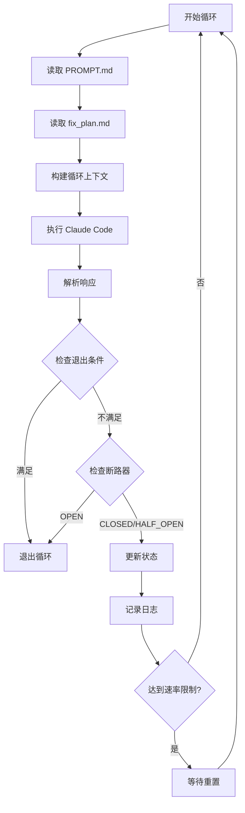

# Ralph for Claude Code - 项目理解文档

> 文档生成时间：2026-02-21
> 项目版本：v0.11.4
> 项目仓库：https://github.com/frankbria/ralph-claude-code

## 1. 项目概述

### 1.1 什么是 Ralph？

Ralph 是一个为 Claude Code 设计的**自主 AI 开发循环系统**。它实现了 Geoffrey Huntley 提出的"Ralph 技术"，能够让 Claude Code 持续自主地迭代改进项目，直到完成开发任务。

### 1.2 核心价值

- **自动化开发循环**：无需人工干预，Claude Code 自动迭代开发
- **智能退出机制**：防止无限循环，通过多种条件判断项目完成状态
- **速率保护**：内置 API 调用限制，防止过度使用
- **全局安装**：一次安装，在任何项目中都可使用
- **会话连续性**：保持上下文，提高开发连贯性

### 1.3 项目状态

- **版本**：v0.11.4（活跃开发中）
- **测试覆盖**：484 个测试，100% 通过率
- **成熟度**：核心功能完善，预计 4 周达到 v1.0
- **许可证**：MIT License

---

## 2. 核心概念

### 2.1 Ralph 循环（Ralph Loop）

Ralph 的核心是一个自主执行循环：

```
1. 读取指令 (PROMPT.md)
   ↓
2. 执行 Claude Code
   ↓
3. 跟踪进度 (fix_plan.md)
   ↓
4. 评估完成情况
   ↓
5. 决策：继续 or 退出
   ↓
如果继续，返回步骤 1
```

### 2.2 智能退出检测

Ralph 使用**双条件检查**来决定是否退出循环：

#### 退出条件（需同时满足）

| 条件 | 说明 |
|------|------|
| `completion_indicators >= 2` | 从自然语言模式启发式检测到完成信号 |
| `EXIT_SIGNAL: true` | Claude 显式确认项目完成 |

#### 其他退出条件

- 所有 `fix_plan.md` 中的任务都已标记完成
- 连续多次收到"done"信号（`>= 2`次）
- 太多测试导向的循环（表明功能已完成）
- 达到 5 小时 API 使用限制

#### 行为示例

```bash
# 场景 1：阶段完成但还有工作
Loop 5: Claude 输出 "Phase complete, moving to next feature"
        → completion_indicators: 3 (高置信度)
        → EXIT_SIGNAL: false (Claude 说还有工作)
        → 结果: 继续循环

# 场景 2：项目真正完成
Loop 8: Claude 输出 "All tasks complete, project ready"
        → completion_indicators: 4
        → EXIT_SIGNAL: true (Claude 确认完成)
        → 结果: 退出并标记为 "project_complete"
```

### 2.3 速率限制和断路器

#### 速率限制
- **默认限制**：100 次调用/小时
- **自动重置**：每小时重置一次
- **倒计时显示**：实时显示剩余时间

#### 断路器（Circuit Breaker）

防止无效循环的智能机制：

```
状态：CLOSED (正常) → HALF_OPEN (监控) → OPEN (停止)
```

**触发条件：**
- 连续 3 个循环没有文件变更
- 连续 5 个循环出现相同错误
- 输出下降超过 70%
- 连续 2 次权限被拒绝

**自动恢复：**
- 默认冷却时间：30 分钟
- `OPEN → HALF_OPEN → CLOSED`

### 2.4 会话管理

Ralph 维护会话上下文以提高开发连贯性：

- **会话文件**：`.ralph/.ralph_session`
- **会话过期**：默认 24 小时
- **自动重置触发条件**：
  - 断路器打开
  - 手动中断（Ctrl+C）
  - 项目完成
  - 会话过期

---

## 3. 安装和使用

### 3.1 系统要求

#### 必需组件
- **Bash 4.0+**：脚本执行环境
- **Claude Code CLI**：`npm install -g @anthropic-ai/claude-code`
- **Git**：版本控制
- **jq**：JSON 处理

#### 推荐组件
- **tmux**：终端复用器，用于集成监控
- **GNU coreutils**：提供 `timeout` 命令
  - Linux：预装
  - macOS：`brew install coreutils`

### 3.2 安装流程

#### 第一阶段：全局安装（仅需一次）

```bash
# 1. 克隆仓库
git clone https://github.com/frankbria/ralph-claude-code.git
cd ralph-claude-code

# 2. 执行安装
./install.sh

# 3. 验证安装
which ralph
ralph --help
```

安装后，以下全局命令可用：
- `ralph` - 启动自主开发循环
- `ralph-monitor` - 启动监控仪表板
- `ralph-setup` - 创建新项目
- `ralph-enable` - 在现有项目中启用 Ralph
- `ralph-import` - 导入 PRD/规范文档
- `ralph-migrate` - 迁移旧项目结构

#### 第二阶段：项目初始化（每个项目）

**选项 A：在现有项目中启用 Ralph（推荐）**

```bash
cd my-existing-project

# 交互式向导 - 自动检测项目类型并导入任务
ralph-enable

# 或指定任务源
ralph-enable --from beads
ralph-enable --from github --label "sprint-1"
ralph-enable --from prd ./docs/requirements.md

# 开始自主开发
ralph --monitor
```

**选项 B：导入现有 PRD/规范**

```bash
# 转换现有 PRD/规范为 Ralph 格式
ralph-import my-requirements.md my-project
cd my-project

# 审查并调整生成的文件：
# - .ralph/PROMPT.md (Ralph 指令)
# - .ralph/fix_plan.md (任务优先级)
# - .ralph/specs/requirements.md (技术规范)

# 开始自主开发
ralph --monitor
```

**选项 C：从头创建新项目**

```bash
# 创建空白 Ralph 项目
ralph-setup my-awesome-project
cd my-awesome-project

# 手动配置项目需求
# 编辑 .ralph/PROMPT.md 设置项目目标
# 编辑 .ralph/specs/ 添加详细规范
# 编辑 .ralph/fix_plan.md 设置初始优先级

# 开始自主开发
ralph --monitor
```

### 3.3 日常使用

一旦 Ralph 已安装且项目已初始化：

```bash
# 推荐：集成 tmux 监控
ralph --monitor

# 或使用分离的终端
ralph                        # 终端 1：Ralph 循环
ralph-monitor               # 终端 2：实时监控仪表板
```

### 3.4 卸载

```bash
# 运行卸载脚本
./uninstall.sh

# 或者如果已删除仓库：
curl -sL https://raw.githubusercontent.com/frankbria/ralph-claude-code/main/uninstall.sh | bash
```

---

## 4. 项目结构

### 4.1 Ralph 项目目录结构

```
my-project/
├── .ralph/                 # Ralph 配置和状态（隐藏文件夹）
│   ├── PROMPT.md           # 主要开发指令
│   ├── fix_plan.md        # 优先任务列表
│   ├── AGENT.md           # 构建和运行指令
│   ├── specs/              # 项目规范和需求
│   │   └── stdlib/         # 标准库规范
│   ├── examples/           # 使用示例和测试用例
│   ├── logs/               # Ralph 执行日志
│   │   └── ralph.log      # 主日志文件
│   ├── .ralph_session      # 会话状态文件
│   ├── .ralph_session_history  # 会话转换历史
│   ├── .response_analysis  # 响应分析结果
│   └── docs/generated/     # 自动生成的文档
├── .ralphrc                # Ralph 配置文件
└── src/                    # 源代码实现（在项目根目录）
```

### 4.2 关键文件说明

| 文件 | 自动生成？ | 你应该... |
|------|-----------|----------|
| `.ralph/PROMPT.md` | 是（智能默认值） | **审查并自定义**项目目标和原则 |
| `.ralph/fix_plan.md` | 是（可导入任务） | **添加/修改**具体实现任务 |
| `.ralph/AGENT.md` | 是（检测构建命令） | 很少编辑（由 Ralph 自动维护） |
| `.ralph/specs/` | 空目录 | 当 PROMPT.md 不够详细时添加文件 |
| `.ralph/specs/stdlib/` | 空目录 | 添加可重用的模式和约定 |
| `.ralphrc` | 是（项目感知） | 很少编辑（合理的默认值） |

### 4.3 文件关系

```
PROMPT.md (高层目标)
    ↓
specs/ (详细需求，按需添加)
    ↓
fix_plan.md (Ralph 执行的具体任务)
    ↓
AGENT.md (构建/测试命令 - 自动维护)
```

---

## 5. 配置详解

### 5.1 `.ralphrc` 配置文件

```bash
# .ralphrc - Ralph 项目配置
PROJECT_NAME="my-project"
PROJECT_TYPE="typescript"

# 循环设置
MAX_CALLS_PER_HOUR=100
CLAUDE_TIMEOUT_MINUTES=15
CLAUDE_OUTPUT_FORMAT="json"

# 工具权限
ALLOWED_TOOLS="Write,Read,Edit,Bash(git *),Bash(npm *),Bash(pytest)"

# 会话管理
SESSION_CONTINUITY=true
SESSION_EXPIRY_HOURS=24

# 断路器阈值
CB_NO_PROGRESS_THRESHOLD=3
CB_SAME_ERROR_THRESHOLD=5
CB_COOLDOWN_MINUTES=30
```

### 5.2 命令行选项

```bash
ralph [选项]

基本选项：
  -h, --help              显示帮助信息
  -m, --monitor           使用 tmux 会话启动并实时监控
  -v, --verbose           显示详细的进度更新
  -s, --status            显示当前状态并退出

速率和超时：
  -c, --calls NUM         设置每小时最大调用次数（默认：100）
  -t, --timeout MIN       设置 Claude Code 执行超时（1-120 分钟，默认：15）

配置：
  -p, --prompt FILE       设置提示文件（默认：PROMPT.md）
  --output-format FORMAT  设置输出格式：json（默认）或 text
  --allowed-tools TOOLS   设置允许的 Claude 工具

会话管理：
  --no-continue           禁用会话连续性（每次循环重新开始）
  --reset-session         手动重置会话状态

断路器：
  --reset-circuit         重置断路器
  --circuit-status        显示断路器状态
  --auto-reset-circuit    启动时自动重置断路器（绕过冷却）

输出：
  -l, --live              启用实时流式输出（实时 Claude Code 可见性）
```

### 5.3 常用命令组合

```bash
# 标准开发循环（推荐）
ralph --monitor

# 快速迭代（低调用限制）
ralph --monitor --calls 20 --timeout 5

# 复杂任务（高超时）
ralph --monitor --timeout 60

# 调试模式（详细输出 + 实时流）
ralph --verbose --live

# 重新开始（清除会话）
ralph --reset-session --monitor

# 恢复断路器后继续
ralph --reset-circuit --monitor
```

---

## 6. 工作原理

### 6.1 Ralph 循环详解



### 6.2 响应分析器

Ralph 使用智能响应分析器来理解 Claude Code 的输出：

**分析内容：**
- 工作类型（feature/refactor/test/fix）
- 修改的文件列表
- 退出信号
- 完成指示器
- 错误检测

**JSON 格式支持：**
```json
{
  "result": "...",
  "sessionId": "...",
  "metadata": {
    "status": "in_progress",
    "exit_signal": false,
    "work_type": "feature",
    "files_modified": ["src/index.ts"]
  }
}
```

### 6.3 会话连续性

Ralph 维护会话上下文以提高连贯性：

```bash
# 会话文件示例：.ralph/.ralph_session
{
  "session_id": "abc123...",
  "created_at": "2026-02-21T10:00:00Z",
  "expires_at": "2026-02-22T10:00:00Z",
  "loop_count": 5
}
```

**会话生命周期：**
1. 创建 - 第一次循环时
2. 使用 - 每次循环使用 `--continue` 标志
3. 过期 - 24 小时后自动过期
4. 重置 - 手动或自动触发重置

---

## 7. 最佳实践

### 7.1 编写有效的 PROMPT.md

```markdown
# 项目目标
[清晰描述项目的最终目标]

# 核心原则
1. 具体性 - 清晰的需求带来更好的结果
2. 优先级 - 使用 fix_plan.md 指导 Ralph 的焦点
3. 边界 - 定义什么在范围内/外
4. 示例 - 展示预期的输入/输出

# 技术栈
[列出使用的技术和框架]

# 开发约定
[代码风格、命名约定等]
```

### 7.2 管理 fix_plan.md

```markdown
# 优先任务

## 高优先级
- [ ] 实现用户认证
- [ ] 添加数据库模型
- [ ] 创建 API 端点

## 中优先级
- [ ] 添加单元测试
- [ ] 实现错误处理

## 低优先级
- [ ] 优化性能
- [ ] 添加文档
```

### 7.3 项目规范组织

```
.ralph/specs/
├── architecture.md      # 架构决策
├── api-design.md        # API 设计规范
├── database-schema.md   # 数据库模式
└── stdlib/
    ├── error-handling.md  # 错误处理模式
    └── testing.md         # 测试约定
```

### 7.4 监控进度

```bash
# 实时监控
ralph --monitor

# 查看日志
tail -f .ralph/logs/ralph.log

# 检查状态
cat .ralph/status.json | jq

# 查看会话历史
cat .ralph/.ralph_session_history
```

---

## 8. 常见问题和故障排除

### 8.1 常见问题

#### Q1: Ralph 过早退出
**原因**：退出阈值设置过低
**解决**：调整 `.ralphrc` 中的阈值参数

#### Q2: 循环卡在相同错误
**原因**：断路器检测到重复错误
**解决**：
```bash
# 查看断路器状态
ralph --circuit-status

# 重置断路器
ralph --reset-circuit --monitor
```

#### Q3: 权限被拒绝
**原因**：`ALLOWED_TOOLS` 配置不包含所需工具
**解决**：编辑 `.ralphrc`：
```bash
ALLOWED_TOOLS="Write,Read,Edit,Bash(git *),Bash(npm *),Bash(pytest)"
```

#### Q4: 会话过期
**原因**：24 小时未使用
**解决**：
```bash
ralph --reset-session --monitor
```

#### Q5: macOS 上 timeout 命令未找到
**原因**：缺少 GNU coreutils
**解决**：
```bash
brew install coreutils
gtimeout --version  # 验证安装
```

### 8.2 调试技巧

```bash
# 启用详细日志
ralph --verbose --live

# 查看最近的错误
grep -i error .ralph/logs/ralph.log | tail -20

# 检查 Claude 响应
cat .ralph/.response_analysis | jq

# 查看会话状态
cat .ralph/.ralph_session | jq

# 监控循环执行
watch -n 5 'cat .ralph/status.json | jq'
```

### 8.3 tmux 会话管理

```bash
# 列出所有会话
tmux list-sessions

# 重新连接
tmux attach -t <session-name>

# 在 tmux 内的快捷键
Ctrl+B 然后 D    # 分离会话（保持运行）
Ctrl+B 然后 ←/→  # 切换窗格
Ctrl+B 然后 [    # 滚动模式（q 退出）
```

---

## 9. 高级特性

### 9.1 自定义超时

```bash
# 短超时适合快速迭代
ralph --timeout 5

# 长超时适合复杂任务
ralph --timeout 60
```

### 9.2 实时流式输出

```bash
# 启用实时输出
ralph --live --monitor

# 在另一个终端查看
tail -f .ralph/live.log
```

### 9.3 断路器自动恢复

```bash
# 配置冷却时间（.ralphrc）
CB_COOLDOWN_MINUTES=30    # OPEN → HALF_OPEN 的分钟数

# 启用自动重置（绕过冷却）
CB_AUTO_RESET=true

# 或使用命令行标志
ralph --auto-reset-circuit --monitor
```

### 9.4 会话管理

```bash
# 禁用会话连续性
ralph --no-continue

# 检查会话信息
cat .ralph/.ralph_session

# 手动重置会话
ralph --reset-session
```

---

## 10. 开发和贡献

### 10.1 测试套件

```bash
# 安装测试框架
npm install -g bats bats-support bats-assert

# 运行所有测试（484 个）
npm test

# 运行单元测试
npm run test:unit

# 运行集成测试
npm run test:integration

# 运行特定测试文件
bats tests/unit/test_cli_parsing.bats
```

### 10.2 测试覆盖

| 测试文件 | 测试数 | 覆盖范围 |
|---------|--------|---------|
| test_cli_parsing.bats | 35 | CLI 参数解析 |
| test_json_parsing.bats | 52 | JSON 输出格式解析 |
| test_exit_detection.bats | 53 | 退出信号检测 |
| test_session_continuity.bats | 44 | 会话生命周期管理 |
| test_circuit_breaker_recovery.bats | 19 | 断路器自动恢复 |
| ... | ... | ... |
| **总计** | **484** | **100% 通过率** |

### 10.3 贡献流程

1. Fork 仓库
2. 创建功能分支：`git checkout -b feature/my-feature`
3. 编写代码和测试
4. 确保所有测试通过：`npm test`
5. 提交更改：`git commit -m "feat: add my feature"`
6. 推送分支：`git push origin feature/my-feature`
7. 创建 Pull Request

---

## 11. 路线图

### 11.1 当前状态（v0.11.4）

✅ 已完成：
- 核心循环功能
- 智能退出检测
- 速率限制和断路器
- 会话管理
- 484 个测试（100% 通过）
- tmux 集成
- PRD 导入
- ralph-enable 向导
- 实时流式输出

### 11.2 计划功能（v1.0.0 前）

🚧 进行中：
- 日志轮转功能
- 干运行模式
- 指标和分析跟踪
- 桌面通知
- Git 备份和回滚系统

📅 时间线：约 4 周到 v1.0.0

---

## 12. 相关资源

### 12.1 官方链接

- **GitHub 仓库**：https://github.com/frankbria/ralph-claude-code
- **Issue 追踪**：https://github.com/frankbria/ralph-claude-code/issues
- **Claude Code**：https://claude.ai/code

### 12.2 文档

- [README.md](README.md) - 主要文档
- [CONTRIBUTING.md](CONTRIBUTING.md) - 贡献指南
- [IMPLEMENTATION_PLAN.md](IMPLEMENTATION_PLAN.md) - 实现计划
- [TESTING.md](TESTING.md) - 测试指南

### 12.3 相关项目

- **Claude Code** - Ralph 的 AI 引擎
- **Aider** - 原始 Ralph 技术实现
- **Geoffrey Huntley 的 Ralph** - 灵感来源

---

## 13. 总结

Ralph for Claude Code 是一个强大的自主开发工具，它通过以下方式提升开发效率：

1. **自动化迭代**：无需手动干预的持续开发
2. **智能决策**：双条件退出机制防止过早或过晚终止
3. **安全保护**：速率限制和断路器防止资源浪费
4. **灵活配置**：丰富的配置选项适应不同项目需求
5. **完善测试**：484 个测试确保系统稳定性

### 快速开始提醒

```bash
# 1. 安装（一次性）
./install.sh

# 2. 在项目中启用
cd your-project
ralph-enable

# 3. 开始开发
ralph --monitor
```

---

**文档版本**：1.0
**最后更新**：2026-02-21
**适用 Ralph 版本**：v0.11.4
